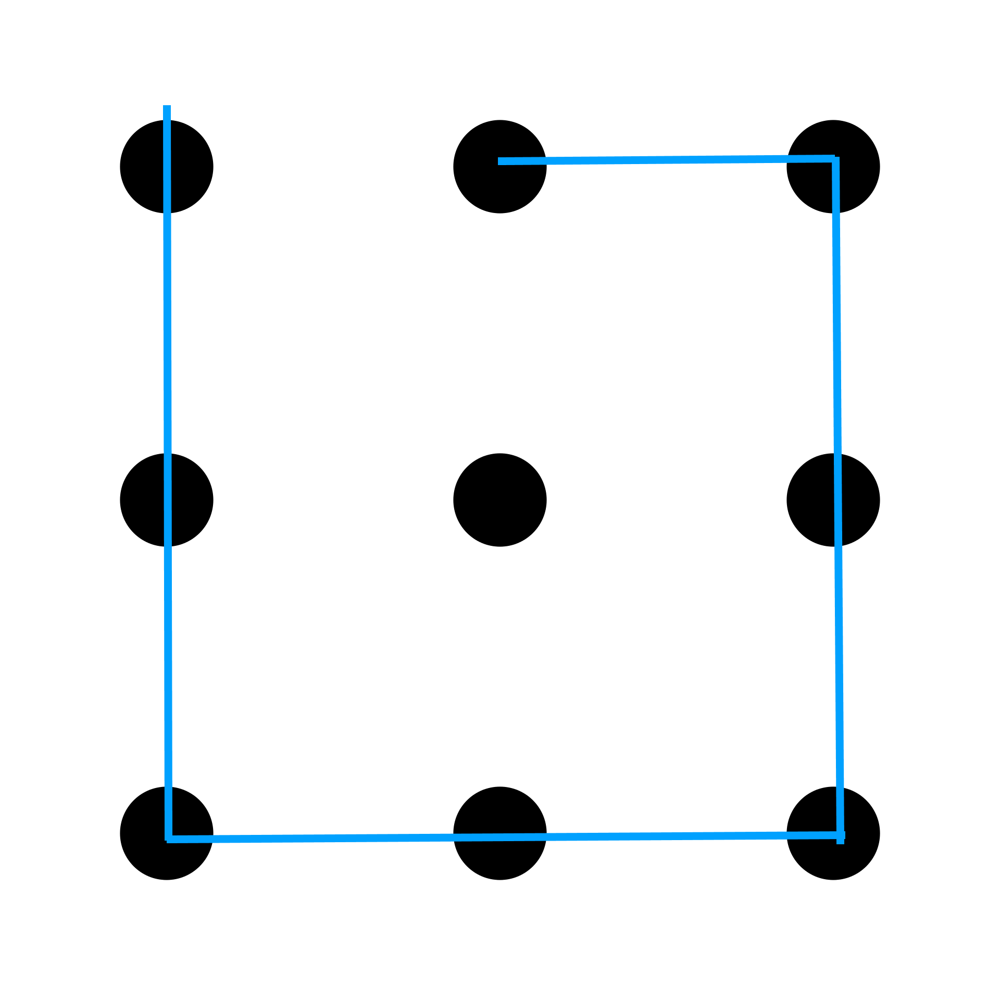
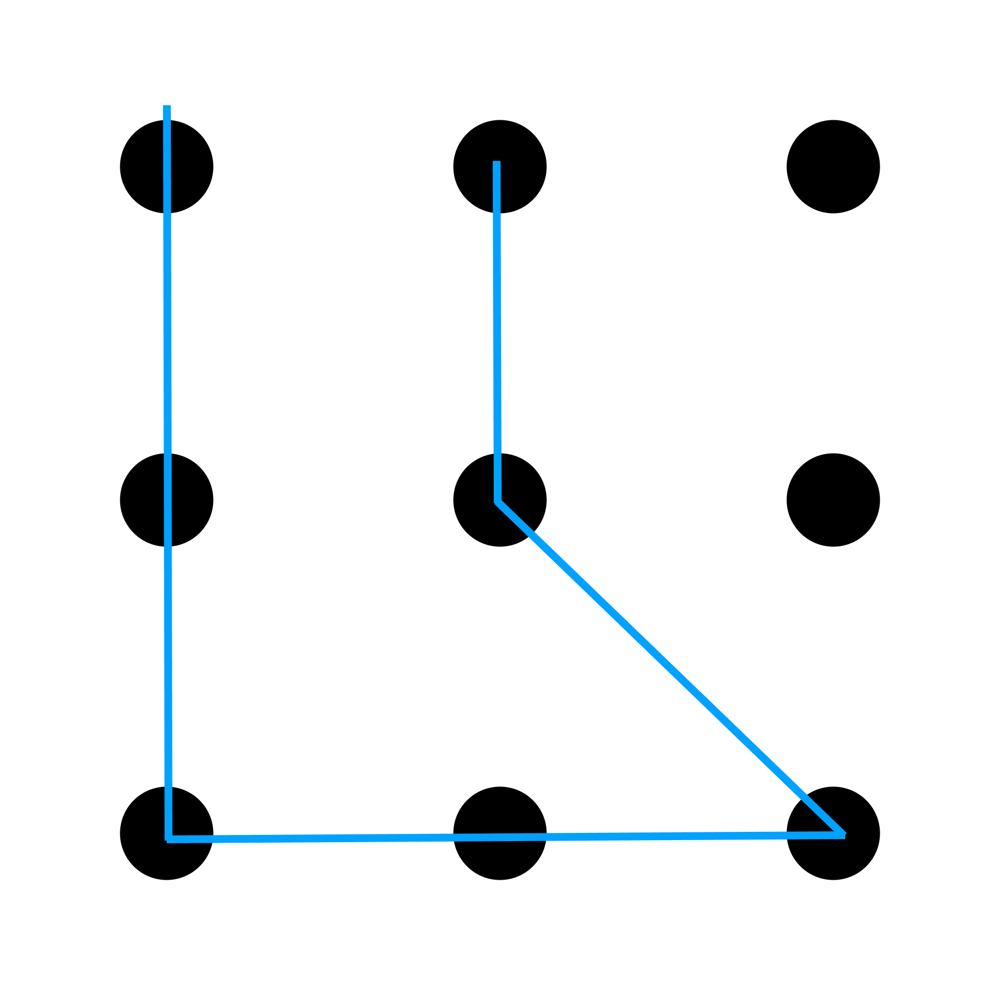

# Odcinek 1: Wprowadzenie

Witajcie. W tym cyklu wykładów postaram się zebrać praktycznie cały mój dorobek. Nazywam się John Vervaeke. Jestem adiunktem na Uniwersytecie w Toronto, jestem członkiem Wydziału Psychologii oraz Programu Kognitywistyki. Zajmuję się również dydaktyką w programie "Psychologia buddyzmu i zdrowie psychiczne". Wydałem sporo filmów na różne tematy, niektórzy z Was mogli widzieć niektóre z nich. Ale tym, co chcę osiągnąć w tym cyklu wykładów, jest zebranie tego wszystkiego i przedstawienie ogólnego, unifikującego stanowiska, którym mam nadzieję pokazać związki pomiędzy zagadnieniami, które być może już znacie. Wszystko zaczęło się, gdy zainteresowałem się pewnym szczególnym zjawiskiem. Zainteresowało mnie, że najwyraźniej istnieje coraz większa zbieżność pomiędzy ludźmi zainteresowanymi buddyzmem, a tymi zainteresowanymi kognitywistyką. O tym, czym jest kognitywistyka, porozmawiamy sobie trochę później. Natomiast część z tego już znacie ze świata wokół siebie, ponieważ właśnie doświadczamy czegoś, co zwane jest "rewolucją mindfulness".

O mindfulness mówi się wszędzie. Wczoraj byłem w księgarni - "Chapters" - i tam jest cały dział poświęcony mindfulness. Zatem dlaczego ta rewolucja mindfulness ma miejsce? Otóż ma miejsce właśnie przez interakcję pomiędzy buddyzmem a kognitywistyką. Tylko dlaczego się to dzieje i dlaczego nagle tak wybuchło? I co rozumiemy przez mindfulness? Właśnie temu poświęciłem część mojego dorobku naukowego. O tych sprawach będziemy tutaj rozmawiać. Istnieje jeszcze wiele innych kwestii, które - według mnie - wydają się współistnieć z ową rosnącą bliskością buddyzmu i kognitywistyki: wzrasta zainteresowanie - zarówno akademickie jak i publiczne - tematem mądrości, czymś, o czym nie rozmawiało się prawie wcale jeszcze całkiem niedawno. Otóż mądrość stała się bardzo gorącym tematem zarówno w psychologii jak i kognitywistyce, a książki, które oferują trening mądrości znów stają się popularne.

Kolejne doświadczenie z tej samej księgarni - wczoraj kupiłem swojemu synowi książkę zatytułowaną ["Jak być stoikiem?"](https://amzn.to/2qQmnPB). Z jakiej przyczyny pewne filozoficzne stanowisko z epoki hellenistycznej stało się popularną i pożądaną książką? Skąd to łaknienie mądrości i dlaczego ludzie zaspokajają je w ten sposób? Stoicyzm, filozofie z okresu hellenistycznego - będę o tym mówił. Myślę, że są ku temu dobre powody.

Oczywiście - rośnie zainteresowanie akademickie i publiczne psychodelikami. Właśnie udzielałem wykładu, w tym tygodniu, w Yale, o psychodelikach oraz rosnącym zainteresowaniu psychodelikami i doświadczeniami psychodelicznymi. Obserwuje się radykalne zjawiska z nimi związane. Ludzie mogą zostać uwolnieni z lekoopornych uzależnień, mogą przezwyciężyć zespół stresu pourazowego. Przy użyciu najlepszych form terapii odsetek wyleczonych z zespołu stresu pourazowego wynosi - jeżeli wszystko pójdzie dobrze - może 20%. Po wprowadzeniu psychodelików do leczenia odsetek ten może wzrosnąć do 80%. O co zatem chodzi? Skąd to zainteresowanie?

Rośnie zainteresowanie, publiczne i - dorównujące mu - akademickie, tematem szczęścia. Cóź, zawsze byliśmy kulturą zorientowaną na szczęście. "Życie, wolność i dążenie do szczęścia", i tak dalej. ["Life, liberty and the pursuit of happiness" - fragment Deklaracji Niepodległości Stanów Zjednoczonych]. Ale sprawy przybrały interesujący obrót: kwestia "sensu" i "sensu życia" wysuwa się na pierwszy plan. Ludzie coraz więcej mówią nie tylko o zwykłym zadowoleniu, ale czym jest dla człowieka życie, które ma sens. I okazuje się, że sens życia jest niezwykle ważny. Jest bardzo dobrym predyktorem ogólnego dobrostanu. Jest bardzo dobrym predyktorem sukcesu w życiu w ogóle. Nie ma się zatem co dziwić, że jest czymś, czego ludzie poszukują. Moją tezą i co będę się starał wykazać jest, że to nie przypadek, że wszystko to dzieje się właśnie teraz!

To nie przypadek: owa zbieżność buddyzmu, rewolucji mindfulness, zainteresowania mądrością i starożytną filozofią (jak stoicyzm), rosnącym publicznym zainteresowaniem psychodelikami, doświadczeniami transformatywnymi i doświadczeniami mistycznymi, rosnącym akademickim i publicznym zainteresowaniem sensem życia. Jest ku temu powód - istnieje unifikujące wyjaśnienie, dlaczego to ma miejsce.

Ale jest inny zbiór zjawisk! To była jasna strona tego, o czym chcę powiedzieć. Istnieje grupa _mrocznych_ czynników, które również zdają się współistnieć. Mamy obecnie - choć niektórzy z tym dyskutują, ale myślę, że dowody są jasne; CDC [Center for Disease Control - prawdopodobnie chodzi o agencję zajmującą się zdrowiem publicznym w Kolumbii Brytyjskiej] opublikowało niedawno pewne dane - doświadczamy kryzysu zdrowia psychicznego. Liczba samobójstw rośnie. Co prawda mają tu znaczenie pewne czynniki socjoekonomiczne, ale jasno widać, że dzieje się coś jeszcze. Rośnie wrażenie, które dotyka wielu ludzi, że tracimy kontakt z rzeczywistością. Coraz częściej spotykamy się, czy to wśród jednostek, czy też grup, z nihilizmem. Z wyrazami cynizmu. Z wyrazami głębokiej frustracji i daremności. Porzucamy zaufanie do wszelkich instytucji publicznych. Utraciliśmy zupełnie wiarę i zaufanie w nasz system polityczny. Tracimy wiarę w wymiar sprawiedliwości. Przynależność religijna spada w sposób konsekwentny. Spada przynależność do różnego rodzaju zrzeszeń i organizacji w ogóle.

Ja i współautorzy naszej książki "[Zombie w kulturze zachodniej: kryzys XXI wieku](https://amzn.to/36bDD1R)" (Christopher Mastropietro i Filip Miscevic) ["Zombies in Western culture: a 21st century crisis"] wykazywaliśmy, że wrażeniu braku kontaktu z rzeczywistością towarzyszy wrażenie (i będziemy o tym rozmawiać, gdyż chcę używać tego określenia w znaczeniu technicznym, w jakim użył go Frankfurt), że otacza nas coraz więcej _bullshitu_ [w polskich tłumaczeniach również "kit"]. Wszędzie! Wszechogarniającego! Można zerknąć do naszej książki na wykres, który pokazuje w jaki sposób to wrażenie wzrasta i jak towarzyszą temu wzrosty w wielu innych _mrocznych_ czynnikach. Ludziom wydaje się coraz bardziej - i widać to w mediach publicznych, ale jest to temat obecny w świecie akademickim - że spędzamy zbyt wiele czasu w środowiskach wirtualnych. Wydaje się, że coraz więcej dowodów wskazuje na, przykładowo, powiązanie użytkowania różnych sieci społecznościowych z rosnącą depresją i rosnącą samotnością.

Co więcej - i porozmawiamy sobie o tym, w jaki sposób dzieje się to trochę bardziej niejawnie - objawia się to w rodzajach rozrywki, której poszukujemy oraz w mitologiach, które się nam podobają. Jak wspomniane zombie! O tym też pomówimy - czemu zombie są tak popularne? Dlaczego superbohaterowie są teraz tak popularni? Te mitologiczne formy (i pomówimy o tym, czym jest mit), jak będę się starał dowodzić, są wyrazem pewnego kulturowego wrażenia, poczucia, że w jakimś sensie _utknęliśmy_. Można to zauważyć na przykład w tym, jak powszechne - nieomal jako stały element tła - jest przywoływanie "kryzysu" i "upadku". Apokalipsa! Apokalipsa zombie, nieuchronny upadek cywilizacji. Wszystko to jest powszechne, traktowane jako oczywistość. Jakiś czas temu filmy, w których było to pokazywane, wpadały w kategorię science fiction, bo były uważane za zbyt śmiałe. Ale teraz stało się to powszechnym uczuciem towarzyszącym nam w tle.

Otóż ja uważam, że wszystkie te negatywne czynniki również posiadają jedno unifikujące wyjaśnienie. Właściwie to będę się starał dowieść w trakcie tego cyklu, że zarówno pozytywne jak i negatywne czynniki wskazują na _to samo_ unifikujące wyjaśnienie. Będzie to koncepcja, że nasza kultura doświadcza dojmującego "kryzysu znaczenia". Kryzysu sensu. Będziemy musieli porozmawiać o tym, czym ów "sens" jest.

Nie twierdzę, że to jedyny kryzys, z którym musimy się zmierzyć. W żadnym wypadku. W rzeczy samej, chcę pomówić o tym jak ów "kryzys sensu" wchodzi w interakcję z innymi kryzysami: kryzysem środowiska naturalnego, kryzysem socjoekonomicznym. Ale oprócz nich, a są one powszechnie dyskutowane, istnieje również kryzys sensu poruszany w znacznym stopniu w środowisku akademickim, który należy podać do świadomości publicznej, gdyż - jak będę się starał dowodzić - owe trzy kryzysy nie są niezależne. Są istotnie współzależne.

Lecz czym jest ów sens, który doświadcza kryzysu? Dlaczego go łakniemy? Jak powinniśmy kultywować mądrość - ponieważ, będę wykazywał, że o to właśnie chodzi w mądrości - by ten sens ogólnie wzmacniać. Mądrość polega na dogłębnym realizowaniu i uświadamianiu sensu. [W oryginale John używa słowa "realize" i podkreśla oba znaczenia tego słowa: stwarzać i uświadamiać sobie. Ten trik nie działa w języku polskim.] Jak kultywować tę mądrość, co to właściwie znaczy? Nie będę tego poruszał tylko teoretycznie, będę mówić również o praktyce. Jakich praktyk można użyć (i jakich już się używa) by odpowiedzieć na tę potrzebę kultywowania mądrości? Jaką rolę, przykładowo, odgrywają praktyki mindfulness w kultywowaniu mądrości?

Oto zatem trzy pytania, do których będziemy nieustannie powracać: czym jest ów "sens", dlaczego go łakniemy, oraz jak kultywować mądrość, by go realizować? Poruszymy przede wszystkim temat "kryzysu sensu": jak owo rozumienie "sensu" wyewoluowało, czym jest, dlaczego jest tak ważne dla rozwoju ludzkości? Następnie zajmiemy się historią tego kryzysu: dlaczego zaistniał, jakie były ku temu czynniki historyczne? Dzięki temu uzyskamy historyczny opis sensu. Będziemy mieli poczucie, czym ten sens, który przechodzi kryzys, jest - ten, którego ludziom brakuje lub tracą go w swoim życiu.

Będziemy rozmawiać o powiązaniach pomiędzy sensem, mądrością oraz - co ważne - samotranscendencją. Okaże się, że owo pojęcie samotranscendencji, które będziemy musieli rozwinąć i uszczegółowić, jest podstawową potrzebą, ponieważ spełnia u istot ludzkich podstawową rolę. Nierozerwalnie związana jest ona z koncepcjami mądrości i, oczywiście, sensu. Z czasem, a nawet od samego początku, zaczniemy dostrzegać głębokie połączenia pomiędzy sensem, mądrością, samotranscendencją, a także odmiennymi stanami świadomości. Dlaczego istoty ludzkie szukają sposobów na zmianę stanu świadomości? W zasadzie nie tylko ludzie to robią - dotyczy to także innych inteligentnych organizmów. Wrony brodate turlają się po dachach, by wywołać uczucie rozkojarzenia tylko po to, by zmienić stan swojej świadomości. O co chodzi? Dlaczego inteligencja musi być związana z odmiennym stanem świadomości i dlaczego to w szczególności ludzie rozwinęli bardzo wymyślne sposoby na wytwarzanie, opanowywanie i interpretowanie tych odmiennych stanów świadomości? Będę o tym mówił w kontekście szamanizmu.

I rytuały! O nich opowiemy w kontekście stanu przepływu - czyli gdy jesteśmy pochłonięci - oraz dlaczego ludzie go poszukują i dlaczego jest tak potężny. Jak już wspominałem, rozważymy go w kontekście doświadczeń psychodelicznych. Co ważniejsze, doświadczeń mistycznych, które mogą mieć miejsce podczas niektórych doświadczeń psychodelicznych, ponieważ, jak się okazuje, właśnie doświadczenie mistyczne jest tym ważnym i odmieniającym. Ale istnieje podzbiór tych doświadczeń mistycznych, które są niezwykle kluczowe - to doświadczenia przebudzenia. To przeżycia mistyczne, po których ludzie są w stanie powiedzieć: "To było w jakimś sensie bardziej rzeczywiste niż ten świat, a ja muszę mój świat odmienić i muszę odmienić siebie!". Wchodzą w relację z czymś, co L.A. Paul nazywa ["doświadczeniem transformatywnym"](https://amzn.to/32VF9Da), co również nazywa się "skokiem kwantowym" - radykalną odmianą ich życia. I wiemy, mamy już teraz solidne badania, które pokazują, że mają rację! Ich życie faktycznie się poprawia po tych doświadczeniach przebudzenia.

O tym wszystkim pomówimy dogłębnie i, ośmielę się powiedzieć, być może będziemy w stanie zebrać to wszystko razem i faktycznie zaproponować - co może nawet niektórych oburzyć - naukowe, kognitywistyczne wyjaśnienie czym jest oświecenie i dlaczego łagodzi owo cierpienie spowodowane brakiem sensu, które ma szczególne znaczenie dla nas w tych czasach, ale które zawsze było odwiecznym zagrożeniem od czasów "rewolucji osiowej". To oczywiście oznacza, że będziemy musieli omówić tematy powiązane z mrocznymi aspektami, jak wspomniałem, stwarzania sensu. Jakie jest połączenie, a jest głębokie i doniosłe, pomiędzy stwarzaniem sensu, które jest tak kluczowe, a naszą endemiczną zdolnością do samooszukiwania się i samozniszczenia. Istnieje przyczyna, z której jesteśmy tak skąpani w _bullshicie_, bo _bullshit_ jest naszym odwiecznym zagrożeniem. Samooszukiwanie się jest endemiczne.

To oznacza, że ważne będzie dyskutowanie głupoty jako czegoś odrębnego od ignorancji. Ignorancja jest brakiem wiedzy. Głupota jest brakiem mądrości. Głupota występuje wtedy, gdy nasza zdolność do zaangażowania własnej podmiotowości, podążania za własnymi celami, jest podkopywana i zagrożona samooszukiwaniem się i zachowaniem prowadzącym do samozniszczenia, które są odwiecznymi słabościami naszych zdolności poznawczych. Właściwie, czego będę się starał dowodzić, ta sama maszyneria, która czyni nas tak adaptacyjnie inteligentnymi jest tą samą maszynerią, która czyni nas podatnymi na głupotę. To nas zaprowadzi w kierunku niektórych tematów istotnych dla egzystencjalnego doświadczenia ludzi w kryzysie sensu. Tematów takich, jak absurd, alienacja, daremność, przerażenie - prawdziwe przerażenie.

Większość filmów grozy nie jest tak naprawdę przerażająca. Powiemy czym jest prawdziwa zgroza i co czują ludzie, gdy faktycznie doświadczają przerażenia. Ich poczucie kontaktu z rzeczywistością zostaje podważone i to ich, jak się można domyślać, przeraża. Pomówimy o bezsensowności i dlaczego coraz więcej ludzi odczuwa ten stan. Stan rozpaczy. I jak już to zrobimy, stopniowo przeniesiemy się z historycznego przedstawienia źródła kryzysu sensu - co nam da poczucie czym, historycznie, ten sens jest - do kognitywistycznego badania poznania. Poznawczego, naukowego badania sensu i stwarzania sensu.

Gdy ludzie używają tego słowa: "sens", jest to przenośnia. Mają na myśli, że coś w ich życiu jest analogiczne do sposobu, w jaki zdanie może mieć "sens": części w jakiś sposób do siebie pasują, mogą mieć wpływ na poznanie, połączyć nas w jakiś sposób ze światem. Nasze życie posiada coś, czego analogią jest sens zdań. Musimy rozwikłać tę metaforę. Dlaczego ta metafora jest używana i na co wskazuje, gdy mówimy o sensie życia? Dlaczego najbardziej znaczące, wypełnione sensem doświadczenia, które spotykają ludzi, to właśnie te najbardziej niewypowiedziane, których nie potrafią ubrać w słowa? O co tu chodzi?

Będzie nam trzeba porozmawiać o różnych rodzajach wiedzenia. Niektóre spadły z naszego kulturowego radaru właśnie z powodu kryzysu sensu. Mamy tendencję do redukowania wszystkich rodzajów wiedzy, o których mówili starożytni do jednego: wiedzieć to posiadać szczególny rodzaj przekonania. Jesteśmy zatem bardzo skoncentrowani na przekonaniach, przez co jako kultura jesteśmy tak bardzo skupieni na ideologiach. Ale okazuje się, że będziemy musieli nabyć znacznie szersze pojęcie, co znaczy "wiedzieć". W wiedzeniu chodzi o dużo więcej, niż o posiadanie uzasadnionych, prawdziwych przekonań. Istnieje rodzaj wiedzenia _jak_ złapać piłkę. Istnieje rodzaj wiedzenia _jak to jest_ przeżywać dokładnie to doświadczenie, teraz. Istnieje rodzaj wiedzenia _jak to jest_ uczestniczyć w czymś, na przykład w związku. O tym wszystkim musimy pomówić.

Oczywiście niektórzy z was wiedzą o tych innych rodzajach wiedzenia, bo wiecie o tym jak ważne są i jak stanowią integralną część psychoterapii, która jest kolejnym zjawiskiem rozpowszechniającym się w naszej kulturze. Jednym z tego powodów jest kryzys sensu. Innym powodem, z którego ludzie poszukują terapii jest właśnie próba odzyskania tych utraconych rodzajów wiedzenia. Tych rodzajów wglądu, które są potrzebne do transformacji - nie przekonań, ale tego, jak postrzegamy świat. Nasze poczucie własnego ja i poczucie rzeczywistości często muszą zostać odmienione w toku teriapii. To dlatego psychodeliki są tak ważna dla powodzenia terapii, ponieważ są w stanie odmieniać te pozostałe rodzaje wiedzenia. O tym wszystkim będziemy rozmawiać. To nam da strukturalne i funkcjonalne objaśnienie, czym jest sens. Jaka jest jego struktura? Jakie są jego procesy poznawcze? Jakie są jego mechanizmy kognitywne? Jak funkcjonują? Jak mogą popaść w dysfunkcję?

Mając zarówno objaśnienie historyczne jak i strukturalno-funkcjonalne, zmusimy je do wzajemnej rozmowy. Będą się wzajemnie formować, ograniczać i wspierać. A z tego dialogu, jak zaproponuję - jakkolwiek może się to wydać zuchwałe - powstanie realna odpowiedź na kryzys sensu. Przebudzenie z kryzysu sensu. O to chodzi w tym cyklu: o przebudzenie z tego kryzysu. Nie ideologicznie, ale głęboko, transformatywnie i egzystencjalnie. Nie jest to zatem coś, czego mogę dokonać w prosty sposób. Bo to nie jest problem z prostymi odpowiedziami. Jeżeli ktokolwiek zaoferuje wam odpowiedź na ten kryzys w ciągu godziny, byłbym gotów się założyć, że was zwodzi, wami manipuluje lub sam w znacznym stopniu zwodzi siebie.

Jest powód, dlaczego utknęliśmy. Jest powód, dlaczego to takie trudne. To, czego się podejmujemy, jest złożone i ciężkie. Zatem ten cykl będzie składał się z wielu wykładów, ponieważ będę starał się starannie - i, mam nadzieję, odpowiedzialnie - zbudować argument, w którym pokażę, jak możemy przebudzić się z tego kryzysu sensu. Jak ten kryzys oddziałowuje z kryzysem zdrowia psychicznego, jak oddziałowuje z kryzysem środowiska naturalnego, jak oddziałowuje z kryzysem socjoekonomicznym. To jest moje zobowiązanie wobec was. Będę zawsze robił, co w mojej mocy, by przedstawiać rygorystyczną, racjonalną argumentację. Postaram się zawsze podawać odniesienia do pracy innych. Chcę, byście zrozumieli, że nie jestem w stanie - i nikt nie powinien sam tak twiedzić - podawać wam absolutnej, niepodważalnej prawdy. Mogę zaoferować dobrą argumentację i mocne dowody. Ale nie chcę, by była to seria wykładów akademickich. Wykonuję swoją pracę akademicką i jestem z niej dumny. Ale to - chcę to przeznaczyć tym, którzy podchodzą do tego z własnym egzystencjalnym zainteresowaniem.

Postaram się więc ograniczyć żargon i techniczne pojęcia do minimum. Będę musiał wprowadzać pewne pojęcia i mam nadzieję je starannie wyjaśniać w miarę potrzeb. To jest moje zobowiązanie wobec was. Nie mogę być bezstronny! Tak się nie da! Będę się starał w miarę moich możliwości przedstawiać wam moje argumenty, moje punkty widzenia i dlaczego sądzę, że można je rozumieć jako wysoce wiarygodne.

## Początki sensu

Chciałbym zacząć od pytania: jak i dlaczego ów sens tak bardzo stanowi część naszego człowieczeństwa? Dlaczego jest tak głęboko zaszyty w naszym człowieczeństwie? Myślę, że będzie zrozumiałe, że gdzieś muszę zacząć. I to może być mylące, ponieważ uważam - jak i jeden z współautorów moich książek, Filip Miscevic - że należy myśleć o kontinuum. Głębokie powiązania między sensem a poznaniem można prześledzić daleko wgłąb naszego ewolucyjnego dziedzictwa, na długo przed powstaniem ludzkości. Zatem fakt, że gdzieś zaczynam nie ma na celu odznaczyć, że jest to jakiś bezwzględny początek. Chcę jedynie wskazać na okres, kiedy - jak wielu uważa - ludzkość w takiej formie, jaką jest teraz, się ukształtowała. Nie do końca w takiej samej formie, jak teraz, bo oczywiście zaszło mnóstwo procesów historycznych i kulturowych, ale chodzi o taką ludzkość, którą jesteśmy w stanie rozpoznać jako _nas_ i jak bardzo dotyczy jej to stwarzanie sensu, o którym zamierzam mówić.

Ten okres jest znany jako przejście do górnego Paleolitu. Ma to miejsce około 40 tys. lat p.n.e. Co interesujące, biologicznie, jako gatunek, istnieliśmy już dużo dawniej. Istnieliśmy - choć zdania są podzielone, ale konserwatywnie można przyjąć - od około 100 tys. lat temu. Jednak około 40 tys. lat temu zaszła zmiana. Zmiana radykalna.

Znów wybieranie jakiegoś szczególnego momentu sprawia, że wygląda to jakby wcześniej nic nie istniało. Niektórzy tak przedstawiają przejście do górnego Paleolitu, ja tak nie chcę robić. Myślę, że to błąd. Jest kontinuum, które widać wcześniej, ale w pewnym momencie zachodzi radykalna zmiana: przejście do górnego Paleolitu. Obserwujemy, że ludzie zaczynają robić coś, czego nie robili dotąd - _wytwarzają sztukę_. Wytwarzają sztukę _przedstawieniową_. Rzeźbią. Malują na ścianach jaskiń. Są mocne dowody na to, że zaczynają tworzyć muzykę. Co jeszcze robią? Mamy dość dobre dowody na to, że zachodzi znaczące wzmocnienie ich zdolności poznawczych. Skąd to wiemy? Mamy pierwsze przypadki użycia kalendarzy, oczywiście bez dat i bez liczb, bo umiejętność liczenia nie została jeszcze wynaleziona, ale obserwujemy symboliczne przedstawienia faz Księżyca i upływu dni, zatem ludzie śledzą upływ czasu używając abstrakcyjnych wzorców, aby ulepszyć zdolności polowania.

Coś innego się dzieje, co również jest nieodłączną częścią naszego człowieczeństwa: wynajdujemy broń miotaną. Neandertalczycy, którzy są współcześni Homo Sapiens, nie używają pocisków. Ich włócznie są grube, zakończone kamieniem i służą do wykonywania pchnięć. Wiemy, że walczyli w bliskich starciach ze zwierzyną, bo obserwujemy u nich uszkodzenia kości podobne do urazów obecnych u ludzi biorących udział w kowbojskich rodeo, gdzie dochodzi do "zabaw" z ogromnymi, wściekłymi ssakami. Homo Sapiens robią coś innego - rozwijają bardzo cienkie oszczepy, zakończone nie kamieniem, lecz kością, a kość jest dużo trudniejsza w obróbce, niż kamień. Chodzi o to, że oszczepy są bardzo dobrymi pociskami. Są bardzo lekkie. Ludzie tworzą rolę miotacza włóczni, wynajdują procę i zaczynają rozwijać zdolność noszenia wielu pocisków, które mogą miotać na dalekie odległości. To wymaga przyspieszonego rozwoju płata czołowego, co później okaże się, oczywiście, bardzo ważne, jak zobaczymy, dla poprawy naszej inteligencji.

Pomyślcie jak głęboko ta koncepcja "rzucania" jest zakorzeniona w waszym poznaniu. Pomyślcie o tym, gdy mówicie, że macie "projekt" do wykonania [łac. _proiectus_, od _proiacio_ znaczy "wyrzucać"; _iacio_, znaczące "rzucać" jest podstawą pozostałych przykładów]. "Projekt" - rzucacie! Albo ludzie mogą mówić "o, tam jest obiekt". To oznacza "rzucony przed". Lub "subiektywny". To znaczy "rzucony pod". Cały czas, w sensie poznawczym, rzucacie. To dlatego, że zadanie rzucania jest tak skomplikowane. Wydaje nam się to tak trywialne, że jest sobie jakiś ruchomy cel, a ja mogę w niego rzucić i go trafić, ale jeżeli spróbuje się zbudować sztuczną inteligencję, która ma to zrobić (co zostało odkryte przez wojsko), okazuje się to bardzo, bardzo trudnym problemem. Zatem rozwijają się zdolności rzucania pocisków, kalendarze, muzyka, rzeźby, malowidła. Co takiego się dzieje? Skąd ta eksplozja?

Zwróćcie uwagę, jak to wszystko jest związane z różnymi aspektami rozumienia, czym jest sens. Oczywiście, powstają sztuka i muzyka - w tym jest jakiś sens - ale również czasowi przypisuje się coraz większe znaczenie - jest mierzony i rozumiany za pomocą kalendarzy. Przestrzeń i czas stają się coraz bardziej znaczące, bo zaczyna się je rozumieć w wysoce dynamiczny sposób w kontekście broni miotanej. Co się zatem dzieje? Dlaczego się to stało?

Cóż, zostało wykonane dużo rzetelnej pracy na ten temat. [David Lewis-Williams](https://amzn.to/2NbzlyI), prace Matta Rossano "[Selekcja nadnaturalna](https://amzn.to/2Nn7Imq)" (myślę, że to sformułowanie, to przesada). Jego artykuły takie, jak "[Czy medytacja uczyniła nas ludźmi?](http://www2.southeastern.edu/Academics/Faculty/mrossano/recentpubs/meditating.pdf)". Miałem przyjemność spotkać Matta. Argumentuje on, że w tym okresie zachodzi radykalna zmiana w ludzkich zdolnościach poznawczych, która zgadza się z badaniami innych ludzi, takich jak Michael Winkleman. Otóż wiemy, że przed górnym Paleolitem, jakieś 30 tys., a nawet 60 czy 70 tys. lat temu - nie do końca wiadomo, bo są różne okresy, w których to się być może stało - ludzkość przeżyła niemal całkowitą zagładę. Ludzie prawie całkowicie wyginęli. Zostaliśmy zdziesiątkowani, podejrzewa się, do liczby maksymalnie dziesięciu tysięcy osób. Było prawie po nas! Częściowo, zdaje się, że winna temu była zmiana klimatu pod koniec ostatniej epoki lodowcowej w Afryce, a częściowo wybuch superwulkanu, który miał miejsce około 70 tys. lat temu - nie ma pewności! Ale konsekwencją tego jest niezwykła presja wywierana na ludzkość.

Ludzie przenoszą się na wybrzeża, próbując przeżyć, itd., ale - ludzie wydają się przyjmować interesujące podejście do tej sytuacji. Po pierwsze dywersyfikują swoją dietę - co to oczywiście jest ważne - ale bardziej interesujące jest to, że nie próbują wynaleźć technologicznej odpowiedzi na tę sytuację. Bo klimat jest zbyt ogromny i trudny do zrozumienia! Wynajdują odpowiedź społeczno-kognitywną. Ludzie zaczynają tworzyć szersze sieci wymiany handlowej. Otóż kiedy pójdzie się tą drogą, nie jest się wrażliwym na indywidualne wahania w środowisku. Ma się dostęp do dużo większych zasobów, zarówno w znaczeniu ile rzeczy ludzie mogą posiadać, a także jakich odkryć mogą dokonać. Zatem ludzie zaczynają formować szersze sieci relacji handlowych. I to jest bardzo ważne, bo znacznie powiększa skalę, na jakiej ludzkie zdolności poznawcze muszą teraz funkcjonować. I ludzie całkiem zrozumiale odpowiadają na to rozwijając wszystko to, co jest teraz tak powszechne. Rozwinęli kilka rytuałów (a o tym jak ważne są rytuały, będziemy jeszcze mówić) mających na celu radzenie sobie zarówno ze zmianami środowiskowymi oraz powiększonymi sieciami społecznymi. Nawiasem mówiąc o tym będziemy mówić bardzo dużo: jak dalece nasze poznanie ma charakter partycypacyjny. Uczestniczymy w rozproszonym poznaniu, ogromnych sieciach kognitywnych. Dawno zanim Internet połączył komputery, kultura łączyła w sieci ludzkie mózgi, dostarczając nam niektóre z najpotężniejszych zdolności radzenia sobie z problemami.

Czym są owe rytuały? Potrzebne są rozmaite rytuały handlowe. Dlaczego? Pomyślcie, jak oczywiste jest dla was mieszkanie w mieście. Pojawia się głębokie, podstawowe założenie cywilizacji: zadawanie się z obcymi! Wieloma! I myślicie sobie "No tak!". Otóż nie - to niezwykle trudne! Inne gatunki tego nie robią. Następuje przesunięcie, musimy wchodzić w interakcje z ludźmi spoza naszej grupy łowiecko-zbierackiej i musimy tworzyć z nimi relacje. Zaczynamy rozwijać rytuały, których zadaniem jest wzmacnianie naszych zdolności komunikacji i tworzenia relacji opartych na zaufaniu z ludźmi, których nie znamy osobiście. Możecie powiedzieć - "Ok!". Dlatego właśnie nadal robicie rzeczy, które nie mają sensu - spotykacie kogoś i robicie coś takiego: wystawiacie rękę, ten ktoś ją chwyta i porusza nią w górę i w dół. W ten sposób pokazujecie, że nie macie przy sobie broni, pozwala to tej osobie was dotknąć, by zobaczyć, czy macie wilgotne dłonie, itd. Dzieje się mnóstwo rzeczy zupełnie intuicyjnych. Mogę wyczuć, czy ktoś jest spięty. Większość z nas nie zwraca już na to uwagi, ale to nadal działa. Gdy ściskacie komuś dłoń, gdy pytacie się "Jak się masz?" - to się stało trywialne. Nie oczekujemy odpowiedzi! "Jak się masz?" - jeżeli ktoś wam zaczyna odpowiadać, myślicie "O nie!". Ale pierwotnie to coś znaczyło ze względu na ważne umiejętności, które musiały zostać rozwinięte, byśmy mogli w tych rytuałach uczestniczyć.

Muszę potrafić przyjąć twoją perspektywę. Muszę wiedzieć, co ci chodzi po głowie. Muszę wiedzieć, co czujesz. Muszę mieć możliwość przejścia z perspektywy pierwszej osoby do trzeciej osoby bardzo, bardzo łatwo. Bo jeżeli tego nie potrafię, nie uda mi się z tobą handlować. Ta zdolność patrzenia na innych z innej perspektywy, szczególnie na ludzi, których nie znamy zbyt dobrze, oznacza konieczność wykształcenia umiejętności, którą Daniel Siegel nazywa ["wzrokiem umysłu"](https://www.drdansiegel.com/about/mindsight/) - to umieć rozpoznawać stany czyjegoś umysłu. I wiecie co? W miarę polepszania zdolności rozpoznawania stanów umysłu innych ludzi, my polepszamy zdolność rozpoznawania stanów swojego własnego umysłu. A to oczywiście stanie się częściowo źródłem takich rzeczy jak metapoznanie i mindfulness.

Następna grupa rytuałów, które będą potrzebne, skierowana jest w drugą stronę. Rytuały wymiany handlowej odpowiadają za to, jak obchodzić się z obcymi. Problem w tym, że skoro teraz zaczynamy wchodzić w interakcje z tymi wszystkimi ludźmi, nasze zobowiązania i lojalność wobec grupy jest coraz bardziej wystawiana na próbę, niż w przeszłości. Mogła być uznawana za oczywistą, ponieważ przebywaliśmy z tymi samymi ludźmi, a oni przebywali z nami przez cały czas. Ale teraz pojawia się, za pozwoleniem, "kuszenie" ze strony obcego, które oczywiście jest obecnie częścią wszystkich naszych mitologii: że obcy może przyjść i nas skusić. Co zatem robimy? Otóż tworzymy rytuały inicjacji. Rytuały zaprojektowane po to, byśmy zademonstrowali nasze przywiązanie do grupy. Te rytuały często wymagają podjęcia ryzyka, wystawienia się na zagrożenie, wymagają ofiary. Obecnie nasze rytuały przejścia zostały bardzo uładzone, ale gdy spojrzeć w przeszłość, te rytuały mogły być naprawdę traumatyczne. I dramatyczne. Ludzie stawiani byli w sytuacjach, w których mogli doświadczyć ogromnego bólu lub strachu. Będziemy omawiać niektóre z nich w dalszej części tego cyklu. Zatem, dlaczego? Po co narażać kogoś na doświadczanie bólu i strachu? Ponieważ jeżeli przejdzie przez ból i strach, to pokazuje jego lub jej zobowiązanie wobec was! Jest naprawdę związany, związana z grupą.

Lecz co to oznacza w kontekście zdolności poznawczych? Co to oznacza dla sposobu, w jaki umysł jest trenowany? Otóż musisz naprawdę usprawnić swoją zdolność regulowania emocji. Musisz znacząco ulepszyć swoją zdolność do czegoś, co zwie się "decentrowaniem" - oddaniem się w ręce innych, przyjmowaniem nieegocentrycznej perspektywy. Ponieważ to, co jest w danej chwili ważne, nie jest skupione na tobie. Rytuał, owszem, jest na tobie skupiony, lecz ty, poprzez rytuał, skupiasz się na grupie. To będzie miało ogromny wpływ na nasze poznanie.

## Egzaptacja

Pojawia się również trzeci rytuał. Wydaje się, że czerpie z tych kognitywnych usprawnień, które wprowadziły rytuały wymiany handlowej i inicjacyjne. By o nim opowiedzieć, muszę wprowadzić koncepcję, której będziemy używać bardzo często. To pojęcie egzaptacji. Wywodzi się ono pierwotnie z biologii, lecz dzięki pracy [Michaela Andersona](https://www.dropbox.com/s/gbzohaikvbqq5d1/69anderson_synthese_2007.pdf?dl=0) zostało wprowadzone do rozumienia, jak działa mózg, jak działa poznanie. Egzaptacja, w ujęciu biologicznym, to mechanizm ewolucyjny. Przykładowo, używam swojego języka, by mówić. Język nie wyewoluował, byśmy mogli mówić. Gdyby tak było, wszystkie zwierzęta posiadające języki mówiłyby do nas, a to byłoby przerażające. Szczególnie koty! To musi być przerażające, gdy twój kot do ciebie mówi.

Po co zatem wyewoluowały języki? Wyewoluowały, byśmy mogli przemieszczać jedzenie po jamie ustnej. Są bardzo gibkie. Są również wykrywaczami trucizn - to jest ostatni bastion obrony przed truciznami - posiadają wiele zakończeń nerwowych. Macie zatem ten niezwykle czuły i gibki mięsień. Tak się składa, że w toku ewolucji ten mięsień znalazł się również w trakcie oddechowym, ponieważ ewolucja nie jest inteligentnym projektantem - używacie tej samej rurki do oddychania i do jedzenia - bardzo kiepski projekt. Niemniej jednak tak jest. Wasze języki mogą wstrzymywać przepływ powietrza. Gibki i czuły mięsień, który może wstrzymywać przepływ powietrza - tego potrzebujemy do mowy. Zatem język został egzaptowany - ewolucja nie musiała wytwarzać aparatu do gadania od zera - wystarczyło coś, co już wyewoluowało w jednym celu, co można było egzaptować do użycia w innym celu.

Michael Anderson i inni przekonują, że bardzo często mózg postępuje w ten sam sposób. Mózg wykształca pewien mechanizm, jakąś niewielką maszynkę, zbiór procesów kognitywnych, służące do robienia jednej rzeczy, a następnie uczy się jak wykorzystać to do zupełnie innych zastosowań. Będziemy do tego wracać wiele razy w ciągu tego cyklu. Zatem te ulepszone zdolności mentalne, które były rezultatem rytuałów wymiany handlowej i rytuałów inicjacyjnych, zostają wykorzystane w innej grupie rytuałów - zostają egzaptowane - które również wydają się stawać powszechne. To są rytuały szamańskie. Wiemy, że zdolność do bycia świadomym własnego umysłu, do kontroli umysłu i kontroli emocji są trenowane, jak już wspomniałem. Wiemy również, że ludzie (będzie więcej na ten temat później) z samego tylko powodu bycia bardzo inteligentnymi stworzeniami posiadającymi wyrafinowaną świadomość poszukują odmiennych stanów świadomości. W szamanizmie kultywuje się praktyki osiągania odmiennych stanów świadomości, które podpinają się pod i egzaptują ów ulepszony "wzrok umysłu", ową wzmocnioną umiejętność manipulacji i kontroli stanów własnego umysłu i własnych stanów emocjonalnych.

[Michael Winkelman pokazuje](https://amzn.to/2WhCKQK), że w grupach łowiecko-zbierackich jednostki będące szamanami to zjawisko powszechne. W rzeczy samej, szaman jest kimś tak historycznie upowszechnionym, że można dobrze uargumentować stwierdzenie, że stał się postacią archetypową. Czymś w rodzaju "mądrego starca". Zatem Yoda, Merlin, to wszystko są postacie szamanów. Wiadomo nam, że szamani stanowili najlepszą opiekę zdrowotną, na jaką można było liczyć przez bardzo długi czas. Powiemy też dlaczego tak było. Wiadomo nam, że jeżeli macie w swojej grupie szamana, pomoże to rozładować konflikty w waszej grupie. Poprawi to jej zdolności łowieckie. Jestem naukowcem, nie wierzę w żadne nadnaturalne zdolności, duchy i podobne rzeczy, poszukuję więc alternatywy - i robią to Matt Rosano i Machael Winkleman - alternatywnego wyjaśnienia dlaczego nasi szamani byli aż tak skuteczni. O co chodzi? Chcę też poruszyć to, jak kluczowy był szamanizm dla zajścia owego przejścia do górnego Paleolitu, ponieważ da się wiarygodnie uargumentować, że to świt szamanizmu pomaga wyjaśnić w jaki sposób ludzie byli w stanie dokonać tak nagłego skoku w ich zdolnościach poznawczych. To jest oczywiście teza stawiana przez kilku ludzi, o których wspomniałem: Michaela Winkelmana, [Davida Lewis-Williamsa](https://amzn.to/2NbzlyI), Matta Rossano i innych.

Bo w tym rzecz właśnie - to nie jest zmiana sprzętowa. Mózg istniał już przez 160 tys. lat. Nie zmienia się w znaczącym stopniu w ciągu przejścia do górnego Paleolitu. Dużo bardziej prawdopodobne jest, że nie jest to zmiana sprzętowa w mózgu, a zmiana oprogramowania - w zakresie tego jak ludzie używają mózgu. I czego chcę po części dowieść, to że szamanizm prawdopodobnie miał w tej zmianie oprogramowania spory udział. Teraz muszę wprowadzić jeszcze jedno pojęcie, bardzo ważne. To będzie koncepcja _psychotechnologii_.

## Psychotechnologia

Technologia oznacza systematyczne użycie narzędzia. Narzędziem jest na przykład długopis, który trzymam. Chciałbym, żebyśmy najpierw zrozumieli powiedzenie [Andy'ego Clarka](https://amzn.to/2pWVXLH) "jesteś urodzonym cyborgiem". Nasze mózgi ewoluowały poprzez kilka gatunków w kierunku używania narzędzi. Okazuje się, że po rozpoczęciu użycia narzędzia, nawet po krótkim czasie, mózg zaczyna modelować je tak, jakby było częścią ciała. To dlatego możemy robić dziwne rzeczy takie, jak "wyczuwanie" gdzie jest koniec samochodu, gdy chcemy go zaparkować, i inne podobne. Jesteśmy urodzonymi cyborgami, wyewoluowaliśmy by być zintegrowani z maszynami. Patrzę na siebie - jestem cyborgiem! Jedyną biologicznie naturalną rzeczą tutaj jestem nagi ja, wszystko pozostałe to narzędzia - wszystko! Nie urodziłem się ubrany - używam ubrania, by modyfikować moją zdolność do przemieszczania się przez środowiska i przenoszenia przedmiotów. Krzesło, biurko, podłoga, tablica, wszystko to są narzędzia.

Interesującym jest, że to również może zostać egzaptowane. Zdolność mózgu do podpięcia się pod narzędzie może przenieść się z fizycznego przedmiotu na przedmiot poznawczy. Fizyczne narzędzie jest dopasowane do naszej biologii i ją usprawnia. Za pomocą mazaka mogę kreślić znaki na tablicy, których nie jestem w stanie zrobić biologicznie. Mam butelkę, pasuje ona do mojej ręki i mogę w niej przenosić płyny. Gdybym chciał przenosić wodę w dłoniach, jej ilość jest minimalna. Butelka pasuje do biologii i usprawnia ją. Psychotechnologia pasuje do naszego mózgu i usprawnia jego działanie. Możecie powiedzieć: "O czym ty mówisz? Co to takiego - psychotechnologia?" Spójrzcie - oto jedna z nich - piśmiennictwo. Nie rodzimy się ze zdolnością pisania i czytania. Rodzimy się ze zdolnościami językowymi. Rodzimy się do nauki mowy. ([Noam Chomsky](https://en.wikipedia.org/wiki/Noam_Chomsky), tego typu rzeczy.) Ale nie rodzimy się zdolni do pisania i czytania. Właściwie to przez większość naszej historii byliśmy kompletnymi analfabetami.

Co takiego daje nam piśmiennictwo? To standardowy zestaw technik, który reguluje przetwarzanie informacji. Zauważcie jak usprawnia ono nasze zdolności poznawcze: nie muszę mieścić tych wszystkich pojęć moim umyśle! Mogę je zapisać na tablicy. Mogę coś zapisać, a potem do tego wrócić. Zauważcie, co potrafię. Potrafię połączyć mój mózg teraz z moim mózgiem w przyszłości - stworzyć sieć wszystkich jego instancji. Usprawniam moje zdolności poznawcze. Mogę także połączyć mój mózg z waszymi mózgami i polepszyć moje zdolności rozwiązywania problemów. Pomyślcie tylko, jeżeli bym wam to zrobił - usunął piśmiennictwo z waszych mózgów. Nie możecie - i mam na myśli również w sensie dosłownym - wyobrażać sobie słów. Nie możecie niczego zapisać na papierze, nie możecie prowadzić refleksji nad swoim poznaniem. Zabieram wam to, mózgi macie sprzętowo te same. Ale to, jakie problemy jesteście w stanie rozwiązać, dramatycznie się pogorszyło. To właśnie potrafią psychotechnologie. Potrafią ulepszyć oprogramowanie waszej maszynerii poznawczej.

## Szamanizm

Takim zestawem psychotechnologii jest właśnie szamanizm. Psychotechnologii służących do odmieniania stanu świadomości i rozszerzania zdolności poznawczych. Jak szamanizm wygląda? Co takiego się robi, będąc szamanem? Nawet dziś są ludzie, którzy twierdzą, że praktykują szamanizm. A to kolejna rzecz - skąd rosnące zainteresowanie neo-szamanizmem? Co ci ludzie sądzą, że im to daje?

Szaman robi bardzo wiele interesujących rzeczy, by wprowadzić się w pewien szczególny stan. Często jest to pozbawianie się snu, intensywne, długie okresy wielogodzinnego śpiewania, tańca i intonacji. Angażuje się w imitajce - zakłada ubrania, maskę, które przedstawiają jakąś inną postać, jakieś zwierzę. Czasem szaman poddaje się długiej izolacji - izolacji społecznej. Wychodzi w dzicz. I oczywiście, chociaż nie jest to potrzebne, ale powszechne, szaman używa psychodelików w celu przywołania odmiennego stanu świadomości. Co się zatem tutaj dzieje? Steve Taylor w swej książce ["Budząc się ze snu"](https://amzn.to/2NgXhAR) opowiada o "zaburzających strategiach", których ludzie, nawet dziś, używają, starając się wywołać to, co nazwałem doświadczeniami przebudzenia - owe radykalne przemiany w poczuciu własnego ja i w poczuciu rzeczywistości. O tym też opowiem. Chodzi głównie o to, że szaman zwykle stara się zaburzyć zwyczajne sposoby odnajdywania wzorców w świecie. Dlaczego moglibyśmy chcieć zaburzyć zwyczajne sposoby odnajdywania wzorców w świecie? Ponieważ to, jak znajdujemy wzorce - podkreślę jeszcze raz: to samo, co czyni nas adaptacyjnymi, czyni nas podatnymi na samooszukiwanie się - mechanizm wynajdywania wzorców jest niezwykle głęboki.

Zajmuję się badaniami naukowymi na ten temat. Wielu z was już widziało ten przykład. Jest to "zadanie z dziewięcioma punktami":

Należy połączyć wszystkie dziewięć punktów czterema prostymi liniami. Następną linię należy zacząć w miejscu zakończenia poprzedniej. Gdy się to pokaże ludziom, zwykle początkowo mówią: "O, to jest bardzo proste! Oczywiście, że potrafię to zrobić! Raz, dwa, trzy cztery... Chwila, pominąłem środkową kropkę!":

"Raz, dwa, trzy... Chwila! Raz, dwa, Chwila! Raz, dwa...":

I się zatrzymują! Okazuje się, że to jest niezwykle trudne zadanie - połączenie wszystkich kropek za pomocą czterech prostych linii. Tylko czy naprawdę jest to tak trudne? Jedna, druga, trzecia, czwarta linia:

Co w tym trudnego? Oczywiście, gdy się to zrobi, ludzie się denerwują i mówią: "Oszukiwałeś! Wyszedłeś poza szablon! Wyszedłeś poza kwadrat!". To stąd się bierze wyrażenie "think outside the box" ["myśleć nieszablonowo"]. Otóż to zadanie jest trudne, bo ludzie nakładają na nie szablon - kwadrat. Następnie aktywują, nieświadomie, umiejętność łączenia punktów. Tę zabawę robiło się jako dziecko - łączyło kropki. A kiedy łączy się kropki, nie powinno się robić następującej rzeczy - zakrętów w miejscu, gdzie kropki nie ma. Jeżeli będziemy tak robić, nie wyjdzie nam obrazek stolika piknikowego, tylko jakaś psychodeliczna jazda po kwasie. Nieświadomie nakładamy szablon, a następnie aktywujemy stosowne umiejętności i jesteśmy w tym szablonie zamknięci i zablokowani. Nie możemy rozwiązać tego zadania - nie przez coś nie tak w podanych nam danych, tylko dlatego jakie ramy nadaliśmy temu zagadnieniu, jak je ujęliśmy. To ujmowanie, ten wzorzec należy zaburzyć - o tym będziemy rozmawiali obszernie - aby doprowadzić do spostrzeżenia. I coś jeszcze wam powiem - powiedzenie uczestnikom eksperymentu "myśl poza szablonem", co jest dość zabawne, w ogóle nie pomaga im w odnalezieniu rozwiązania! To właśnie miałem na myśli, mówiąc, że nie powinniśmy redukować naszego pojęcia wiedzy do przekonań. To, co tutaj działa, to nie przekonanie o tym, że powinniśmy "myśleć nieszablonowo", tylko wiedza _jak_ wyjść poza szablon - _jak_ odmienić swoją uwagę, _jak_ zmienić swoje spojrzenie na to, co jest dla nas wyraźne i istotne. Jak zmienić to, co jest dla nas ważne lub realne.

Otóż szamanizm jest zestawem praktyk, praktyk _zaburzających_ i praktyk manipulacji uwagą, zaprojektowanych w celu zaburzania zwyczajnego ujmowania spotykanych co dzień zagadnień, aby szaman mógł dokonywać lepszych spostrzeżeń. Jakich spostrzeżeń? Spostrzeżeń dotyczących pewnych wzorców i szablonów w otoczeniu, których inni być może nie zauważają. Lepszych spostrzeżeń - _wzroku umysłu_ - na temat innych ludzi. Wkrada się tutaj również owo wiedzenie partycypacyjne, o którym wspominałem - gdy szaman odgrywa rolę zwierzęcia, nie posiada zwyczajnie przekonań na temat sarny - on się nią staje. Oczywiście nie metafizycznie, ale stara się poczuć jakie umiejętności, jaką perspektywę ta sarna posiada, w jaki sposób myśli, w jakim świecie żyje. Stając się sarną, mając owo wiedzenie partycypacyjne _jak to jest_ być sarną, można poprawić zdolność wyśledzenia i upolowania sarny. Te ulepszone zdolności do spostrzeżeń, zmian nastawienia, wiedzenia partycypacyjnego, oznaczają, że w szamanie łączy się wiele cech wielu różnych jednostek. Szamani są wysoce charyzmatyczni. Pomyślcie, że można by połączyć supergwiazdę rocka, wyjątkowego terapeutę i niesamowitego artystę w jednej osobie, która odwiedza was czasie choroby. Ta osoba potrafi wzmocnić waszą zdolność uruchomienia własnego efektu placebo. Efekt placebo działa! 30 do 40 procent preparatów, sprzedawanych jako leki, działa na zasadzie placebo. Mieć dostęp do osoby, która potrafi ten efekt uruchomić - a lepszej nadziei w tych czasach nie ma - to nadal o 30 do 40 procent lepiej, niż bez niej. Co zatem robią szamani? Otóż - wzmacniają swoje zdolności poznawcze.

W następnym wykładzie powrócimy do szamanów, porozmawiamy więcej o ich pracy, jak zwiększają swoje zdolności poznawcze i jak ten fakt odegrał ważną rolę w przemianie ludzi w istoty, dla których stwarzanie sensu jest ważne. Zobaczymy, co to takiego. Ale już to widzicie. Zauważcie - aby podpiąć się pod te wszystkie sposoby wiedzenia, aby przywołać odmienne stany świadomości - jak bardzo szaman manipuluje znaczeniem i sensem. To nie jest to samo, co szarlataneria.

Widzimy więc, już na samym początku, połączenia między stwarzaniem sensu, odmiennymi stanami świadomości i zwiększoną zdolnością kontaktu ze światem. A jaki jest związek z "mądrością"? "Szaman" oznacza: "ten, który wie", "ten, który widzi", "ten, który spostrzega". Szamani są uważani za mądrych - stąd wzięły się słowa takie, jak "wiedźma", które przecież oznacza "tę, która wie".

To na tyle w naszym pierwszym wykładzie, który dał wam poczucie, jak będziemy poruszać się dalej. Dziękuję za poświęcony czas.
