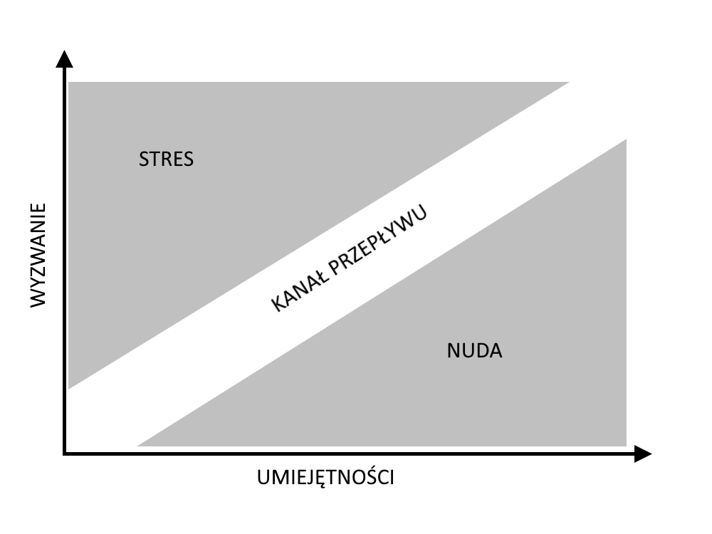
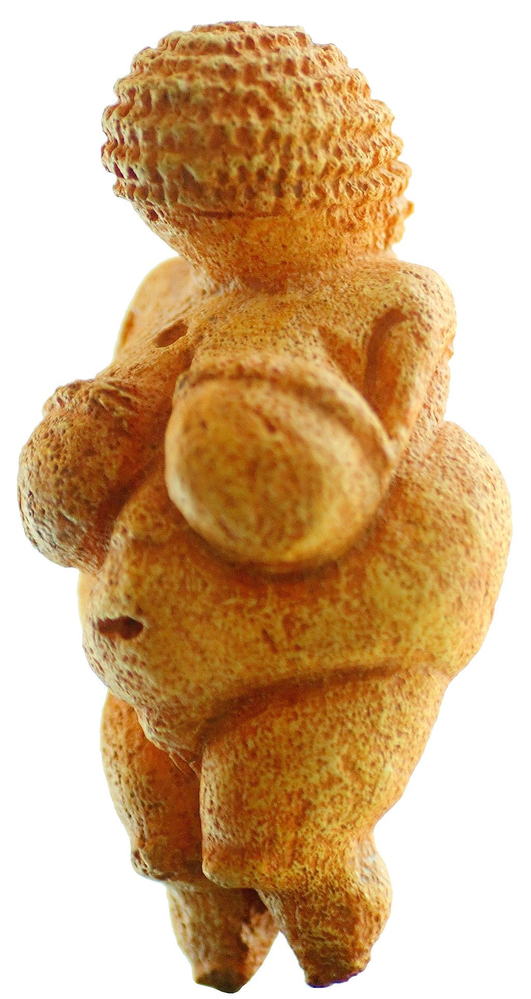

# Odcinek 2: Przepływ, metafora i rewolucja osiowa

Witajcie z powrotem. Jestem John Vervaeke, a to jest cykl wykładów na temat budzenia się z kryzysu sensu.

## Podsumowanie poprzedniego odcinka

Ostatnim razem zaczęliśmy przyglądać się historii i początkom zdolności stwarzania sensu, aby nieco rozjaśnić czym ona jest. Dziś chciałbym kontynować. Mówiliśmy o powiązaniach pomiędzy stwarzaniem sensu, polepszaniem zdolności poznawczych, odmiennych stanów świadomości i mądrością. Poruszaliśmy to w kontekście przejścia do górnego Paleolitu, podczas którego ludzie zdali się doświadczyć radykalnej zmiany - nie biologicznej, lecz w sposobie, w jaki zaczęli używać swoich zdolności poznawczych.

Mówiliśmy o ważnych koncepcjach, takich jak kognitywna egzaptacja oraz psychotechnologie oraz o tym jak przejście do górnego Paleolitu mogła być napędzana przez szamanizm, który stanowił zbiór owych psychotechnologii służących do odmieniania świadomości i kognitywnej egzaptacji ulepszonych zdolności, które już były tworzone dzięki rytuałom wymiany handlowej i rytuałom inicjacyjnym.

Poruszyliśmy też to, jak szaman stosował rozmaite strategie zaburzające, starając się odmienić sposób ujmowania, nadawania ram rzeczywistości. Ponieważ to, jak ujmujemy rzeczywistość jest z jednej strony źródłem naszej adaptacyjności - naszych zdolności odnajdywania wzorców - lecz z drugiej może być powodem zamknięcia w pewnym sposobie ujmowania lub zastosowania błędnych ram na rzeczywistość. Wtedy potrzebujemy wglądu, potrzebujemy spostrzeżenia. Poruszaliśmy to w kontekście zadania z dziewięcioma punktami, a to zaprowadziło nas do wniosku, że istnieją pewne rodzaje wiedzenia, które są niezależne od wiedzy, którą można wyrazić za pomocą stwierdzeń na temat przekonań. Istnieje rodzaj wiedzenia *jak* coś zrobić, *jak* to jest mieć daną perspektywę i *jak* to jest mieć wiedzę o czymś poprzez identyfikowanie się z tym i uczestniczenie w tym. Zacząłem wam pokazywać w jaki sposób szamańskie odmienne stany świadomości wpływały na usprawnienie i odmienianie stwarzania sensu, jak pozwalały na dokonywanie spostrzeżeń i poprawiały to, jaką pomoc mógł nieść szaman w polowaniach i uzdrawianiu - coś, co faktycznie miało spory wpływ na przetrwanie. Chciałbym pociągnąć to dalej i rozwinąć tę myśl, by kontynuować wyjaśnianie o co chodzi w szamanizmie, by bardziej uczytelnić stwarzanie sensu, mądrość, odmienne stany świadomości, różne rodzaje wiedzenia oraz jak to wszystko jest wzajemnie powiązane.

## Przepływ a szamanizm

Wśród rzeczy, które szamani zwykli robić są praktyki w znaczący sposób odmieniające ich uwagę. Jak wspomniałem, są to strategie zaburzające: pozbawianie się snu, pozbawianie się seksu, izolacja społeczna, użycie substancji psychodelicznych, przeciągłe intonacje, taniec. Wszystkie one są pomyślane w celu wywołania radykalnych zmian w pracy mózgu. Oprócz tego, jak będę się starał argumentować, szaman również wprowadza się w stan przepływu.

Przepływ stał się tematem szeroko dyskutowanym, zarówno w świecie akademickim, jak i w kulturze popularnej. To pojęcie rozpropagował Csikszentmihalyi, jego książka ["Przepływ"](https://lubimyczytac.pl/ksiazka/66626/przeplyw) wysunęła je na pierwszy plan w 1990r. Czym jest doświadczenie przepływu? Jest to doświadczenie, w którym jesteśmy "pochłonięci". Angażujemy się w zadanie, które jest bardzo wymagające. Właściwie to ma ono pewną konkretną strukturę. Stan przepływu to stan, w którym wyzwanie danej sytuacji nieznacznie przekracza nasze umiejętności. Można to przedstawić na wykresie. Oś pozioma przedstawia umiejętności, pionowa poziom wyzwania. Obszar po przekątnej Csikszentmihalyi nazywa "kanałem przepływu":

Gdy moje umiejętności (pomówimy o tym w kontekście wglądu i restrukturyzacji) są na akurat takim poziome, że mogą zostać egzaptowane i poszerzone do stopnia, w którym mogę sprostać wyzwaniu wkładając w to cały swój wysiłek - znajduję się w kanale przepływu. Gdy moje umiejętności przekraczają wyzwanie - dopada mnie nuda. Gdy wyzwanie przekracza moje możliwości - dopada mnie stres.

Zwróćmy teraz uwagę na fakt, że tym, co nas charakteryzuje, jest ogromna zdolność do sytuacyjnego uczenia się. Do stanu przepływu potrzebujemy kontekstu, w którym w miarę rosnących umiejętności środowisko odpowiada rosnącym wyzwaniem. Otóż w naszej kulturze stworzyliśmy maszyny indukujące stan przepływu. Te maszyny dostarczają sytuacji, w której nasze umiejętności ciągle się doskonalą w środowisku, które również się doskonali. Co więcej, dostarczają one bardzo ciasnej pętli sprzężenia zwrotnego pomiędzy nami a odpowiedzią środowiska. Otrzymujemy bardzo jasną informację, a porażka ma znaczenie - przynajmniej w sensie symbolicznym możemy umrzeć. Oczywiście domyślacie się, co mam na myśli - mówię o grach komputerowych. Gry wideo są jednymi z najlepszych sposobów na wprowadzanie ludzi w stan przepływu. Właśnie po części dlatego są tak uzależniające. Światowa Organizacja Zdrowia obecnie rozważa uznanie uzależnienia od gier wideo za chorobę. To właśnie dlatego, że wzbudzają stan przepływu. Uzależnienia (jeszcze do nich później wrócimy) są napędzane przez ewolucyjnie adaptacyjną maszynerię - dlatego są tak zniewalające.

Co jeszcze można robić, by znaleźć się w stanie przepływu? Można grać jazz. Można uprawiać sztuki walki - mnie się to zdarza. Pewną szczególnie interesującą czynnością, bo nie znajduje ona innego wyjaśnienia poza chęcią wejścia w stan przepływu, jest wspinaczka. Gdyby nie ten powód, wspinaczka wyglądałaby na torturę ze starożytnej mitologii greckiej. Musimy wejść na ścianę skalną, będzie to bardzo fizycznie wymagające, będzie bolało, można spaść i zranić się. I jak już wejdziemy na samą górę, musimy zejść na dół. Brzmi jak tortura. Ale wiemy, dlaczego ludzie to robią - wspinają się po skałach, bo wchodzą w stan przepływu, a stan przepływu jest doświadczeniem głęboko pozytywnym. To nie to samo, co zwykła fizyczna przyjemność - przepływ dużo bardziej wiąże się z sensem życia. Okazuje się, że im częściej doświadczamy przepływu, tym większe prawdopodobieństwo, że będziemy dobrze oceniać sensowność naszego życia, będziemy odczuwać większy dobrostan.

Przepływ ma jeszcze wiele interesujących cech. Pamiętajmy, nadal zmierzam w kierunku argumentowania, że szamanizm być może służy do trenowania wchodzenia w stan przepływu. Rzecz w tym, że przepływ jest uniwersalium. Ludzie ze wszystkich kultur, grup społeczno-ekonomicznych, obojga płci, mówiący różnymi językami, z różnych środowisk, w różnym wieku, donoszą o możliwości wejścia w stan przepływu i opisują go, szczegółowo, w niemal ten sam sposób. To jest uniwersalium, a uniwersalia są ważne w kognitywistyce. Przyglądamy się uniwersaliom, ponieważ dają one nam dogłębny wgląd w maszynerię.

Jak to jest, doświadczać przepływu? Otóż w przepływie odczuwamy głęboką jedność. Przykładowo ja uprawiam sztuki walki i gdy sparringuję się z kimś, moje poczucie połączenia z moim przeciwnikiem jest naprawdę wysokie i odczuwam to jako jedność. Idzie za tym rodzaj spontaniczności - gdy nadchodzi cios, nie myślę sobie: "Podnieś teraz rękę, John!", ruch *wypływa* ze mnie (stąd określenie: przepływ) - blok pojawia się sam. Bramkarz hokejowy wystawia dłoń - krążek jest w rękawicy. Istnieje niezwykłe uczucie zjednoczenia, a z nim powiązane jest coś jeszcze. Z jednej strony wiemy, jak w przypadku szamana męczącego się długotrwałym śpiewem, że wydatkowana jest ogromna ilość metabolicznej energii. Wkładamy w to ogromny wysiłek, a z drugiej strony wydaje się to łatwe! To właśnie owa spontaniczność. Wydaje się z nas wypływać. Czas płynie inaczej, nasze poczucie własnego ja zmienia się dramatycznie. Ludzie w stanie przepływu tracą wrażenie samoświadomości. Tej, która zawsze nam towarzyszy, samoświadomości, która zawsze, nieustannie zajmuje się naszą autobiografią: "Jak mi dziś idzie? Jak sobie radzę? Kim jestem? Co robię?". Zajmuje się zarządzaniem naszym wizerunkiem: "Jak wyglądam? Co o mnie sądzą inni? Jak sobie radzę? Czy coś mi grozi?" - całe to paplanie. A to oczywiście może wymknąć się spod kontroli, na przykład w depresji, gdy rozmyślamy o tym wszystkim, co nas przytłacza. To męczące. A w stanie przepływu - znika! Bo nie ma na to miejsca! Bo jesteśmy tak pochłonięci zadaniem. Stan przepływu jest niezwykle wyrazisty. To rodzaj jasności i jaskrawości, którą można porównać do gry komputerowej. Świat wydaje się intensywniejszy, a ludzie bardzo lubią ten stan. Nie tylko go lubią. Wygląda na to, że to wtedy pracują najlepiej.

Zatem przepływ jest doświadczeniem optymalnym w dwóch znaczeniach: jest to doświadczenie uważane przez wielu ludzi za jedno z najlepszych, jakie im się mogą przydarzyć, ale również to wtedy radzą sobie najlepiej w tym, w czym chcą się rozwijać. Dlatego wchodzenie w stan przepływu jest tak motywujące. Lecz dlaczego ten stan jest tak pozytywny? W 2013r. opublikowaliśmy wspólnie z Adrianem Bennettem i Leo Ferraro pracę, w której argumentowaliśmy jakie mechanizmy kognitywne odpowiadają za stan przepływu. Csikszentmihalyi podaje sprzyjające warunki środowiskowe: umiejętności muszą zbiegać się z wyzwaniem, musi istnieć ciasne sprzężenie pomiędzy jednostką a środowiskiem (jak w grach wideo), potrzebne są bardzo jasne informacje (nie mogą być niejednoznaczne ani mgliste), a popełnienie błędu musi mieć konsekwencje (musi być związane z jakimś kosztem). Wymienił wszystkie te czynniki oraz jak można trenować wprowadzanie się w stan przepływu. Otóż wydaje się, że jest to zbieżne z treningiem mindfulness. Im więcej trenujemy mindfulness, tym lepszą mamy zdolność w osiąganiu stanu przepływu. Lecz czy uda nam się podać wspólne wyjaśnienie tych wszystkich zjawisk? Uważam, że tak. Zarówno w zakresie fenomenologii - dlaczego nasze doświadczenie przepływu jest takie, a nie inne - jak również dlaczego poprawia ono nasze zdolności poznawcze i czemu szaman miałby chcieć poprawiać swoje zdolności poznawcze wprowadzając się w coś w rodzaju przepływu, stosując określone rytuały.

Wróćmy do wspinaczki. Przypomnijmy sobie z poprzedniego wykładu dyskusję ujmowania rzeczywistości i odnajdywania wzorców, przypomnijmy sobie zadanie z dziewięcioma punktami. Owe wzorce nie są wyłącznie szablonami w naszych umysłach, one są szablonami rozumienia rzeczywistości. Gdy podczas wspinaczki zdolność ujmowania rzeczywistości zawiedzie, jesteśmy w kropce - utknęliśmy! Nie tylko poznawczo - fizycznie utknęliśmy na ścianie! Chcąc być dobrymi wspinaczami musimy przełamywać sposób ujmowania rzeczywistości, musimy trenować przełamywanie ram: restrukturyzowanie, odmienianie tego, co jest w danej chwili istotne i wyraziste, a następnie jak się do tego dopasować. Musimy ponownie dopasowywać siebie do ściany skalnej. A po chwili musimy zrobić to znowu. I znowu. I znowu.

Weźmy inny przykład - muzyka jazzowego. Grając, podejmuje pewien schemat, bawi się nim, ale nie może robić tego zbyt długo. Co musi zrobić? Musi coś zmienić, musi dokonać restrukturyzacji. Musi przesunąć się w kierunku innego wzorca, pobawić się nim, ale z nim też nie powinien pozostać zbyt długo. Podejmuje temat, ale po chwili go odświeża, robi to znów, i znów, i znów. Czy widzicie co się dzieje w przypadku wspinacza, muzyka jazzowego, zawodnika sztuk walki? Odbywa się tutaj *kaskada spostrzeżeń*. Jedno spostrzeżenie prowadzi do następnego, które prowadzi do następnego, każde stanowi podkład dla następnego. Mówi się, że gdy dokonujemy odkrycia lub spostrzeżenia, wykrzykujemy "Acha!" oraz otrzymujemy zastrzyk energii, który jest to podobny do błysku światła. Dlatego spostrzeżenie symbolicznie przedstawia się poprzez wizerunek świecącej żarówki nad czyjąś głową - to ten błysk! Teraz wyobraźcie sobie, że owo "Acha!" wydłużamy do przeciągłego "Achaaaaaa..." - oto stan przepływu. Kaskada spostrzeżeń. Im więcej "płyniemy", tym bardziej trenujemy zdolności do spostrzeżeń i bezpośredniej interakcji z otoczeniem.

## Intuicja

W grach wideo oczywiście problemem jest fakt, że to środowisko nie jest prawdziwym światem. Ale, oczywiście, w świecie szamana płynie on przez świat realny - realny świat społeczny, realny świat ekologiczny. Ale jest coś więcej. Przepływ to nie tylko kaskada spostrzeżeń. To samo w sobie już jest świetne. Ale dzieje się coś jeszcze. Coś, co ma związek z naszą zdolnością do niejawnego uczenia się. (Zwróćcie uwagę, że choć mówię o kwestiach historycznych, jednocześnie staram się uprawiać kognitywistykę, bo jednocześnie podkreślając historię zaczynam stawiać podstawy, na których mogę zbudować wyjaśnienie strukturalno-funkcjonale.) A więc - uczenie niejawne ["implicit learning"]. Określenie to ma początki w pracach prowadzonych w latach 60-tych przez Arthura Reebera i wielu innych. Reeber starał się naprawdę zrozumieć w jaki sposób ludzie uczą się języków. Eksperyment polegał na tworzeniu zestawów arbitralnych reguł - zupełnie dowolnych, wymyślanych na poczekaniu - jak można łączyć ciągi znaków i/lub liczb. Zasada mogła brzmieć, na przykład, że nie mogą występować po sobie więcej niż trzy samogłoski lub, że spółgłoski zawsze muszą występować parami. Na tej podstawie tworzyło się ciągi długości ośmiu lub dziewięciu znaków - takiej długości, by nie dało się ich łatwo trzymać w pamięci roboczej. Następnie robiło się tak: generowało się takich ciągów bardzo wiele i pokazywało się je uczestnikom eksperymentu. Oto jeden, drugi, trzeci, itd. To była część pierwsza. W drugiej części również generowało się ciągi znaków, ale dwóch rodzajów. Część z nich była wytworzona w oparciu o ten sam zestaw reguł, co ciągi pokazywane wcześniej. Druga część to ciągi wytworzone z użyciem zupełnie innych zasad. Te dwa zestawy się mieszało. Zadanie było następujące: czy potrafisz wskazać ciągi znaków, które należą do tej samej grupy, jak pokazywane poprzednio?

Moglibyśmy się spodziewać, że nic szczególnego się nie stanie - to przecież takie losowe! Reeber jednak ustalił, że uczestnicy radzili sobie bardzo dobrze. Dużo lepiej, niż gdyby strzelali. Ludzie są w stanie powiedzieć: "Te ciągi należą do tej pierwszej grupy. Ten nie. Ten tak. Ten nie." Co interesujące, jeżeliby zapytać ich: "Dlaczego? Skąd to wiesz?", odpowiadają w dwojaki sposób. Albo stwierdzają, że nie mają pojęcia, po prostu to "czują", co brzmi dość niesamowicie, albo podają jakieś wyjaśnienie, jakąś zasadę bądź procedurę. Otóż wiadomo nam, że sami się oszukują, ponieważ podane przez nich zasady, gdyby je zastosować, nie prowadziłyby do tak dobrego wyniku, jaki sami uzyskali w eksperymencie!

Mamy zatem niesamowitą zdolność, działającą poza naszą świadomością, odnajdywania skomplikowanych wzorców w otoczeniu. Można zapytać: "Cóż z tego? Jaki ma to związek z szamanizmem?" Cierpliwości. Ostatnim razem powiedzieliśmy o tym, jak szaman wynajduje schematy - wróćmy do tego. Opowiem wam o naprawdę interesującym eksperymencie. Jest nieco badań na temat zdolności parapsychologicznych, jak zdolność "wyczuwania", że ktoś na nas patrzy. Że można wyczuć czyjś wzrok na swoich plecach i rzekomo jesteśmy w stanie z dużą trafnością powiedzieć "O! Czuję czyjś wzrok!". Wykonano faktycznie taki eksperyment: osoba siedziała w pokoju, mając zasłonięte oczy i zatkane uszy - nie była w stanie niczego wyczuć. Bez jej wiedzy do pokoju wchodził ktoś inny i patrzył na nią. Uczestnik eksperymentu nie widzi, nie słyszy, a ktoś inny na niego patrzy. Nie może niczego wyczuć. Nie wolno używać perfum, nic z tych rzeczy. Uczestnik niczego nie widzi, nie słyszy, nie czuje i tylko czeka w pokoju. Bez jego wiedzy ktoś na niego patrzy, a zadaniem uczestnika jest wskazać, czy tak się działo, czy nie. Otóż uczestnicy odpowiadali poprawnie dużo częściej, niż gdyby strzelali. Mówili "Myślę, że ktoś na mnie patrzy!" i faktycznie tak było. Oczywiście jest to dość upiorne.

Jednak później okazało się, że po niewielkiej zmianie tego eksperymentu nie udawało się powtórzyć. O co zatem chodziło? Do pomieszczenia wprowadzano osobę, a uczestnik mówił "Myślę, że ktoś na mnie patrzy!", a badacze odpowiadali mu, czy miał rację. Mówili mu, czy trafił, czy się mylił. Możecie zapytać, co z tego? Otóż sprawa wygląda tak: badaczom wydawało się, że wprowadzali osoby do pomieszczenia w sposób losowy. Okazało się, że w rzeczywistości nie robili tego w sposób losowy, bo wiecie, co jest dla istot ludzkich bardzo trudne do osiągnięcia? Losowość. Osoby były wpuszczane do pokoju według skomplikowanego wzoru. Uczestnik eksperymentu niejawnie uczył się tego wzoru, ponieważ dostawał informację zwrotną. Jeżeli usunie się informację zwrotną - nie mówi się uczestnikowi, czy miał rację - wynik nie jest lepszy od losowych odpowiedzi.

Wiele ze zdolności, które wyglądają na parapsychologiczne, w rzeczywistości są zdolnościami wychwytywania w sposób niejawny złożonych schematów w środowisku, bez udziału świadomości. Hogarth w swojej książce ["Edukacja intuicji"](https://amzn.to/2PyK09w) ["Educating Intuition"] wysuwa na ten temat naprawdę świetną tezę. Twierdzi, że to, co nazywamy intuicją, naprawdę istnieje, ale nie ma w tym niczego magicznego - jak twierdzą osoby o rzekomych zdolnościach parapsychologicznych. Intuicja jest wynikiem zdolności do niejawnego uczenia się.

Jesteśmy w stanie wychwytywać przeróżne, złożone wzorce nie wiedząc, w jaki sposób to robimy. Potrafimy je dostrzegać, nie wiemy jednak jak to się dzieje. Dlatego nasza intuicja to takie dziwne uczucie - po prostu *wiemy*. Wiemy tak wiele! Robimy to cały czas! By przywołać znany przykład, za [Dreyfusem](https://amzn.to/2PD7J8C), wiemy jak blisko kogoś możemy stać i pod jakim kątem się ustawić. Gdzie stać, w jakiej bliskości, jak być zwróconym w miarę postępu rozmowy i jak w miarę zmian kontekstu możemy się do kogoś zbliżyć lub od kogoś oddalić, jak się poruszać. Ale gdyby nas zapytać jak to robimy, nie wiemy! Możemy co najwyżej powiedzieć "Po prostu wiem, jak to robić." A jednak gdy ktoś tego nie wie, jest to niekomfortowe. Bardzo niekomfortowe!

Hogarth zauważa jeszcze coś innego na temat intuicji - coś bardzo powszechnego. Mianowicie mamy na nią dwa różne określenia, nie zdając sobie sprawy z faktu, że oba oznaczają to samo. Póki wszystko idzie dobrze, niejawne uczenie nazywamy intuicją. Ale istnieją jeszcze uprzedzenia. Gdy niejawne uczenie pójdzie źle, mówimy o przesądach. Rasista posiadł błędną intuicję na temat ras. Jak zatem niejawne uczenie może pójść nie tak? Sprawa wygląda tak. Istnieją pewne złożone wzorce w otoczeniu, a nasza zdolność niejawnego uczenia się je wychwytuje. Sęk w tym, że istnieją dwa rodzaje wzorców w naszym otoczeniu: korelacje i związki przyczynowo-skutkowe. Co mam na myśli? Korelacje występują wtedy, gdy dwa zjawiska są ze sobą powiązane. Podam przykład korelacji, której nie należy mylić ze związkiem przyczynowo-skutkowym. Istnieje korelacja pomiędzy wielkością uroczystości weselnej a długością związku małżeńskiego. Większe wesele - dłuższe małżeństwo. Byłoby głupie uważać, że powinno się wyprawić jak największe wesele, bo z faktu, że wielkie wesela są predyktorem długości związku małżeńskiego nie wynika, że wielkie wesela są *przyczyną* dłuższego trwania małżeństwa. Te fakty są jedynie skorelowane. Duże wesele jest odzwierciedleniem szerszej sieci społecznej i większych zasobów finansowych, a te dwa czynniki faktycznie wpływają na trwanie związku małżeńskiego.

Kolejny przykład. Mam już wystarczająco wiele lat, by pamiętać, jak codzienna modlitwa była wycofywana ze szkół (wychowywałem się w religijnym domu). Wielu ludziom nie podobało się to. Mówiło się, że "wycofujemy modlitwę ze szkół, a przestępczość rośnie!", itd. Nawiasem mówiąc przestępczość wcale nie rośnie - poczytajcie trochę Stevena Pinkera. Ale załóżmy, że faktycznie by tak było. To byłaby tylko korelacja. Wiecie, jaka korelacja jeszcze istnieje? Wiemy, że poziom gazów cieplarnianych wzrasta w sposób konsekwentny. (I jest to oczywiście część kryzysu środowiska naturalnego, który też poruszymy.) Co w tym samym okresie konsekwentnie *spadało*? Piractwo na Karaibach! Piraci grasujący wśród wysp Karaibów na drewnianych statkach z armatami, i tak dalej. W miarę spadku tego zjawiska rósł poziom gazów cieplarnianych. Mam nadzieję, że nikt z was nie myśli, że moglibyśmy rozwiązać problem globalnego ocieplenia przywracając piractwo.

Takich przykładów jest mnóstwo. W świecie istnieje wiele schematów, które są iluzoryczne, gdyż są zaledwie korelacjami. To nie są związki przyczynowo-skutkowe. Bigota wychwytuje schemat korelacyjny, nie przyczynowo-skutkowy. Najlepiej byłoby umieć trenować zdolność niejawnego uczenia się tak, by wychwytywać związki przyczynowo-skutkowe, które faktycznie istnieją, a nie związki korelacyjne, które są iluzoryczne. Ale pewnej rzeczy nie da się osiągnąć. Instruowanie ludzi, by świadomie wyszukiwali schematy, nie działa. Powróćmy do eksperymentu Reebera. Jeżeli uczestnika eksperymentu, w którym ma przyjrzeć się ciągom znaków, jawnie poprosi się o to, co jest celem: "Postaraj się zgadnąć zasady! Świadomie, umyślnie postaraj się zrozumieć zasady!", wynik nie będzie lepszy. Będzie gorszy!

Hogarth też to porusza w swojej książce "[Edukacja intuicji](https://amzn.to/2PyK09w)". Nie da się zastąpić niejawnego uczenia uczeniem jawnym, bo właśnie przez swą niejawność jest ono tak skuteczne. Co się da zrobić jawnie? Możemy jedynie zadbać o prawidłowy kontekst, prawidłowe czynniki środowiskowe tak, aby nasza maszyneria niejawnego uczenia łatwiej wychwytywała związki przyczynowo-skutkowe niż schematy korelacyjne. Tak, że nauczymy się dobrej intuicji zamiast złej. Jak to osiągnąć? Cóż, Hogarth twierdzi, że należy do tego podejść jak do uprawiania nauki: kontrolując kontekst. Bowiem nauka jest sposobem na rozróżnianie schematów przyczynowo-skutkowych od korelacji. Ustawia się środowisko w taki sposób, aby to rozróżnienie osiągnąć. Co to oznacza? Oznacza, że planując eksperyment staram się dokładnie wszystko mierzyć. Otrzymuję bardzo jasne informacje. Upewniam się, że zmiana w wartości jednej zmiennej jest ściśle powiązana ze zmianą innej zmiennej. Na przykład zmieniam dawkę leku i sprawdzam, czy objawy się poprawiają. Poszukuję jasnej informacji, przejrzystej informacji zwrotnej. I niepowodzenie ma znaczenie w nauce. Gdy sprawdzamy hipotezy (przy czym dbamy o to, by owo sprawdzenie było możliwe), niepowodzenie ma konsekwencje.

Teraz zauważmy rzecz następującą. Hogarth powiada coś w rodzaju: "Chcę postawić cię w sytuacji niejawnego uczenia, w której będziesz otrzymywać jasną informację zwrotną - jak w nauce - gdzie istnieje ścisłe powiązanie pomiędzy tym, co robisz a odpowiedzią środowiska, a niepowodzenie ma znaczenie." Jak w nauce. I przekonuje nas, że powinniśmy starać się przeprowadzać niejawne nauczanie w tak ukształtowanym kontekście. Otóż ja i moi współpracownicy argumentowaliśmy, że te trzy kryteria, które odmieniają intuicję w poprawne uczenie niejawne, to te same, które są potrzebne do osiągania stanu przepływu. Przejrzysta informacja, ciasna pętla sprzężenia zwrotnego, niepowodzenie ma konsekwencje. Wspinacz poszukuje i potrzebuje przejrzystych danych, natychmiastowej informacji zwrotnej, a niepowodzenie naprawdę ma konsekwencje. Tak zbudowany kontekst oznaczał będzie dużą szansę, że jego maszyneria nauczania niejawnego będzie wychwytywać schematy przyczynowe, a nie tylko korelacje.

Zobaczcie, co udało się nam zebrać. Szaman wchodzi w stan przepływu, rozwija różne techniki wprowadzania się w ten stan głębokiego zanurzenia, całkowitego płynięcia, w którym doświadcza kaskady spostrzeżeń. Uzyskuje również zwiększoną zdolność niejawnego uczenia się i wychwytuje bardzo złożone, prawdziwe wzorce w świecie. Tylko to jest wyłącznie intuicja - nie ma pojęcia, jak to się dzieje.

Zwróćmy uwagę na jeszcze jedną interesującą rzecz. Te dwie siły wzajemnie się wspierają, ponieważ spostrzeżenia dają naszemu poznaniu zdolność eksploracji w poszukiwaniu, a następnie niejawnemu uczeniu się nowych wzorców, a te nowe wzorce wzmagają umiejętność do restrukturyzacji. A następnie dalej eksplorujemy, szukając nowych wzorców, podejmujemy je, ucząc się niejawnie, a nasze zdolności rosną. Wchodzenie w stan przepływu dogłębnie poszerza nasze zdolności poznawcze. Ktoś, kto jest ekspertem we wprowadzaniu się w ten stan, będzie pożądaną osobą w grupie. Jednakowoż taki ktoś mierzy się z bardzo poważnymi wyzwaniami. Nie ma pojęcia skąd pochodzą informacje, które dostaje! Nie wie dlaczego posiada taką zdolność do wnikliwości! Odczuwa dogłębną jedność ze światem, utratę poczucia własnego ja, gdy odgrywa rolę zwierzęcia... Musicie zrozumieć, że to nie są spostrzeżenia werbalne! Jak w przypadku zadania z dziewięcioma punktami, to nie słowa, nie przekonania prowadzą do wglądu w to, jak porusza się sarna! To dokonywanie spostrzeżeń - spostrzeżeń intuicyjnych - *jak* należy rozmawiać z chorą osobą, by wywołać u niej efekt placebo, by pomóc jej się wyleczyć.

Zauważcie, co się tutaj dzieje! Zauważcie, że to jest doświadczenie nieomal mistyczne! To potężny odmienny stan świadomości. Usprawnia wasze kognitywne przetwarzanie. A szaman stwarza znaczenia, stwarza sens. Śpiewa, tańczy i opowiada historie - odmienia poczucie sensu, znaczenia, poczucie tożsamości. Leczy ludzi i przemienia ich.

## Metafora

Co to wszystko oznacza? Dlaczego miałoby to napędzać przejście do górnego Paleolitu? W pierwszej kolejności pozwala to polepszyć nasze zdolności poznawcze. Ale - by odwołać się do prac [Michaela Winkelmana](https://amzn.to/2WDXti4), a także [Matta Rossano](https://amzn.to/330Qjqp) - w owym stanie nasz mózg uczy się jak skomunikować ze sobą obszary, które zwykle ze sobą nie rozmawiają. To ma miejsce szczególnie, gdy zostało poprzedzone znaczącą strategią zaburzającą - głodówką, izolacją społeczną, braniem psychodelików - ponieważ, gdy dokona się obrazowania mózgu kogoś, kto doświadcza przeżycia psychodelicznego, widzimy, że obszary mózgu dotąd nieskomunikowane komunikują się między sobą.

Gdyby po prostu to zrobić: połączyć ze sobą obszary mózgu, które się normalnie nie komunikują, odczulibyśmy to jako szum. Lecz gdy posiadamy polepszoną zdolność do spostrzeżeń i polepszoną intuicję, możemy te rozłączne obszary zmostkować. Połączyć je. Jest to pewna zdolność, którą uważamy za oczywistą, myślimy, że jest to zwykła część naszego poznania. To jest nasza zdolność do tworzenia metafor. Słowo metafora samo w sobie jest metaforą - oznacza przenosić, łączyć. To tworzenie połączeń w miejscach, gdzie zwykle tych połączeń nie ma. Co nam trzeba teraz zrozumieć, to jak powszechne są metafory. Ostatnio o tym wspominałem - czym jest "projekt". Ale dokonajmy refleksji - "refleksja" to też metafora! - jak nasze myśli i nasz język przepełnione są metaforami (to też była metafora). Mogę, na przykład, powiedzieć "Widzisz, o co mi chodzi?", "Łapiesz?", "Pojmujesz?", "Potrafisz to objąć?", "Czy to do ciebie dociera?" - to wszystko są metafory! *Dotarliśmy do połowy* tego wykładu. Mam nadzieję, że nie jest on dla was zbyt *ciężki*. Widzicie? To jest nierozerwalnie i głęboko częścią naszego poznania.

Przywołajmy pracę [Lakoffa](https://amzn.to/2N60nJa) i innych. Mam pewne uwagi do tej teorii, ale sama idea, że nasze poznanie wypełnione jest metaforami i funkcjonuje poprzez metafory - uważam, że tak po prostu jest. Dlaczego metafora jest tak potężna? Ponieważ tym sposobem tworzymy kreatywne połączenia między pojęciami. Poznanie metaforyczne leży u podstaw zarówno nauki, jak i sztuki. Gdy szamani wzmacniają pracę tej maszynerii, łącząc obszary mózgu, które zwykle się nie komunikują, umożliwiają ogromne zwiększenie zdolności do tworzenia metafor. Jednym ze sposobów, w jaki nasze poznanie, stwarzanie znaczeń i odmienne stany świadomości zbiegają się w jedno, jest to jak nasze umysły, nasze ucieleśnione umysły, wytwarzają metafory, by spostrzegać powiązania. Właśnie dlatego gdy ktoś staje przed problemem i potrzebuje zmiany sposobu myślenia o nim, mówimy mu, by użył analogii, by pomyślał o metaforze. O to właśnie chodzi: szamani rozwijają psychotechnologie odmieniające stan świadomości, by dostać się do stanu przepływu, a ten stan już jest w stanie uczynić ich bardziej wnikliwymi i dawać im potęgę intuicji. Ale również czyni ich generatorami metafor. Dają ludziom takie formuły myślenia, które pozwalają im łączyć ze sobą koncepcje w taki sposób, żeby za pomocą znaków żłobionych w kawałku kości dało się śledzić ruch Księżyca. Wyrzeźbienie tej figurki da im połączenie z ideałami płodności:

Widzimy zatem jak wiele z tematów, które następnie rozwiniemy, wysuwa się tutaj na pierwszy plan. Jak dalece szaman splata razem i usprawnia zdolności poznawcze z odmiennymi stanami świadomości oraz zwiększa naszą umiejętność dostrzegania sensu w świecie. Dosłownie stwarzania więcej ilości znaczeń. Jeżeli jesteście członkami grupy łowiecko-zbierackiej, która posiada w swoich szeregach szamana, wasza grupa wygra rywalizację z innymi grupami, które go nie mają. To nie przypadek, że jest to powszechne. To nie przypadek, że zjawisko przepływu jest uniwersalium. Ponieważ egzaptuje ono naszą najbardziej podstawową maszynerię i potężnie ją usprawnia. Szamani doświadczają bardzo ciekawego przeżycia, rodzaju transformacji. Często doświadczają "lotu duszy", tak jakby przenosili się do innego świata i w nim szybowali. Stąd bierze się pojęcie narkotycznego "odlotu". Szaman doświadcza uczucia unoszenia się ponad światem. Dlaczego? Czemu mózg miałby generować takie wrażenie? Pomyślmy - szaman uzyskuje coraz szerszy obraz coraz bardziej złożonych wzorców - ale dzieje się to głównie intuicyjnie i metaforycznie. Gdzie musimy się znaleźć, by mieć szerszą perspektywę? Musimy się znaleźć *wyżej*. Spójrzcie jak często używamy tego między sobą. Mówimy o *nadzorze*. Ktoś, kto rządzi, sprawuje *nadzór*, *superwizję*. Widzicie? To metafory, nikłe szepty echa szamańskiego lotu, lotu ponad wszystkim - intuicyjnego, wnikliwego pojmowania, które jest metaforycznym wyrażeniem głębokiego kontaktu ze światem.

## Epoka osiowa

Podejmiemy wszystkie te tematy raz jeszcze, gdy bardziej zajmiemy się badaniem maszynerii stwarzania sensu. Ale teraz musimy kroczyć dalej. Chciałbym pomówić o jeszcze innej rewolucji. Do tej pory mówiłem o rewolucji paleolitycznej - wtedy kształtuje się maszyneria stwarzania sensu, odmienne stany świadomości, samoprzekraczanie, szybowanie ponad światem, kultywacja mądrości powiązanej z wieloma kwestiami, które uważamy za duchowe i religijne. Wszystkie się wtedy łączą - w górnym Paleolicie. Zaszła jednak jeszcze jedna ważna zmiana, która miała miejsce około 10 tys. lat p.n.e. To rewolucja neolityczna - wynalezienie rolnictwa. Rolnictwo jest ważne, ponieważ do dotychczasowej maszynerii dokłada kolejne mechanizmy utworzone w wyniku wykształcenia się złożonych społeczeństw, powstałych za sprawą osiedlania się ludzi w stałych miejscach na dłuższy okres. Ich relacje ze środowiskiem i między sobą ulegają gwałtownym zmianom, ponieważ zaczynają żyć w otoczeniu dużych grup obcych sobie ludzi.

Następuje bardzo długi okres rozwoju. Ten świat następnie przekształca się w świat starożytny, w miarę jak kamień zostaje wyparty przez metal i następuje epoka brązu - okres panowania pierwszych wielkich cywilizacji w Mezopotamii i Egipcie. W owym czasie zachodzi transformacja w postrzeganiu i doświadczaniu świata. Ludzie nadal robią to wszystko, o czym do tej pory mówiliśmy - nadal mają rytuały - oczywiście rozwinięte już w bardzo wyrafinowane, złożone systemy wierzeń. Nadal angażują się w odmienne stany świadomości. Ten świat trwa bardzo długo. Ale nasz kontakt z nim jest bardzo osobliwy! Gdybym was zapytał, czy czytaliście teksty z epoki brązu, prawdopodobnie odpowiedzielibyście, że nie! Czytaliście Epos o Gilgameszu? Pewnie nie. Czytaliście mity egipskie? Pewnie nie. Dlaczego nie? Przecież cywilizacje Sumeru, Mezopotamii i Egiptu są tytanicznie ważne! Długotrwałe! Ale zauważcie - jeżeli zapytam, czy czytaliście fragmenty Biblii lub na przykład Platona, może niektóre teksty Buddy lub Konfucjusza - prawdopodobnie tak! Z jakiegoś powodu czujecie, że ci ludzie są w jakimś sensie dla was istotni. W takim, w jakim ludzie z epoki brązu już nie są! Dlaczego? Otóż wydaje się, że zaszła kolejna wielka zmiana porównywalna z przejściem do górnego Paleolitu.

Znów, nie jest to jeden moment, a bardziej kontinuum, ale nie muszę tutaj zajmować decydującego stanowiska i nie mam pewności, że dyskusje wokół tego są zbyt owocne. Ale [Karl Jaspers](https://amzn.to/321tvp7) zdefiniował "epokę osiową". [Karen Armstrong](https://amzn.to/2JCiR1W) spopularyzowała to określenie w [niedawno wydanej książce](https://amzn.to/2JCiR1W). Otóż w okresie pomiędzy około 800 a 300 lat p.n.e. zaszła ogromna zmiana. Autorzy tworzący w tym okresie i systemy filozoficzne wtedy powstałe są dla nas zrozumiałe, czytamy te dzieła i te szkoły myślicielskie są w jakimś sensie dla nas istotne. Natomiast nie czujemy tego w stosunku do tego wszystkiego, co powstało przed upadkiem epoki brązu. Nie wydaje się to wcale - przynajmniej dla większości z nas - w istotny sposób odnosić do nas. Nie identyfikujemy się z tym. Zaszło coś, co nas ukształtowało. Podobnie jak górny Paleolit ukształtował nas jako ludzi, "epoka osiowa" ukształtowała nas jako cywilizację Zachodu, a właściwie cywilizację w ogóle, bo nie tylko na Zachodzie owa "rewolucja osiowa" ma miejsce. Ma miejsce także w Indiach oraz Chinach.

Co takiego zaszło? Skąd ta zmiana? Wiele rzeczy się dzieje, nie jesteśmy do końca pewni, są na ten temat pewne spory, ale jedno wiemy na pewno - epoka brązu załamuje się. Ukazało się na ten temat parę dobrych pozycji: Drews, książka Cline'a ["1177 przed Chr. Rok, w którym upadła cywilizacja"](https://lubimyczytac.pl/ksiazka/4852318/1177-przed-chr-rok-w-ktorym-upadla-cywilizacja). Rozmaite toczą się dyskusje nad tym dlaczego cywilizacje brązu upadły: czy była to zmiana w prowadzeniu wojen z użyciem rydwanów, ogólny upadek systemów, czy kombinacja różnych zmian w technologiach wojskowych? Nie wiadomo. Nie ma to dla nas znaczenia. Wystarczy, że wiemy o tym upadku. Musimy jednak zrozumieć powagę tego upadku.

To największy upadek cywilizacji jaki widział świat. Upadek Cesarstwa Rzymskiego nie jest nawet w przybliżeniu tak niszczycielski jak upadek epoki brązu. Największa liczba miast przestaje istnieć w tym okresie, niż kiedykolwiek w spisanej historii. Najwięcej kultur znika. Następuje największy spadek piśmienności. Największe załamanie handlu. To najbliższe apokalipsie wydarzenie w historii ludzkości. Koniec świata. Po nim następują mroczne wieki. Wcześniej istniały imperia takie, jak Egipt - tytaniczne imperia-dinozaury, ogromne i wpływowe, trwające przez wieki. Kultury trwające tysiąclecia znikają. I w rzeczy samej dzieje się coś analogicznego do następstw zagłady dinozaurów. Gdy wyginęły dinozaury, malutkie ssaki do tej pory biegające sobie w trawie, zaczynają ewoluować. Podobnie gdy imperia-dinozaury przeszły do historii, z następujących potem mrocznych wieków wyłaniają się rozmaite niewielkie społeczności. Ludzie ledwo wiążący koniec z końcem. Niezwykle ciężki to czas. Czas, gdy znów występuje presja adaptacyjna na ludzkie zdolności poznawcze. Przypomnijmy sobie wąskie gardło w Afryce poprzedzające przejście do górnego Paleolitu. Tutaj mamy do czynienia z kolejnym wąskim gardłem. Zatem ludzie są bardziej otwarci na eksperymenty. Próbują innych rzeczy niż ich przodkowie. Są gotowi na wypróbowywanie nowych form organizacji społecznej.

Co ważniejsze, zaczynają wynajdywać nowe psychotechnologie. Mówiliśmy o tym ostatnim razem, czym jest psychotechnologia - to standaryzowany sposób przetwarzania informacji, który usprawnia nasze zdolności poznawcze, łącząc ze sobą mózgi. Nasz mózg z instancjami naszego mózgu w przyszłości. Nasz mózg z mózgami innych ludzi. Otóż coś ciekawego dzieje się w jednym z obszarów, który został najbardziej dotknięty upadkiem epoki brązu, w rejonie Palestyny. W Palestynie, dzisiejszym Izraelu, Jordanie itd. Regionie dawno temu znanym jako kraina Kanaanu. Wydaje się, że to tam wynaleziono nowy rodzaj piśmienności. Pamiętacie naszą dyskusję o tym, jak potężną psychotechnologią jest piśmienność. Była ona obecna w epoce brązu - sławne egipskie hieroglify, pismo klinowe Sumerów. Sprawa z tego typu pismem wygląda tak, że bardzo trudno się go nauczyć. Trzeba było uczęszczać do specjalnych szkół przez bardzo długi czas. To mogło być zajęcie na całe życie. To była twoja praca - umieć czytać i pisać. Bycie skrybą (stąd biorą się słowa jak "skrobać"). Twoim jedynym zajęciem było bycie piśmiennym, bo piśmienność była bardzo trudna, bardzo cenna i bardzo rzadka, bo pismo ideograficzne jest niezwykle trudne. (Mam parę tatuaży z ideogramami, np. "medytować".) W krainie Kanaanu wynaleziono pismo alfabetyczne, następnie podjęte przez Fenicjan, którzy przynoszą je do Grecji, następnie alfabet kanaański niepostrzeżenie zlewa się z antycznym pismem hebrajskim i wchodzi do użytku w języku hebrajskim. To się okaże bardzo ważne. Te dwie grupy [Grecy i Hebrajczycy] będą niezwykle ważne.

Dlaczego jednak pismo alfabetyczne jest tak potężne? Dużo łatwiej jest się go nauczyć! To dużo bardziej efektywna i skuteczna psychotechnologia. Wspominałem jak piśmienność zwiększa zdolności poznawcze. Teraz mając do dyspozycji piśmienność alfabetyczną, możemy nauczyć się jej dużo lepiej i większa liczba ludzi może się nią posługiwać. Nasze zdolności uczenia się pisma, dostępność i możliwość dzielenia się korzyściami z jego użytkowania są znacznie wzmocnione. Rosną rzesze ludzi zdolnych posługiwać się pismem. Piśmienność odpowiada za coś bardzo ważnego i bardzo interesującego jeżeli chodzi o jej działanie na poczucie własnego ja i poczucie własnego poznania. Jak wspominałem, gdy potrafimy coś zapisać, możemy później wrócić do własnych myśli i prowadzić na ich temat refleksje. Stajemy się świadomi własnych myśli. I zauważcie, co jest teraz możliwe: potrafimy dużo łatwiej korygować własny sposób myślenia, ponieważ nie musimy polegać na przechowywaniu całości naszych myśli w głowie! Możemy je zapisać, uzewnętrznić, wystawić na osąd, zastanowić się nad nimi i możemy je poprawiać. Możemy je przechowywać niezależnie od naszej pamięci.

Powoli uzyskujemy umiejętność, którą [Robert Bellah](https://amzn.to/330RZAd) nazywa "myśleniem drugiego rzędu". Zacznijmy od tego, że wszyscy posiadamy zdolność do metapoznania (pomówimy o tym później). Metapoznanie to świadomość własnego umysłu. Mogę was zapytać "co myślicie" i możecie stać się tego świadomi. "Czy masz dobrą pamięć? Tak lub nie." - odpowiecie "tak" lub "nie". To właśnie metapoznanie. To wiedza na temat i świadomość własnego umysłu. Wszyscy mamy tę zdolność. Zauważcie, co się teraz dzieje. Stajemy się bardziej świadomi naszego poznania, możemy się nad nim zastanowić, poprawić je, ulepszyć, przechować, podzielić się nim z innymi. Myślenie drugiego rzędu ma miejsce wtedy, gdy uwewnętrzniamy psychotechnologię integrując ją z mechanizmami metapoznania, co usprawnia nasze zdolności krytycznej analizy naszego sposobu myślenia i jego korekcji. Myślenie drugiego rzędu wyłania się dzięki pismu alfabetycznemu.

Co jeszcze udaje się wynaleźć w tym okresie? Jest to okres przemieszczania się wielu armii w miarę odbudowy imperiów. Najbardziej znanym jest Asyria na Bliskim Wschodzie. Pożądane są ruchome armie, co skutkuje powstaniem bardzo ważnego wynalazku, który również uznajemy za oczywisty. To coś, co nosimy przy sobie (przynajmniej tak kiedyś było, wspomnimy jeszcze o tym). Pieniądze! Monety! Wynalezione zostaje bicie monet. Monety są oczywiście technologią fizyczną. Jest to coś, co nosimy przy sobie, jednak sens pieniądza jako czegoś namacalnego stał się ostatnio wątpliwy, bo większość z nas nie nosi już fizycznych pieniędzy ze sobą - pieniądz jest czymś czysto symbolicznym. I o to właśnie chodzi! Pieniądz uczy nas posługiwania się systemami zupełnie abstrakcyjnych symboli. Zaczynamy posługiwać się abstrakcyjnymi symbolami i uczymy się czegoś jeszcze - liczenia. Musimy zacząć myśleć matematycznie, a przynajmniej arytmetycznie. Zatem trenowane jest abstrakcyjne, symboliczne, logicznie ścisłe myślenie. Dzieje się to z pobudek praktycznych, ale się dzieje. Staje się gotowe na egzaptację. Piśmienność alfabetyczna powoduje wytrenowanie owego myślenia drugiego rzędu. To wszystko jest gotowe na egzaptację. Powiecie: "Rozumiem, ale cóż z tego, że te psychotechnologie trenują zdolności gotowe na egzaptację?" Cóż, gdy spotkają się myślnenie drugiego rzędu oraz myślenie abstrakcyjno-symboliczne, wspólnie staną się logicznie ściślejsze, co się okaże? Okaże się, że ludzie zaczynają coraz jaśniej rozumieć pewne dwie rzeczy na temat swpojego poznania.

Pierwsza z nich to jak dalece mogą poprawiać swoje poznanie. Jak dalece mogą się samoprzekraczać, dokonywać samotranscendencji. Zmysł samotranscendencji zostaje poprawiony. Ale co jeszcze? To również zwiększa ich świadomość tego jak dalece sami się oszukują. Jak wiele błędów znajduje się w ich zdolnościach poznawczych, których wcześniej nie byli świadomi, a teraz mając możliwości myślenia drugiego rzędu, piśmienność i myślenie abstrakcyjno-symboliczne, mogą zdać sobie z tego sprawę. Są w stanie powiązać ze sobą dwie cechy: niesamowitą zdolność samokorekcji z niesamowitą zdolnością samooszukiwania się. Więc ludzie zaczynają zachowywać się inaczej. Odmieniają poczucie własnego ja i poczucie kontaktu ze światem. Zdają sobie sprawę z bardziej osobistego poczucia odpowiedzialności, co oczywiście doprowadzi do zmiany w myśleniu o sobie samych w kategoriach moralnych.

Co mam na myśli? Podam konkretny przykład. Przed tym okresem ludzie rozumieją chaos, wojny i przemoc jako część porządku naturalnego. Po "rewolucji osiowej" wraz z nadejściem myślenia drugiego rzędu, zwiększoną świadomością samoprzekraczania i samokorekcji zaczynamy zdawać sobie sprawę, że my jesteśmy odpowiedzialni za tę przemoc. My odpowiadamy za chaos. Nie w jakimś mglistym sensie, ale z samej natury tego, jak nasze umysły stwarzają sens. To dlatego Dhammapada zaczyna się słowami "Umysł poprzedza wszystkie zjawiska". Ludzie zaczynają rozumieć, co widać w Dhammapadzie, że nie ma większego wroga niż nasz własny umysł! Ale nie ma też większego sprzymierzeńca, niż nasz własny umysł! Zaczynają rozumieć ten obosieczny miecz swoich zdolności poznawczych. Nieokiełznany prowadzi do przemocy za sprawą samooszukiwania się i ułudy. Ale zdyscyplinowany dzięki samokorekcji i samoprzekraczania prowadzi do mądrości i możliwości zmniejszenia przemocy i zmniejszenia cierpienia.

Następnym razem pomówimy więcej o tej rewolucji i tym zrozumieniu, że ludzie mają możliwość zarówno samoprzekraczania jak i samooszukiwania się oraz jak to radykalnie odmieniło ich poczucie własnego ja i kontaktu ze światem. Oraz jak to odmieniło znaczenie czym jest sens i czym jest mądrość. Dziękuję za poświęcony czas.
