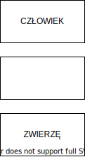
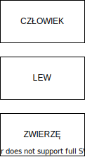

# Odcinek 5: Platon i alegoria Jaskini

Witajcie w piątym odcinku "Przebudzenia z kryzysu sensu".

## Podsumowanie poprzedniego odcinka

Ostatnim razem przyglądaliśmy się wkraczaniu Rewolucji Osiowej do starożytnej Grecji. Powtórzyliśmy naszą wiedzę o Pitagorasie, a następnie skupiliśmy się konkretnie na postaci Sokratesa i rewolucji sokratycznej. Znów obserwowaliśmy jak bardzo kwestie poczucia sensu, mądrości i samotranscendencji są ze sobą powiązane. Przyjrzeliśmy się Sokratesowi i jego szczególnemu rozumieniu mądrości, w której to, co dla nas wyraziste i istotne ściśle powiązane jest z tym, co dla nas prawdziwe i rzeczywiste. W tym rozumieniu te dwie sprawy: co nas przemienia oraz prawda o świecie, powinny być stale połączone. Przełomowa w metodzie sokratycznej jest próba wywołania u ludzi zrozumienia jak bardzo zagrożeni są rozdzieleniem tych dwóch porządków i jak bardzo przez to stają się podatni na wciskanie sobie *bullshitu*, samooszukiwanie się, oraz, że życie nękane za tą sprawą przez samozniszczenie nie jest życiem, którym warto żyć. Sposobem na umożliwienie rozkwitu człowieczeństwa jest rozwijanie umiejętności - mądrości - utrzymywania tych dwóch porządków w ścisłym powiązaniu. Sokrates tak bardzo był przekonany o powadze tej umiejętności - czynienia życia sensownym - że był gotów za nią umrzeć.

## Platon

Jak wspominałem, był pewien zwolennik Sokratesa obecny podczas jego procesu, nieobecny przy jego śmierci, jednak głęboko dotknięty tym wydarzeniem. Chodzi oczywiście o Platona. Powiedzieć, że Sokrates był kontrowersyjny, to nie powiedzieć nic o Platonie. Co roku ukazują się setki opracowań dzieł Platona. To dlatego Platon jest tak fundamentalny, nie tylko dzięki swoim ideom, ale jak zobaczymy Platon i jego prace są w pewnym sensie niewyczerpywalne. Możemy do nich powracać. Jako kultura robimy to co jakiś czas i widzimy tam coś, czego nie widzieliśmy wcześniej. Możemy znaleźć tam coś, co przemienia nas jako jednostki. Takie jest moje osobiste doświadczenie. Wracam do Platona w różnych momentach mojego życia i wtedy Platon przemawia do mnie w sposób, w jaki wcześniej tego nie robił.

Proszę, byście to zapamiętali, bo będę próbował was przekonać, że taki model rozumienia *świętości* jest o niebo lepszy niż poprzez jakąś nadnaturalną obecność. Coś jest dla nas *święte*, gdy jest niewyczerpywalnym źródłem nowych spostrzeżeń i odczytań, które mogą nas na nowo odmieniać. To z pewnością był sposób odbierania Platona podzielany przez wielu ludzi w starożytności. Wywarł na nich ogromny wpływ. Zdobyłbym się na stwierdzenie, że platonizm oraz neoplatonizm, jak przekonują Versluis i inni, stanowią fundamenty duchowości zachodniej. Wrócimy do tego.

Platon był straumatyzowany śmiercią Sokratesa. Myślę, że był tym głęboko poruszony, a myślę tak dlatego, że wciąż powraca do tego próbując zrozumieć jak to możliwe, że jego ukochane miasto, jego miasto - Ateny - mogło zgładzić tego człowieka, którego tak podziwiał i kochał. Jak to możliwe, że jego ukochane Ateny zabiły jego ukochanego Sokratesa? Otóż jeśli Sokrates stał przed dylematem danym mu przez bogów, Platon stał przed dylematem danym mu przez śmierć Sokratesa. Platon pragnął zrozumieć jak ludzie mogli być tak głupi. Próbując to osiągnąć Platon uczyni coś bardzo ważnego z ową mitologią dwóch światów, o której mówiliśmy: niższego świata, mniej prawdziwego i wyższego, prawdziwego. (Pamiętajmy nadal, że to rozumienie mitologiczne. Nie mają to być dosłownie dwa światy.) Platon odmieni tę mitologię istotnie odróżniając ją od mitologii hebrajskiej.

Pamiętacie zapewne, że Hebrajczycy rozumieli tę mitologię jako wychodzenie z niepomyślnej teraźniejszości postępując w kierunku przyszłości. Zatem podają historyczną odpowiedź na to jak przemieszczać się ze świata iluzji do świata rzeczywistości. Platon nie poda historycznego rozwiązania. Poda rozwiązanie naukowe. Jest pod głębokim wpływem filozofów przyrody, o których mówiliśmy ostatnio. Platon stworzy pierwszą teorię psychologiczną w historii. U Platona można dostrzec nie tylko początki nauki ale także początki kognitywistyki, nauki o poznaniu. Ma u niego w pewnym sensie początek psychologia. Nie rozumiem tego trywialnie: psychologia Platona jest nadal stosowalna współcześnie, o czym też powiem.

Wgryźmy się w to od razu, bo to nas zaprowadzi w kierunku owych splecionych ze sobą kwestii poczucia sensu, mądrości, samotranscendencji, odmiennych stanów świadomości, itd. Mam nadzieję pokazać wam jak Platon, próbując odpowiedzieć na pytanie dlaczego Ateny zgładziły Sokratesa, pozostawał pod wpływem nie tylko samego Sokratesa, ale także Pitagorasa. Wiemy, że Platon spędził jakiś czas ze społecznością Pitagorejczyków i prawdopodobnie pobierał tam jakiegoś rodzaju nauki.

## Psychologia Platona

Platon rozwija szczególną teorię mającą wyjaśnić dlaczego ludzie czynią głupstwa. Ma ona wiele różnych aspektów, ale warto zacząć od odnoszenia się do niej za pomocą czegoś bliskiego nam wszystkim. Będzie to doświadczenie konfliktu wewnętrznego. Konflikt wewnętrzny ma miejsce wtedy, gdy dwie silne motywacje zdają się w nas działać w opozycji. Od razu zobaczymy, jak będzie to odnosiło się do egzystencjalnego poczucia sensu w życiu, ponieważ często odczuwamy największą rozpacz, stres lub poczucie bycia uwięzionymi, gdy targa nami taki wewnętrzny konflikt. Jesteśmy w istotny sposób wewnętrznie podzieleni.

Oto klasyczny przykład. Otóż uwielbiam czekoladę. Więcej niż uwielbiam. Czekolada wywołuje we mnie... głębokie przyciąganie! Ostatnio udało mi się zrzucić 10 kilo. Poszedłem na dietę. Diety odchudzające to jedno z najbardziej bezowocnych zajęć, jakimi może się zająć człowiek. Odsetek recydywy wynosi 95%, co po naszemu oznacza, że w ciągu roku 95% ludzi, którzy poddali się diecie wraca do wagi sprzed diety. Przemysł dietetyczny ma pięcioprocentowy wskaźnik skuteczności chociaż co roku zarabia miliardy dolarów. Chciałbym, żeby mi płacili za taką skuteczność. Byłoby fajnie, gdybym mógł pozwolić sobie na odnoszenie sukcesu tylko w 5% przypadków i dostawać za to miliony dolarów. Musimy zadać sobie pytanie: dlaczego tak się dzieje? Otóż dzieje się tak ze względu na następujący problem. To tak poważna przypadłość, że ludzie chwytają się wszystkiego i zapłacą wszelkie pieniądze w nadziei, że coś temu zapobiegnie. Jak przedstawia się ten problem? (Pomówimy jeszcze o jego ujęciu kognitywnym.) Otóż wiem, że powinienem schudnąć. Oto dowody, są jasne i racjonalne. Powinienem stracić na wadze. Tak, tak. OK, powinienem schudnąć. Ale potem wracam do domu, a na blacie w kuchni stoi ciasto czekoladowe. Ciężko to wyrazić, ono tam po prostu nie stoi. Wprost pulsuje czekoladową pysznością. Przyciąga mnie jak promień grawitacyjny ze Star Treka. I co się zwykle dzieje? Zjadam ciasto czekoladowe.

Kolejny przykład, który może wam być bliski: prokrastynacja. Wiem, że moi studenci mierzą się z tym problemem. "Tak, tak. Mam pracę do oddania za dwa tygodnie. Dwa tygodnie! Zacznę pracować nad nią dzisiaj wieczorem, bo jeżeli zacznę dzisiaj, nie będę się czuł pospieszany. Jeżeli nie będę pospieszany, praca będzie dużo lepsza. Będę miał więcej czasu na przygotowanie, będę mógł zmienić zdanie. Powinienem zacząć pracować nad nią już dziś wieczorem." I ktoś was zaczepia: "Idziesz na piwo?" - "Jasne!". I już nie ma cię i okładasz.

Zatem wyraźnie jesteśmy nękani tym konfliktem wewnętrznym, a Platon dokonuje na jego temat niezwykłego odkrycia. Spostrzega, że wydaje się istnieć ścisłe połączenie między wewnętrznym konfliktem a samooszukiwaniem się. Samoniszczącym samooszukiwaniem się. Platon przedstawia pewną koncepcję, która (kolejny przypadek) stała się dla nas tak naturalna, że możemy tylko skwitować: "To oczywiste!" Ale znów, to on na to wpada! Platon proponuje koncepcję według której w naszym umyśle istnieją różne ośrodki, które mają różnego rodzaju poznawcze połączenie ze światem i motywują nas na różne sposoby. Platon przedstawia to mitologicznie. Mówi, że jest część nas, która jest jak człowiek [w oryginale "man" czyli równie dobrze "mężczyzna"]. Od razu coś wyjaśnię, bo chociaż ateńska demokracja jest niebywale seksistowska i traktuje kobiety strasznie (pamiętajmy o tym kontekście, bo intrygujące jak dalece Platon był w stanie wznieść się ponad to), to Platon uważa, że kobiety powinny rządzić na równi z mężczyznami, że powinny być zaciągane do armii tak, jak mężczyźni. Nie uwalnia się całkowicie od seksizmu, ale biorąc pod uwagę kontekst myślę, że stopień w jakim był w stanie to zrobić jest godny podziwu. [John opiera się tutaj na angielskich tłumaczeniach "Państwa" Platona, gdzie użyty był wyraz "man" oznaczający zarówno człowieka jak i mężczyznę. W polskich tłumaczeniach użyty jest po prostu "człowiek", więc problem znika, choć można spekulować jakoby bohaterowie tekstu zawsze rozumieli przez to mężczyzn.]

Tym niemniej używa on tej koncepcji "człowieka", który mieszka w naszych głowach i reprezentuje rozum. "Człowiek" jest motywowany prawdą. Tym, co prawdziwe. Obchodzą go zatem prawdziwość i fałsz, na tym mu zależy. Jeżeli chodzi o zakres czasowy - może zająć się bardzo odległymi celami. Może zajmować się bardzo abstrakcyjnymi bytami jak twoje zdrowie czy praca do napisania. Bardzo abstrakcyjnymi bytami: oto jest "zdrowie" i argument: "Powinienem zrzucić na wadze, zajmie mi to wiele miesięcy, ale muszę to zrobić, bo prawdą jest, że jeżeli zrzucę na wadze, moje zdrowie się poprawi". Dlaczego więc po prostu tego nie robię? Dlatego, że w opozycji do "człowieka" działa również "zwierzę", a ono mieszka w okolicach mojego brzucha i genitaliów, reprezentując apetyt:

Ono nie działa w oparciu o prawdziwość i fałsz. Działa w oparciu o przyjemność i ból. To zupełnie inny zestaw norm. Działanie w oparciu o przyjemność i ból nie jest złe samo w sobie. Jeżeli nie mamy takiej zdolności, jesteśmy martwi. Zatem Platon nie uważa apetytu za zło. Chce nam jednak pokazać, że "zwierzę" funkcjonuje w oparciu o inny zestaw zasad niż "człowiek": "Jakimi celami powinienem się zająć? Bezpośrednimi! Kiedy chcę zjeść ciasto? Teraz! Idę na imprezę teraz!" Działa w oparciu o bardzo powierzchowne właściwości. W cieście czekoladowym obchodzi mnie tylko, jak ono wygląda. A wygląda pysznie! Nie prowadzę żadnej dogłębnej analizy, istnieje tylko: "Zjedz! Czekoladowa, słodka pyszność!". Tak bardzo powierzchowne! Znów, nie jest to samo w sobie koniecznie złe. Czasem zdarzają się sytuacje życia i śmierci, w których powierzchowna ocena jest dokładnie tym, czego potrzeba. Nie muszę wiedzieć wiele na temat wewnętrznych mechanizmów działania tygrysa, wystarczy mi: "O cholera! Śmiercionośne! Spadam stąd!".

Zauważcie, że te części są sobie przeciwstawne. Na diagramie zostawiłem miejsce pośrodku, bo oczywiście przygotowuję was na pojawienie się trzeciej części, o której mówi Platon. Jednak zanim to zrobię chciałbym zwrócić waszą uwagę na to, jak Platon rozwija tutaj myśl Sokratesa. Sokrates właściwie nie zaproponował żadnej teorii. Interesowała go praktyka. Praktyki Sokratesa to, jak pamiętacie, sprawianie, aby ludzie zrozumieli jak często to, co znajdują wyrazistym wyprzedza to, co znajdują prawdziwym. Pamiętacie? Otóż Platon powiada: "To nie przypadek! Przyczyną dla której tak się dzieje jest fakt, że mamy różne części psychiki, które działają przeciw sobie." To "zwierzę" czyni rzeczy wyrazistymi. Chwytliwymi. Motywuje nas do pośpiechu, działania teraz. "Człowiek" to część, której używamy, by rozumować! Widzicie zatem, że to jest dokładnie to, z czym większość z nas się mierzy. To zwierzę cały czas wyprzedza to, co jesteśmy w stanie zrozumieć. Widzicie? Platon wyjaśnia dlaczego jesteśmy tak podatni na *bullshit*. Dlaczego wyrazistość często tłumi zrozumienie. Dlaczego jesteśmy nieustannie na to wrażliwi. Teraz pomówimy, dlaczego tak jest.

Wróćmy do przykładu z dietą. Co może nam pomóc w jej utrzymaniu? Są różne strategie, których można użyć, by poprawić jej skuteczność, jak się do niej nastawiamy, itd. Wrócimy do tego. Ale co takiego zwykle zwiększa szanse na zrzucenie wagi? Przyłączenie się do grupy takiej, jak "Strażnicy Wagi" [międzynarodowa organizacja zrzeszająca grupy wsparcia]. Albo przyłączenie się do kółka naukowego by wspólnie unikać prokrastynacji. Dlaczego? Otóż z ważnego powodu. Nie jesteśmy jedynie stworzeniami biologicznymi. Jak wciąż argumentuję, jesteśmy także stworzeniami kulturowymi. Jesteśmy rezultatem ewolucji, która zachodziła poprzez wiele gatunków, w toku której zostaliśmy zaprogramowani do uczenia się systemów abstrakcyjnych symboli i użycia technologii - zarówno fizycznych jak i psychotechnologii. Posiadamy zatem wiele potężnych kulturowych i społeczno-kulturowych napędów.

Platon porównał to do "lwa":

Bo lwy są społecznymi zwierzętami! Stały się również symbolem honoru, bo tak ten mechanizm działa: na zasadzie honoru i wstydu. Honor to mieć szacunek i uznanie tych, których uważamy za członków grupy. Wstyd jest wtedy, gdy czujemy, że nie zyskaliśmy szacunku grupy. Nie należy mylić wstydu z poczuciem winy. To nie są synonimy. Poczucie winy jest wtedy, gdy czujemy, że nie sprostaliśmy własnym ideałom siebie samych. Wstyd jest wtedy, gdy utraciliśmy możliwość zdobycia szacunku grupy. Co jest tutaj interesujące i o to dokładnie Platonowi chodzi - ta część nas potrafi podążać za celami o średnim zakresie. Ponieważ współpracujemy z innymi, nie interesują nas tylko sprawy bezpośrednie. Ale nie operujemy także w domenie abstrakcyjno-teoretycznej. "Lew" działa w domenie społeczno-kulturowej. Potrafi więc podążać za średnioterminowymi celami. Nie tylko krótkoterminowymi, również nie abstrakcyjno-symbolicznymi, ale społecznie uznanymi celami podzielanymi przez grupę. Działa w oparciu o aspekty kulturowe interesujących nas celów. Nie ich abstrakcyjne znaczenie, nie ich powierzchowne znaczenie, ale ich znaczenie kulturowe. Znaczenie współdzielone. W oparciu o to, jak możemy dzielić je z innymi.

Zauważcie, jak bardzo zależy wam na dzieleniu się swoim doświadczeniem z innymi ludźmi! Powtarzam to od lat. Wciąż to obserwuję u innych, nawet swoich znajomych. Ludzie robią coś takiego. Próbują jakiegoś pokarmu po raz pierwszy i mówią: "Och, to jest ohydne! Spróbuj!". Dadzą go do spróbowania komuś innemu, bo potrzebują - oprócz swojej bezpośredniej reakcji - istnienia jakiegoś współdzielonego kulturowego znaczenia tego, co dzieje się wewnątrz ich doświadczenia. I są ku temu dobre powody, bo, jak ciągle powtarzam, nasza łączność z rozproszonym poznaniem jest jednym z najpotężniejszych sposobów zwiększania naszej poznawczej władzy nad światem.

Platon umiejscawia "lwa" w klatce piersiowej. To się bierze stąd, że wiele społecznych emocji i motywacji odczuwamy w klatce piersiowej: dumę, honor i wstyd, tego typu rzeczy. Mamy teraz taki obraz:

Ten pytajnik jest dla nas problematyczny. Co powinno się tam znaleźć, między "rozumem" a "apetytem"? Greckie słowo nie ma bezpośredniego tłumaczenia, czasem wstawia się tam "emocję". To nie bardzo pasuje. Niektórzy umieszczają tam "ducha". To już bliżej, ale problem z "duchem" jest taki, że to pojęcie ma mnóstwo ezoterycznych naleciałości. Nie będę tłumaczył tego słowa. Po prostu zostawię je w oryginale. To jest nasz *thymos*. To część nas motywowana społecznie:

Platon zauważył coś bardzo interesującego. Otóż w tak przedstawionym systemie jest duży potencjał dla konfliktu. Trzeba go odpowiednio poukładać. Jeżeli tego nie zrobimy, wyrazistość, zrozumienie i partycypacja się rozjadą miedzy sobą! A wtedy staniemy się podatni na *bullshit*, staniemy się podatni na samooszukiwanie się. Im więcej doświadczamy konfliktu wewnętrznego, tym większe ryzyko samooszukiwania się, bo "człowiek" i "zwierzę" rozsynchronizowują się i wzrasta ryzyko egocentryzmu. Człowiek cierpiący, szczególnie z powodu lęku powodowanego konfliktem wewnętrznym, ma tendencje do skupiania się na sobie, a nawet samolubstwa. Bo gdy doświadczamy wewnętrznego konfliktu, otrzymujemy coś w rodzaju sygnału zagrożenia: "Coś jest nie tak." A gdy ludzie czują się zagrożeni, mają tendencje do stawania się egocentrycznymi. Jest to jednak mechanizm adaptacyjny.

Zaraz do tego wrócimy, ale chcę teraz znowu przejść na chwilę do kognitywistyki. To zrozumiałe, że posiadamy "lwa" jako jeden z motywatorów, bo jesteśmy stworzeniami społecznymi. Jedną z naszych najważniejszych zdolności adaptacyjnych jest współpraca z innymi. Gdyby mnie wrzucić w afrykańską sawannę byłbym niedługo martwy, bo nie mam ogromnych pazurów i ogromnych zębów. Czym jestem? Niedorzeczną strukturą. Kolebię się na dwóch nogach próbując utrzymać równowagę, nie potrafię szybko biegać, wszyscy mnie widzą z daleka, bo wystaję ponad trawę. Moja szyja i moje najważniejsze organy są z punktu widzenia drapieżnika smakowicie wyeksponowane. Kiepski projekt! Ale wiecie, co potrafię? Mogę skrzyknąć paru innych ludzi, weźmiemy kilka naostrzonych patyków, kilka psów i nagle możemy zabić wszystko, co chodzi po Ziemi.

## Obniżanie wartości w czasie

Nasza zdolność współpracy zawsze była mechanizmem adaptacyjnym. Stąd wiemy dlaczego "lew" znalazł się w opisie Platona. Tylko dlaczego "zwierzę" jest tak bardzo silniejsze od "człowieka"? Otóż istnieje ku temu ważny powód. Ujęte jest to w pracach Ainsliego i innych na temat "hiperbolicznego obniżania wartości" lub "obniżenia wartości w czasie". Ainslie i inni zorientowali się, że ten wzorzec zachowania istnieje w wielu gatunkach. Nie tylko ludzie tak robią. Można to znaleźć także u innych gatunków. Jest jeszcze bardziej uniwersalny niż przepływ. Nie jest powszechny tylko między ludźmi, jest powszechny międzygatunkowo. Jest to zatem mechanizm głęboko adaptacyjny.

Tak wygląda ten mechanizm:

Oś pionowa oznacza obniżanie wartości, co może być trochę mylące. Obniżanie mierzy jak bardzo redukowana jest wyrazistość bodźca. Im wyższe obniżanie wartości, tym jest mniej wyraźny, tym mniej się wyróżnia, tym mniej zwraca naszą uwagę. Oś pozioma to czas z naszego punktu widzenia. Po lewej mamy teraźniejszość, po prawej przyszłość.

Próbuję wam pokazać, jak działa to obniżanie wartości, czyli jak bardzo dany bodziec traci wyrazistość. Obniżanie wartości rośnie z czasem mierzonym od teraz. Zatem bodziec występujący teraz jest bardzo wyraźny - pamiętacie co myśli "zwierzę"? A to, co zdarzy się w przyszłości, szczególnie w dalekiej przyszłości, jest dużo mniej wyraźne. To dlatego "zwierzę" pokonuje "człowieka". Ale czemu? Dlaczego posiadamy ten mechanizm? Okazuje się, że jest on dalece adaptacyjny. Dlatego jest tak powszechny. W jaki sposób jest adaptacyjny? Wyobraźcie sobie siebie w takiej sytuacji. Nie palę. Odchudzam się, ale nie palę, lecz przypuśćmy, żebym palił. W tej chwili staję przed wyborem: zapalić papierosa czy nie? Przedstawmy to graficznie:

Ta jedna decyzja może mieć dwa bezpośrednie rezultaty, przykładowo dostanę kaszlu lub nie, albo coś w tym stylu. Pokazuję to w ogromnym uproszczeniu! Nie próbuję powiedzieć, że każda decyzja ma dwa możliwe rezultaty, chcę tylko w uproszczeniu pokazać, jakie jest sedno tego, co próbuję powiedzieć. Otóż prawdopodobieństwo tego zdarzenia wynosi 100% bo aktualnie się dzieje - trzymam papierosa w ręku i myślę, czy zapalić. Prawdopodobieństwo każdej z konsekwencji zapalenia papierosa - "kaszel" lub "brak kaszlu" - przyjmijmy, że 50%. Następujące po tym efekty już mają prawdopodobieństwo 25%, itd.:

 Widzicie, co się dzieje - w miarę jak przesuwamy się w kierunku przyszłości, prawdopodobieństwo każdego indywidualnego zdarzenia spada bardzo szybko. A teraz w czym rzecz. To mechanizm adaptacyjny. Powinniśmy poświęcać mniej uwagi zdarzeniom, których zaistnienie jest mniej prawdopodobne. To akurat ma sens. Im mniej prawdopodobne zdarzenie, tym mniej nas powinno obchodzić. Wyobraźcie sobie co by było, gdybyście tak nie mieli! Wyobraźcie sobie, gdybyście nie potrafili odfiltrować zdarzeń mało prawdopodobnych! Pomyślcie jak bylibyście przytłoczeni ogromem możliwości: "Gdy wstanę z łóżka mogę lekko skręcić kostkę, co może mnie spowolnić w drodze na zajęcia. Jeżeli spóźnię się na zajęcia, może to źle wpłynąć na moją ocenę. A to może sprawić, że nie zaliczę tych zajęć. A jak nie dostanę zaliczenia, mogę wylecieć ze studiów, co pogrąży moją karierę. Skończę w Buffalo ożeniony z lampą!" To niedorzeczne, prawda? Ale nie niemożliwe. Może poza ostatnią częścią. Nie można się ożenić z lampą.

Mam nawet pewną hipotezę. Myślę, że jedną z rzeczy, która nie działa odpowiednio u ludzi z uogólnionym zaburzeniem lękowym jest właśnie obniżanie wartości w czasie. Nie odfiltrowuje i nie zmniejsza wyraźności potencjalnych bodźców, które są mało prawdopodobnymi wydarzeniami w przyszłości. Zatem ludziom z wysokim poziomem lęku wydają się wyraziste rzeczy, które takie być nie powinny. Wydarzenia mało prawdopodobne wydają im się zbyt możliwe. To jest mechanizm adaptacyjny. Dlatego go posiadamy. Ale jest z nim pewien problem. To problem, jaki występuje w przypadku każdej maszynerii adaptacyjnej i zobaczycie później dlaczego tak jest.

Powróćmy do przykładu z paleniem papierosów. Na rysunku poniżej zaznaczyłem dwa wydarzenia. Jeżeli będę palił, długi łańcuch rozwidlających się prawdopodobieństw może mnie doprowadzić do śmierci w Hamilton. To jest wydarzenie polegające na tym, że umieram mieszkając w Hamilton z rakiem w moim lewym płucu. Drugie to moja śmierć w Toronto z rakiem w obu płucach. Inna kropka oznacza śmierć w Burlington, itd. Różne okoliczności śmierci.

Teraz w czym rzecz? Każda z tych okoliczności z osobna ma małe prawdopodobieństwo wystąpienia. Widzicie to? Każda z tych szczegółowych śmierci jest mało prawdopodobna. Ale charakteryzuję się czymś szczególnym i idę o zakład, że wy też. Nie chcę tylko uniknąć śmierci w Hamilton - choć to byłaby bardzo kiepska śmierć (jestem z Hamilton więc mogę sobie pozwolić na ten żart) - chcę uniknąć śmierci w ogóle! Chcę uniknąć wszystkich tych śmierci. Pomyślcie uważnie - użyję tego w rozumieniu technicznym, ale ścisłym - chcę uniknąć *abstrakcyjnej* śmierci. Nie chcę uniknąć tej śmierci, tamtej, czy innej. Chcę uniknąć wszystkich możliwych śmierci. Chcę uniknąć śmierci *wyabstrahowanej*.

Popatrzcie. Ryzyko każdej szczegółowej śmierci jest niskie. Ale jeżeli zebrać je razem okazuje się, że ryzyko przedwczesnej śmierci spowodowane paleniem papierosów jest bardzo wysokie. Co to dla mnie oznacza? Hiperboliczne obniżanie wartości oślepia mnie na to konkretne zdarzenie, bo jest bardzo mało prawdopodobne. Oślepia mnie na tamto konkretne zdarzenie, bo jest mało prawdopodobne. Oślepia mnie na każdą z czerwonych kropek, bo każda z osobna jest bardzo mało prawdopodobna. Ale oślepiając mnie na nie wszystkie, wiecie na co jeszcze hiperboliczne obniżanie wartości mnie oślepia? Na to, co mają ze sobą wspólnego. Oślepia mnie na to, co mają ze sobą wspólnego, a tym czymś jest przedwczesna śmierć. Oślepiając mnie na część wspólną - to, co współdzielą *abstrakcyjnie* - ta adaptacyjna maszyneria sprawia, że zaciągam się ponownie papierosem, a to ustawia mnie na kurs ku raku lub rozedmie płuc.

Widzicie? Zapamiętajcie to. Do tego motywu będziemy wracać wielokrotnie. Wspomniałem o tym już przy okazji stanu przepływu. Ta sama maszyneria, która odpowiada za naszą adaptację, czyni z nas ofiary samooszukiwania się i zachowania prowadzącego do samozniszczenia. Jednym z zadań poczucia sensu i mądrości jest siłowanie się z tą nieuniknioną rzeczywistością. Nieunikniona rzeczywistość jest taka, że nie możemy się tego pozbyć. Nie możemy wyrzucić tej maszynerii, bo bez niej jesteśmy zgubieni. Nie potrafilibyśmy wyjść z łóżka przez paraliżujący lęk. Nie możemy się jej pozbyć, ale nie możemy też pozwolić jej działać bez nadzoru, bo wtedy zaciągamy się papierosem, pochłaniamy ciasto czekoladowe, idziemy na imprezę i krzywdzimy się, oszukując siebie samych i samych siebie niszcząc.

Co więc powinniśmy zrobić? To, że "zwierzę" istnieje jest faktem. To, czego potrzebujemy, już rozwinęliśmy w toku ewolucji. Szczególnie w płacie czołowym. To zdolność abstrakcyjnego myślenia. Wyabstrahowania tego, co wspólne w dalekiej przyszłości i symbolicznego przedstawienia tego sobie samym. To jest rola "człowieka". "Człowiek" może pojąć abstrakcyjną myśl unikania przedwczesnej śmierci. Ale "człowiek" jest tak słaby! Jest tak słaby specjalnie, bo nie chcemy wcale, by mógł to wszystko wyłączyć! Potrzebujemy, by mógł to pokonać, ale w minimalnym stopniu, bo taki balans jest adaptacyjnie stosowny. Platon ma niebywałą rację! Właściwie to uważam, że Platon ma rację do tego stopnia, że wciąż odkrywamy podział przez niego wprowadzony. Freud dzieli psychikę na trzy części: superego, ego oraz id. W latach dziewięćdziesiątych istniał trend w neuronauce mówienia o trzech kompleksach w mózgu: [gadzim, paleo-ssaczym i neo-ssaczym](https://en.wikipedia.org/wiki/Triune_brain). Wciąż ponownie odkrywamy ten platoński podział.

## Strategia optymalizacyjna

Jednak Platon wpadł na pewien interesujący pomysł. Stwierdził, że przecież "człowiek" może się uczyć. Jest w stanie pojmować teorię, abstrakcyjno-symboliczne przedstawienie problemu, przed którym stoimy. "Lew" sam w sobie nie rozumie teorii, ale "lwa" da się wytresować. Można użyć rozumu by wytresować "lwa". Jak tego dokonać? Tutaj widać zastosowanie myśli Sokratesa i dlaczego Platon pisał dialogi. Bo Sokrates wyprowadził rozum na arenę społeczną. Sokrates wychodzi na rynek i dialoguje z ludźmi. Zachodzi interakcja społeczna, która zostaje pożeniona z racjonalną refleksją i inspirowaniem ludzi tak, by przezwyciężyli samooszukiwanie się. Zatem używając metody sokratycznej "człowiek" może wytrenować "lwa". A "lew" wespół z "człowiekiem" mogą oswoić "zwierzę". Nie zabić! Oswoić. Potrzebujemy tego nauczania "człowieka", tresury "lwa" i oswajania "zwierzęcia" w konkretnym celu - by zmniejszyć konflikt wewnętrzny. Na tyle, na ile to możliwe.

Platon opisuje mądrość jako wewnętrzną *sprawiedliwość* panującą w psychice, co oznacza stan, w którym "człowieka" udało się nauczyć, "lwa" wytresować, a "zwierzę" okiełznać tak, aby wszystkie te części dogadywały się na tyle, na ile to możliwe. Jest to znane pod pojęciem *strategii optymalizacyjnej*. Jeżeli zezwalam "zwierzęciu" rządzić, wszystkie pozostałe części ulegają skurczeniu. Zamiast tego powinienem dążyć do właściwej koordynacji mojej psychiki, aby każda z jej części mogła żyć zaznając maksymalnej swobody nie zagrażając przy tym dwu pozostałym. Gdy się osiągnie ten stan wewnętrznej harmonii, optymalnej relacji, w której każda z części ma swobodę życia bez zagrażania innym, ten stan pełni wzajemnej egzystencji, to dla Platona oznacza doświadczać pełni istnienia. To jest bycie tak w pełni żywym, jak to tylko możliwe. To także doświadczanie rodzaju spokoju, bo zmniejszyliśmy nasz wewnętrzny konflikt.

Pragnienie tego spokoju jest niezwykle potężne. Jednym z naszych meta-napędów (oprócz wszystkich pozostałych) jest dążenie do życia bez konfliktu wewnętrznego. Chcemy żyć w zgodzie z samymi sobą. To jest oczywiście potężny meta-napęd, pod który można się podpiąć. Bo jeżeli mamy silne dążenie w nas samych ku uzyskaniu tej wewnętrznej sprawiedliwości, do realizacji mądrości, do uzyskania owej pełni istnienia, możemy się do niego odwołać. Mogę się do niego odwołać za pomocą metody sokratycznej. Ale zauważcie pewną ważną prawidłowość. W miarę zmniejszania wewnętrznego konfliktu, zmniejszam także samooszukiwanie się. A także w miarę zmniejszania wewnętrznego konfliktu staję się mniej egocentryczny. Oba te procesy dają mi lepszy kontakt z rzeczywistością. Zmniejszam wewnętrzny konflikt, ale tym samym uzyskuję wyraźniejszy obraz rzeczywistości, bo spadają moje samooszukiwanie się i egocentryzm. To ma znaczenie ponieważ, jak widzieliśmy, chcemy mieć kontakt z rzeczywistością. Posiadamy taki meta-napęd. Filozofowie mają w swoim arsenale wiele eksperymentów myślowych, które to pokazują.

Jednym z nich, którym się czasem posiłkuję jest ten. Wyobraźcie sobie rzecz następującą. Wracacie do domu pewnego razu, a wasi rodzice mówią wam: "Chodź, chcemy ci coś pokazać." Prowadzą was korytarzem, którym chodziliście już tysiące razy. Naciskają tajemne miejsce na ścianie, które nigdy dla was nic szczególnego nie znaczyło, po czym otwierają się drzwi do pokoju z ekranami telewizyjnymi, wewnątrz są kasety wideo i wasze zdjęcia ze wszystkich etapów waszego życia. I mówią wam to: "Zanim się urodziłeś, zostaliśmy wynajęci przez rząd, żeby cię wychować. To wszystko część eksperymentu. Rząd dał nam scenariusze do zapamiętania. Wszystko to robiliśmy w ramach rządowego eksperymentu. Tak naprawdę nie kochamy cię ani nie troszczymy się o ciebie. Podążaliśmy tylko za scenariuszem. Wykonywaliśmy swoją pracę zleconą nam przez rząd. Ale skoro skończyłeś 21 lat, jesteśmy zobowiązani wyjawić ci prawdę. Nie obchodzisz nas wcale! Ale musimy kontynuować po opuszczeniu pokoju. Możesz o tym wszystkim zapomnieć, jeżeli chcesz... Będziemy nadal mówić to wszystko, co do tej pory mówiliśmy. Jak bardzo cię kochamy. Zapewnimy spełnienie twoich potrzeb. Ale teraz wiedz, że nic z tego nie odzwierciedla naszych prawdziwych uczuć. Ok?". Pytam wtedy ludzi, jak by się czuli? I odpowiadają: "Byłbym zdruzgotany!" Ale przecież nic się nie zmieniło! Nadal będą mówili ci to samo! Nadal będą traktowali cię tak samo! A oni odpowiadają na to: "Ale to już nie jest *prawdziwe*.".

Robię też czasem coś takiego. Pytam: "Jak wielu z was jest obecnie w satysfakcjonujących związkach osobistych?" Sporo ludzi podnosi ręce. Pytam wtedy: "Jak wielu z was wolałoby wiedzieć, że wasz partner was zdradza nawet, jeżeli oznaczałoby to koniec waszego związku?" Prawie wszyscy podnoszą ręce. Są gotowi na zniszczenie swojego związku, który daje im tak wiele szczęścia, bo nie chcą, by było to sztuczne. Chcą, by to było prawdziwe. Pomówimy później dlaczego ta potrzeba, aby rzeczy były prawdziwe, jest tak ważna. Ale teraz chcę, abyście zrozumieli o co tutaj chodzi Platonowi. Zauważcie, że w modelu platońskim oba meta-napędy są zaspokojone. Zmniejszamy konflikt wewnętrzny oraz zyskujemy lepszy kontakt z rzeczywistością. To się samo napędza. Stajemy się lepsi w wychwytywaniu prawdziwych wzorców w świecie. Nasze umiejętności odnajdywania prawdziwych wzorców polepszają się, ponieważ wyostrza nam się wzrok, możemy lepiej je śledzić. Ale co to oznacza? Otóż w miarę, jak uzyskujemy więcej wewnętrznego spokoju, jesteśmy w stanie dostrzegać więcej prawdziwych wzorców. Zyskujemy tę umiejętność, polepszony wzrok. Ale co możemy jeszcze zrobić? Oczywiście możemy zastosować te umiejętności na nas! Uzyskać sokratyczną wiedzę o sobie samych. W miarę jak stajemy się lepsi w wykrywaniu prawdziwych wzorców, możemy używać tego na nas samych. Możemy uzyskać lepszą wiedzę o sobie.

Zdobywając lepszą wiedzę o sobie, mogę lepiej nauczyć "człowieka". By być dobrym nauczycielem, muszę lepiej poznać swojego ucznia. Wiedząc coraz więcej o sobie mogę uczyć "człowieka", mogę lepiej wytresować "lwa", mogę lepiej oswoić "zwierzę". Zauważcie, co się dzieje: poprawiam się nieco w mojej umiejętności wykrywania prawdziwych wzorców. Używam tego na sobie samym by ulepszyć moją wiedzę o sobie samym i znajdywać bardziej prawdziwe wzorce, co oznacza, że zmniejszam wewnętrzny konflikt. Zmniejszając wewnętrzny konflikt uzyskuję jaśniejszy obraz rzeczywistości. Zyskując jaśniejszy obraz rzeczywistości, staję się lepszy w dostrzeganiu prawdziwych wzorców, co sprawia, że poprawiam wiedzę o sobie samym, co skutkuje zmniejszeniem wewnętrznego konfliktu... Widzicie, co się dzieje? To się może samo napędzać. Te dwie strony wpływają na siebie nawzajem, wzmacniają się i ulepszają. A to jest wspaniałe, bo stajemy się mniej wewnętrznie skonfliktowani i uzyskujemy lepszy kontakt z rzeczywistością:

## Alegoria Jaskini

Platon jest autorem sławnej alegorii. Przypowieści. Mitu. W sensie, którego używam w tym cyklu wykładów. Nazywa się go przypowieścią o lub alegorią Jaskini. Jest to sposób opisywania procesu, który właśnie przeanalizowaliśmy. Zauważcie i zapamiętajcie jak bardzo transformacja samego siebie jest powiązana z zyskiwaniem lepszego kontaktu z rzeczywistością. To rodzaj wiedzenia partycypacyjnego. Nie stoimy poza rzeczywistością jako niezaangażowani obserwatorzy, formułujący prawdziwe na jej temat przekonania. Musimy się przeistoczyć aby móc widzieć prawdziwy świat, co ten świat zmienia, co z kolei stawia nam nowe wymagania ponownego się przeistoczenia. W miarę jak odmieniam siebie, świat objawia mi się w nowy sposób, itd. To jest wiedzenie partycypacyjne. Nie tylko zmieniam zdanie. Nie tylko zmieniam swój umysł. To nie jest wiedzenie angażujące wyłącznie mój umysł, to jest wiedzenie angażujące całą maszynerię mojego "ja".

Czym jest mit Platona? Można go przedstawić graficznie:

Pod powierzchnię prowadzi korytarz, który kończy się pieczarą. Wewnątrz płonie ogień. Ludzie przykuci są łańcuchami do krzeseł tak, że jedyne, co mogą robić, to patrzeć na ścianę jaskini. Inni ludzie znajdują się między nimi a ogniem i rzucają cienie na ścianę jaskini. Przykuci widzą cienie i słyszą echa. A Platon powiada, że ci ludzie biorą cienie i echa za prawdziwe, bo są przykuci. Są uwięzieni. Jednak ktoś z nich może się uwolnić. Co robi ten człowiek? Obraca się i widzi ogień. To pozwala mu zrozumieć, że cienie i echa nie są prawdziwymi rzeczami. Są tylko cieniami i echami. W ten sposób jego umiejętność spostrzegania prawdziwych wzorców - w odróżnieniu od wzorców zaledwie korelacyjnych - jest odmieniona. Pamiętacie - mówiliśmy o tym! Ludzie zaczynają widzieć. Zaczynają rozumieć, że takie są prawdziwe wzorce, w odróżnieniu od tych, o których myśleli, że są prawdziwe. Nabierają smaku na rzeczywistość, a ten smak oznacza, że zaczynają się rozglądać i badać otoczenie. Wtedy zdają sobie sprawę, że jest jeszcze korytarz, z którego dobiega światło i podejmują się wyprawy w górę. Zobaczcie, jak ta wyprawa wygląda. Gdy robią krok naprzód, są oślepiani przez światło. Muszą zaczekać, aż ich oczy się przyzwyczają. Muszą doznać odmienienia. I jak już ich oczy będą dostosowane do światła, widzą dokąd iść i mogą wykonać następny krok. Ale znów są oślepieni... Zachodzi ów powolny proces o którym Platon wciąż powtarza. Na różnych etapach muszą się zatrzymywać, bo są oślepieni, dostosowują się, znów są oślepieni, znów się dostosowują i zyskują umiejętność widzenia, której do tej pory nie mieli! To ta partycypacyjna transformacja, o której mówiłem.

<!--  -->

Ostatecznie wychodzą na powierzchnię i rozglądają się. Czego szukają? Chcą poznać źródło prawdziwego światła. Światła, które pozwoli im dostrzec prawdziwe wzorce. Skąd pochodzi to światło, które ukazuje prawdziwość rzeczy? I nie tylko ukazuje prawdziwość rzeczy. To światło jest źródłem istnienia tych rzeczy. Gdzie to źródło zrozumienia i światła? Rozglądają się i oczywiście dostrzegają jedynie kątem oka, bo nie mogą patrzeć na nie wprost, Słońce. Jest przytłaczające. Jest poza zasięgiem ich zrozumienia. Ale widzą je i przepełnia je ono rodzajem podziwu i strachu. Oczywiście zaraz schodzą szybko tunelem w dół, a gdy tam docierają, próbują opowiedzieć swoim współwięźniom, co widzieli. Ale rzecz jasna potykają się i przewracają, bo ich oczy nie działają już w ciemności. I opowiadają rzeczy, które dla tych ludzi nie mają żadnego sensu. A ci z kolei drwią z nich, a jakby mogli, zabiliby tych, którym udało się oswobodzić. To oczywiście aluzja do Sokratesa.

Po pierwsze zauważcie, że wbrew temu, co się uważa, "oświecenie" nie jest jedynie wschodnią koncepcją. Mit Jaskini jest mitem oświecenia - wschodzenia w kierunku światła. To mit samotranscendencji i samotransformacji. To jest mit - w takim rozumieniu, o jakim mówiłem - wchodzenia w coraz lepszy kontakt z rzeczywistością. Zobaczcie! Ta opowieść mówi w jaki sposób odnajdujemy prawdziwe wzorce, które stawiają nam wyzwanie, oślepiają nas! Ale wtedy zmieniamy się, by je pojąć, dzięki czemu możemy iść dalej i skonfrontować się znów z prawdziwymi wzorcami. Przechodzimy ten cykl, o którym mówiłem. Na to "wschodzenie" istnieje greckie określenie *anagoge*. To jest *anagogiczny* aspekt koncepcji Platona.

Zobaczcie, czego Platon dokonuje. Przemieszczanie się między światem iluzji a światem prawdziwym przeobraża w przepis na to, jak my sami możemy czynić nasze życie racjonalnie bardziej sensownym. Możemy żyć większą pełnią życia, w większym spokoju w połączeniu z zyskiwaniem lepszego rozeznania w prawdziwych wzorcach, które tworzą rzeczywistość. Możemy zaspokoić zarazem nasze pragnienie, nasz meta-napęd ku wewnętrznemu spokojowi jak i nasz meta-napęd do kontaktu z rzeczywistością tak, by się wzajemnie wspierały. To Platon nazywa mądrością. Pełnią istnienia. Stajemy się coraz bardziej prawdziwi w miarę stawania się coraz bardziej pogodzonymi, coraz bardziej potrafiąc dostrzegać i spełniać prawdziwe wzorce. Współdostosowujemy się z rzeczywistością. Możecie powiedzieć: "Co za głupa opowiastka!". Czy na pewno? Czy aby na pewno? A co z opowiastką z 1999r.? Oto mamy ludzi uwięzionych w świecie cieni i nierzeczywistości. Ten świat nazywa się "Matrix". Ludzie ci muszą zostać obudzeni i wprowadzeni w rzeczywisty świat, a główny bohater nazywa się "Neo", od *neoplatonizmu*: "Nowy Człowiek". Ludzie pędzili obejrzeć ten film, a to przecież jest Jaskinia opowiedziana z użyciem fantastycznych sztuk walki, ciekawego science-fiction i efektów specjalnych!

Ta przypowieść - to rozumiem przez prawdziwy mit! To nie jest opowieść z przeszłości. Idziecie zobaczyć "Matrix" dlatego, i dlatego nadal się go ogląda i o nim dyskutuje, że to mit. On was woła. Przemawia do was, bo traktuje o odwiecznych problemach, przed którymi stajecie. Problemem stałego konfliktu w waszej psychice. Problemem uwięzienia w iluzji, braku kontaktu z rzeczywistością. Przedstawia możliwość uwolnienia i samotranscendencji, uzyskania spełnienia i sensu w życiu. To mit mądrości, który jest odwiecznie stosowny, bo nie opowiada o przeszłości. Opowiada o tym, co się dzieje w was tu i teraz.

Chciałbym, abyście zauważyli parę rzeczy. Po pierwsze to, jak rozum i duchowość nie są tutaj sobie przeciwstawne. Są nierozerwalnie powiązane. Zauważcie, jak Platon zestawia Sokratesa z Pitagorasem. Sokratesa, bo on uczy jak "człowiek" może nauczać "lwa", jak zdać sobie sprawę z własnej głupoty. Pitagorasa, bo jest tu samotranscendencja, wznoszenie się ponad samych siebie, radykalna przemiana świadomości, o której tak wiele opowiadał. Jest to tak urzekający, wzbogacający i wzmacniający mit - odwieczna przypowieść - że stanie się nieustannie powracającym motywem w historii Zachodu. Będzie się do niego wracać wielokrotnie.

