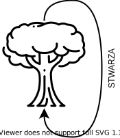

# Odcinek 6: Arystoteles, Kant i ewolucja

Witajcie z powrotem w "Przebudzeniu z kryzysu sensu".

## Podsumowanie poprzedniego odcinka

Poprzednio omawialiśmy ważne i fundamentalne osiągnięcia Platona. Gramatyka cywilizacji Zachodu składa się w zasadzie z Biblii i Platona. Będziemy do obu z nich powracać na różne sposoby. Mówiliśmy o koncepcji mądrości według Platona oraz jak obejmuje ona pewien proces wewnętrznego wyrównywania psychiki w celu zmniejszenia wewnętrznego konfliktu i zmniejszenia samooszukiwania się powodowanego wciskaniem sobie *bullshitu* oraz jak to umożliwia nam spełnienie jednego z naszych meta-pragnień - pragnienia wewnętrznego spokoju - ale również jak możemy połączyć to ograniczanie samooszukiwania się z zyskiwaniem lepszego kontaktu z rzeczywistością. Następnie jak ćwicząc śledzenie prawdziwych wzorców w świecie możemy tę zdolność refleksyjnie zinternalizować i zastosować na samych sobie. Istnieje wewnętrzny związek pomiędzy naszym poznaniem świata a naszym poznaniem samych siebie. Ulepszając zdolność wychwytywania prawdziwych wzorców możemy polepszyć wiedzę o sobie samych, ograniczyć samooszukiwanie się, zwiększyć nasz kontakt z rzeczywistością, płynnie łącząc to wszystko w procesie *anagoge*. To powoduje zaspokojenie drugiego z naszych meta-pragnień, którym jest poczucie kontaktu z rzeczywistością.

Zatem koncepcja mądrości Platona zawiera się w owym *anagogicznym* procesie, który omawialiśmy w kontekście jego wielkiej przypowieści, przypowieści o Jaskini. Zwróciłem potem uwagę, że podobnie jak Sokrates miał szczęście zyskać wielkiego następcę w osobie Platona, Platon miał szczęście zyskać wielkiego następcę w osobie Arystotelesa. Arystoteles jest dla nas przełomowy, ponieważ kładzie fundamenty pod kolejne aspekty naukowego podejścia do mądrości i poczucia sensu oraz formalizuje sposób w jaki dokonujemy głębokiego połączenia między własnym "ja" a rzeczywistością, o czym powiemy w kontekście "dostrojenia światopoglądowego".

## Arystoteles i zmiana

Jak wspominałem, Arystoteles był uczniem Platona. Pobierał nauki u Platona przez około dwadzieścia lat, ale w końcu odłączył się od niego, sławnie stwierdzając, że "Platon przyjacielem, lecz większą przyjaciółką prawda". Arystoteles, jak wielu wciąż przekonuje, np. Gerson i inni, pozostaje w pewnym sensie platonikiem. Ale dostrzegał u Platona pewne istotne braki. Platon nie dokonał zadowalającego opisu zmiany. Arystoteles był pod głębokim wpływem platońskiego opisu dlaczego coś jawi się nam jako prawdziwe. Sądził jednak, że Platonowi nie udało się właściwie opisać zmiany. Wynajdzie więc pewne istotne koncepcje, które staną się integralną częścią naszego sposobu rozumienia co to znaczy mieć sensowny kontakt z rzeczywistością.

Na Arystotelesa wpływ miał również jego ojciec, który był lekarzem. Stąd Arystoteles jest w większej mierze biologiem niż matematykiem, zatem w odróżnieniu od Platona, który miał tendencje do tworzenia analogii matematycznych, będzie on korzystał z analogii biologicznych. Z tego powodu myślę, że słowo, którego używa, mówiąc o "zmianie" lepiej tłumaczyć jako "wzrost" lub "rozwój". Arystotelesa bardzo interesowało to, jak żywe organizmy wzrastają, jak się rozwijają. Tu powinno nam coś zaświtać, bo, jak sądzę, częścią tego, co rozumiemy mówiąc, że mamy "sensowne życie", jest nasz "wzrost" i "rozwój". Zwróćmy uwagę jak często ludzie używają słowa "rozwój" by wskazać poprawę sensu ich życia i własnej mądrości. Wracając, Arystoteles podejmuje platońską koncepcję *eidos*. Jeżeli dobrze pamiętacie, ostatnim razem mówiliśmy o tym: ptak jest czymś więcej niż tylko zestawem jego cech. To nie tylko dziób i garść piór. Jest jeszcze ów *Gestalt*. To ta strukturalno-funkcjonalna organizacja, która sprawia, że wszystkie części działają wspólnie jako całość, w efekcie dając coś, co zachowuje się jak ptak.

Okazuje się, że ten schemat, ów *logos* czy *eidos*, bardzo ciężko ubrać w słowa. Ale jest czymś, co spełnia dla nas dwie funkcje. To on sprawia, że ptak jest ptakiem. Ale również jest wzorcem, który umożliwia nam rozpoznanie ptaka. Gdy możemy pojąć strukturalno-funkcjonalną organizację - ów *eidos* - wtedy rozumiemy, czym jest ptak. Arystotelesa to ujęło, ale chciał nadać temu bardziej dynamiczny opis. Pragnął opisu w kategoriach rozwoju. Interesowało go zatem, jak wspominałem, jak rzeczy wzrastają. Zauważył jaką owa forma gra rolę we wzrastaniu i rozwoju. Zaczął od podania analogii. Używał analogii przedmiotów wykonanych przez ludzi do zrozumienia organizmów biologicznych. Weźmy, na przykład, kawałek drewna, z którego mógłbym wykonać krzesło, a może stół, a jeżeli drewna jest dosyć, być może statek lub łódź. Arystoteles zapytał: "Co sprawia, że drewno zachowuje się jak krzesło, a nie jak stół lub statek?". Stąd bierze się pojęcie "aktualności" [lub "faktyczności"]. Często używamy słowa "faktyczny" by określać coś rzeczywistego: pytać, czy coś jest "faktyczne" to pytać, czy jest rzeczywiste w odróżnieniu od oszustwa czy symulacji. [John korzysta z wieloznaczności słowa "actual", którego jednym ze znaczeń jest "faktyczny". W polskiej nomenklaturze filozoficznej przyjęło się jednak używać predykatu "aktualny" w odniesieniu do bytu rzeczywistego w rozumieniu Arystotelesa.] Co zatem czyni krzesło krzesłem? Jak to się dzieje, że drewno zachowuje się raz jak krzesło, raz jak stół, a raz jak statek? Arystoteles wskazuje, że zachodzi ważna zmiana, która jest dobrą analogią rozwoju. Wykonywanie krzesła jest w jakiś sposób analogiczne do procesu wzrastania organizmu:

Co zatem sprawia, że drewno zachowuje się raz jak krzesło, a raz jak stół? Arystoteles powiada, że to forma. Znów, ma on na myśli *eidos* a nie "kształt", chociaż kształtu można użyć jako analogii. To ta strukturalno-funkcjonalna organizacja. Drewno jest tak strukturalno-funkcjonalnie zorganizowane, że będzie funkcjonowało jako krzesło. Przy innej strukturalno-funkcjonalnej organizacji będzie funkcjonowało jako stół, przy jeszcze innej jako statek:

Arystoteles nie uważa, że ten budulec, drewno, sam w sobie nie odgrywa żadnej roli, ale znajduje na niego ważne określenie. Stwierdza, że drewno tutaj jest "potencjałem". Te pojęcia, "aktualny" i "potencjalny" pochodzą od Arystotelesa. Używamy ich codziennie [znów, "actual" jest słowem potocznym w języku angielskim, w języku polskim używamy słów takich jak "faktyczny" czy "rzeczywisty"], sądząc, że są po prostu częścią naszego naturalnego słownika, ale tak naprawdę są wynalazkami Arystotelesa. Zobaczymy jeszcze jak ważnymi.

Zatem drewno jest *potencjalnie* krzesłem. Drewno jest *potencjalnie* stołem. Drewno jest *potencjalnie* statkiem. Jeżeli temu potencjałowi zostanie nadana konkretna forma, zaczyna zachowywać się jak krzesło, stół, statek. Stąd bierzemy pojęcie *formowania*. Nadajemy czemuś formę aktualizując potencjał tego czegoś, innymi słowy nadajemy temu strukturalno-funkcjonalną organizację, aby to coś zachowywało się w konkretny sposób. To ważne! Następnie Arystoteles zaproponował, że organizmy żywe dokonują tego na samych sobie. Pamiętajcie, że to tylko analogia, ale żywy organizm jest jak krzesło, które samo siebie konstruuje. Wyobraźcie sobie, ażeby krzesło mogło jakimś sposobem narzucać strukturalno-funkcjonalną organizację drewnu tak, aby to drewno przemieniało się w krzesło. To dokładnie robią organizmy żywe! Jedzą! Jedzenie to potencjalni *my*. Wkładamy w siebie pokarm, *transformujemy* go - w naszym DNA znajduje się kod, który nadaje pokarmowi pewną formę, nakłada nań strukturalno-funkcjonalną organizację, tworząc nas. Oczywiście to rozwija się w czasie. Nie dzieje się to tak, o! Dlatego widzimy to jako wzrost i rozwój. To niezwykle ważne, ponieważ, jak się przekonamy, stanie się to fundamentalne dla zrozumienia naszego kontaktu ze światem.

## Kant i błędne koło

W jaki sposób możemy użyć tego do zrozumienia ludzkiego kontaktu ze światem, jak rozwijają się i wzrastają jako podmioty poznawcze? Najpierw odstąpię na moment od Arystotelesa i Epoki Osiowej, by omówić pewien ważny sposób rozumienia rozwoju i zmiany. Chodzi konkretnie o dorobek Alicii Juarrero, bezpośrednio zainspirowany modelem arystotelesowskim.

Mówiąc o zmianie zwykle używamy modelu odziedziczonego po rewolucji naukowej. Modelu pochodzącego od Newtona. W tym modelu zmiana zachodzi w wyniku ciągu przyczynowo-skutkowego. Standardowo widzimy to tak: filiżanka stoi na biurku, przesuwam ją. Dlaczego się przemieściła? Przemieściła się dlatego, że ją przesunąłem. Wygląda to na oczywiste i niekontrowersyjne, prawda? Podajemy więc wyjaśnienie: "przemieściła się, *ponieważ* została popchnięta". Stąd wnioskujemy, że ogół zmian i rozwoju następuje w ciągu zdarzeń, np. A, B i C, gdzie A wywołało B, a B wywołało C:

Zdarzenie A poprzedza B i je wywołuje, następnie B poprzedza C i je wywołuje. W miarę rozwoju myśli Newtona w rewolucji naukowej ten sposób rozumienia jak rzeczy się dzieją staje się dominujący. Przyjęty zostanie przez zwolenników newtonowskiego światopoglądu. Warto zwrócić uwagę, że ten sposób rozumienia zdarzeń zdawał się rozwiązywać mnóstwo zagadnień. Podjął to znany filozof Immanuel Kant, do którego odwołuje się Alicia Juarrero. Zajmowało go dlaczego model newtonowski odnosił taki sukces. Model arystotelesowski istniał przez tysiąclecia - dlaczego wypierany był przez model Newtona?

Kant odpowiada, że ten model daje nam coś wspaniałego: prosty sposób wyjaśniania zjawisk. Mogę wyjaśnić zdarzenie C pokazując, że było ono poprzedzone zdarzeniem B, które spowodowało zdarzenie C. Z kolei zdarzenie B było poprzedzone zdarzeniem A, które je spowodowało. Bardzo eleganckie, liniowe, czyste wyjaśnienie. Możecie się zdziwić, że w ogóle o tym dyskutujemy, skoro to tak oczywiste! Ale jak próbowałem wielokrotnie pokazywać, wiele z tego, co uznajemy za oczywiste i naturalne, to w rzeczywistości historyczne wynalazki. Musimy zwracać uwagę na proces, który sprawił, że tak myślimy.

Dlaczego to takie ważne? Bo model newtonowski zapobiega pewnej kategorii pustych wyjaśnień. Zapobiega błędnemu kołu. Ta linia między A i B zapobiega błędnym kołom. Błędne koło ma miejsce wtedy, gdy w naszym rozumowaniu zakładamy tę samą rzecz, którą chcemy wyjaśnić.

Pokażę standardowy przykład. Ludziom się zdarza tak rozumować całkiem nieświadomie. Widzimy trójkąt gdzieś w świecie, światło wpada do naszego oka, zamieniane jest na sygnały nerwowe, wchodzi do naszej świadomości, gdzie jakimś sposobem jest wyświetlane na wewnętrznym ekranie, pojawia się na nim trójkąt i mamy takiego małego człowieczka, który wykrzykuje: "Trójkąt!":

Istnieją bardziej rozbudowane wersje tego argumentu, jak centralny system wykonawczy. To jest nazywane teorią homunkuluarną. Homunkulus oznacza "człowieczka". Gdy się to przedstawi w taki sposób, mam nadzieję, że widzicie w jak oczywisty sposób jest to bezużyteczne, bo powinniście natychmiast zapytać jak zatem ten człowieczek widzi ten wewnętrzny trójkąt? Cóż, w głowie tego człowieczka jest jeszcze mniejszy ekran z jeszcze mniejszym człowieczkiem, który wykrzykuje: "Trójkącik!":

A ten mniejszy jak widzi? "Trójkącik!":

Widzicie, co się tutaj dzieje? Wpadamy w nieskończoną pętlę ponieważ używamy wzroku by próbować wyjaśnić wzrok. Pamiętajcie o tym pojęciu homunkularnego błędu w argumentacji, bo to dokładnie ma tutaj miejsce. Chociaż łatwo to wyjaśnić, musicie zrozumieć, że bardzo często popełniamy ten błąd próbując wyjaśnić i zrozumieć samych siebie. Wyjaśnienie z użyciem homunkulusa jest błędnym kołem w argumentacji, ponieważ używa się czegoś do wyjaśnienia tego czegoś. Kant uważał, że model newtonowski jest wspaniały, bo gdy trzymać się jego gramatyki, gdy trzymać się jego zasad, przyczyną zawsze musi być niezależne zdarzenie poprzedzające. Tym sposobem nie wpada się w błędne koło. To niesamowite!

To, co się stało przed zdarzeniem A jest problematyczne. Co było na początku? Może Bóg? Kant odpowiada: "Nie!", na co podaje szereg argumentów, ale nie będę w nie teraz wnikał. Wystarczy powiedzieć, że model przyczynowo-skutkowy stał się dominującym sposobem wyjaśniania porządku rzeczy. Ale Kant napotkał na bardzo znaczący problem. Nieprzypadkowo ma on związek z tym wszystkim, o czym mówiliśmy w kontekście Arystotelesa, czyli z tymi rzeczami, które mogą wzrastać. Otóż Kant wyszedł na zewnątrz i zobaczył drzewo. Stało się to dla niego bardzo problematyczne, bo drzewa nie spełniają modelu Newtona. Dlaczego? Kant patrzył na drzewo i kontemplował: "Co stwarza drzewo? Naturalnie światło słoneczne! Jak światło słoneczne wchodzi w drzewo? Poprzez liście! A co stwarza liście? Cóż, to samo drzewo! Czyli drzewo stwarza liście, a liście stwarzają drzewo! Zatem drzewo stwarza drzewo!". Wprowadził pojęcie "samoorganizacji". Drzewo jest samozorganizowane. Problem polega na tym, że organizmy żywe korzystają ze *sprzężenia zwrotnego*. W sprzężeniu zwrotnym wyjście z układu skierowane jest doń z powrotem. Drzewo stwarza liście, które zbierają energię, która zwracana jest do procesu stwarzania liści. Organizmy żywe są samozorganizowane. Korzystają ze sprzężeń zwrotnych, ale jeżelibym chciał podać wyjaśnienie sprzężenia zwrotnego, wpadam w błędne koło:

Wpadam w błędne koło! Zatem Kant doszedł do zaskakującego wniosku. Doszedł do wniosku, że nauka o istotach żywych jest niemożliwa. Że biologia jest niemożliwa. Kant odznaczał się ogromnym intelektem, był geniuszem. Geniuszem filozoficznym. Nie można tego argumentu tak po prostu odrzucić: "Oczywiście, że biologia istnieje, co za idiota z tego Kanta!" Nie, nie! To my musimy cofnąć się i zastanowić nad tym, gdzie leży błąd w argumentacji. Bo skoro biologia istnieje, nie ma co do tego wątpliwości, oraz skoro istoty żywe korzystają ze sprzężeń zwrotnych, co do czego również nie ma wątpliwości - są samozorganizowane - a próbując prześledzić ciąg przyczynowo-skutkowy wpadam w błędne koło, a wyjaśnienia oparte o błędne koło są puste - to gdzie myli się Kant?

## Teoria samoorganizacji Alicii Juarrero

To właśnie podejmuje Alicia Juarrero i stwierdza, że przez bardzo długi czas nie mieliśmy sposobu na rozwiązanie tego zagadnienia. Przez długi czas istniała wyrwa pomiędzy fizyką a biologią. Czemu o tym dyskutujemy? Otóż jeżeli chcemy zrozumieć Arystotelesa, jeżeli pragniemy głęboko pojąć co to oznacza, że istnieją organizmy żywe, które wzrastają i rozwijają się, a rozwój i wzrost są nieodłączną częścią naszego poczucia sensu i naszego poczucia kim i czym jesteśmy - naszej osobistej tożsamości... Jeżeli nie potrafimy rozwiązać tego paradoksu, nie będziemy potrafili zrozumieć, na fundamentalnym poziomie, kim i czym jesteśmy i o czym my w ogóle, do cholery, rozmawiamy, mówiąc, jak ważne są dla nas wzrost i rozwój! Bo ten język na zawsze pozostanie rozłączny od jakiegokolwiek naukowego zrozumienia! Gdzie zatem tkwi błąd? Diagram z drzewem wydaje się sensowny. Żywe istoty są sprzężeniami zwrotnymi. Są samozorganizowane. Wzrastają, rozwijają się, stwarzają same siebie!

Co musi wylecieć? Cóż, to:

Zanim podskoczycie wykrzykując: "Ale to właśnie jest przyczynowość!", pomyślcie, że w istocie wiemy, wiemy na pewno, że ostatecznie Newton się mylił! Model Newtona nie jest kompatybilny z teorią względności. Nie działa na poziomie kwantowym. Wiemy zatem, że nie powinniśmy być absolutnie oddani temu poglądowi. Juarrero zaczerpnęła pewną ważną koncepcję od Arystotelesa, by rozwiązać ten problem. Używa Arystotelesa by wyjaśnić pewien nowy sposób mówienia o wzroście, rozwoju i samoorganizujących się procesach, który znany jest jako "teoria układów dynamicznych".

Po pierwsze, Juarrero wprowadza rozróżnienie pomiędzy "przyczynami" a "ograniczeniami". By dobrać się do tego rozróżnienia, wróćmy do czegoś, co wydaje się oczywiste. Weźmy obiekt, na przykład filiżankę. Gdy ją popchnę, przesunie się:

Dlaczego się przesunęła? Momentalnie odruchowo odwołujemy się do gramatyki newtonowskiej: "Przesunęła się, bo ją popchnąłeś!". Możemy także wykroczyć poza fizykę i powiedzieć, że chciałem ją popchnąć, ale nie o to chodzi, bo mógł w nią uderzyć jakis inny obiekt i to mógł być powód przesunięcia. Dlaczego jeszcze się przesunęła? Pomyślcie, co jeszcze musi być prawdą, by mogła się przesunąć. Musi istnieć za nią wolna przestrzeń:

Powierzchnia stołu musi mieć odpowiedni kształt. Filiżanka musi mieć odpowiedni kształt. To nie są zdarzenia! To są okoliczności. Przyczyny to zdarzenia, które sprawiają, że coś się dzieje. Ograniczenia to nie zdarzenia, to okoliczności! Nie sprawiają, że coś się dzieje, one coś umożliwiają. Pomiędzy ograniczeniami a zdarzeniami są ogromne różnice. Newtonowski sposób myślenia tak bardzo zafiksowuje nas na ciągach przyczynowo skutkowych, tak bardzo wychodzi to na pierwszy plan, że nie widzimy znaczenia ograniczeń. Jednak Arystoteles, będąc platonikiem, tak naprawdę uważa okoliczności i ograniczenia za ważniejsze. Dlaczego? Ponieważ gdy mówię o strukturalno-funkcjonalnej organizacji, gdy mówię o wzorcu, mam na myśli ograniczenia, okoliczności i możliwości:

To w tym drugim mechanizmie znajdujemy *formę*. Czasem nazywa się to "przyczyną formalną". Tutaj znajdujemy strukturalno-funkcjonalną organizację. Ograniczenia są strukturalnie i funkcjonalnie zorganizowane tak, że przemieszczenie filiżanki jest możliwe. To ważne, bo pierwszy mechanizm to aktualność, a z drugiego czerpiemy potencjał do kształtowania możliwości. To mam na myśli, mówiąc, że coś jest potencjalne. Mam przez to na myśli, że z użyciem ograniczeń zostały ukształtowane takie możliwości, że jedne zdarzenia są bardziej prawdopodobne od innych.

Popracujemy nad tym jeszcze, ale możemy się na chwilę zatrzymać, by docenić jak ten opis już zaczyna rozwiązywać problem samostwarzającego się drzewa i jego samoorganizacji. W drzewie zachodzi szereg zdarzeń biochemicznych. Te zdarzenia są powodem utrzymywania pewnej formy, formuły lub strukturalno-funkcjonalnej organizacji. Zastanówcie się teraz nad tym - dlaczego drzewa wzrastają w taki sposób, w jaki wzrastają? Dlaczego się rozpościerają? Dlaczego rozkładają gałęzie? Dlaczego rozpościerają liście? Ponieważ próbują wpłynąć na prawdopodobieństwo, że foton uderzy w cząsteczkę chlorofilu. Struktura drzewa kształtuje prawdopodobieństwo zdarzeń, a zdarzenia są przyczyną tej struktury. Sprawiają ją. Ale forma ogranicza zdarzenia.

Spójrzcie na mnie - jestem żyjącą istotą. W środku mnie zachodzi mnóstwo różnych zdarzeń. One tworzą strukturalno-funkcjonalną organizację. Ta organizacja stwarza wewnętrzne środowisko, w którym prawdopodobieństwo zdarzeń jest radykalnie zmienione. Zdarzenia, które mają bardzo małe prawdopodobieństwo zachodzenia poza mną mają wysokie prawdopodobieństwo zachodzenia we mnie. A zdarzenia, które mają wysokie prawdopodobieństwo zachodzenia poza mną mają niskie prawdopodobieństwo zachodzenia we mnie. O to chodzi w byciu żyjącą istotą. Zdarzenia stwarzają strukturę - strukturalno-funkcjonalną organizację, *eidos*, *formę* - a to ogranicza zdarzenia. To nie jest błędne koło, bo mówię o dwóch różnych mechanizmach. Mówię o aktualności i potencjności:

Musimy sobie zdać sprawę z czegoś na temat tej dyskusji o możliwościach. Być może wielu z was uważa to za zbyt abstrakcyjne, ale tak naprawdę jest to integralna część nauki. Nauka opiera się na założeniu, że potencjał jest czymś prawdziwym. Potencjalność jest realna. Spójrzmy, oto obiekt, który się porusza - podnoszę filiżankę. W trakcie ruchu posiada pewną energię kinetyczną:

Gdy ją zatrzymam, czy niszczę całą energię kinetyczną? Otóż energia kinetyczna została energią potencjalną. Jeżeli zasada zachowania masy i energii jest prawdziwa, również prawdziwa jest potencjalność. Spójrzcie na to, coś z Newtona:

Czy to jest zdarzenie? Czy jest to coś, co dzieje się o, tam, w tej chwili? Czy to się zdarza w każdy wtorek o czwartej? To nie jest zdarzenie. To jest sposób, w jaki kształtują się okoliczności. Nakłada ograniczenia na to, co jest w świecie możliwe. Dyskutowanie o realnej potencjalności to nie dyskutowanie o fikcji czy abstrakcji, to dyskutowanie o czymś, co jest nieodłączną częścią bieżącej nauki.

## Teoria ewolucji

Jeszcze nie skończyliśmy, bo Juarrero zauważa, że istnieją dwa rodzaje ograniczeń. Dzięki temu nasze wyjaśnienia staną się jeszcze bardziej wyrafinowane. Istnieją ograniczenia, które czynią pewne rodzaje zdarzeń bardziej prawdopodobnymi. Nazywa je ona "ograniczeniami sprzyjającymi" [enabling constraints]. Oprócz nich są ograniczenia, które zmniejszają prawdopodobieństwo, redukują możliwości w układzie. To są "ograniczenia wybiórcze" [selective constraints]. To nam da bardzo potężny sposób rozumienia rozwoju. Użyjmy tego za Juarrero by pomówić o jednej z najważniejszych teorii rozwoju i zmiany, jednym z wielkich wyróżników nauki. Właściwie jest to teoria fundamentalna nauk biologicznych. Chodzi oczywiście o teorię doboru naturalnego, teorię ewolucji Darwina. Darwinowska teoria ewolucji jest prawdopodobnie pierwszą teorią układów dynamicznych w nauce i jest teorią zaprojektowaną specjalnie w celu wyjaśnienia wzrostu i rozwoju. Oczywiście nie w ramach jednostki, lecz w toku rozwoju gatunków.

Rzućmy okiem na tę teorię. Musimy najpierw poszukać sprzężenia zwrotnego, bo każda teoria układu dynamicznego musi takie sprzężenie zwrotne posiadać, aby opisywała układ samozorganizowany. O jakim sprzężeniu zwrotnym zatem mówi teoria ewolucji? Oczywiście mamy seksualną reprodukcję. Skąd biorą się kozy? Z innych kóz. Kozy się rozmnażają. Są produktem i wchodzą z powrotem do układu, stając się producentem. Robią więcej i więcej kóz, które robią więcej i więcej kóz, itd. Dlatego nazywamy to *re*produkcją. To sprzężenie zwrotne. Z czego Darwin zdał sobie sprawę? Otóż zauważył, że na ten proces są nałożone wybiórcze ograniczenia. Jakie? Niedostatek zasobów. Co ciekawe, przyglądałem się niektórym teoriom rozwoju wczesnego życia i niektórzy biolodzy twierdzą, że ewolucja nie zachodziła przez pierwsze 800 milionów lat ponieważ u zarania życia nie występował niedostatek zasobów. Niedostatek zasobów oznacza, że istnieje rywalizacja. Oznacza, że nie wszystko może przeżyć. I to ogranicza możliwości w układzie.

Dobrze. Czyli dobór naturalny ogranicza możliwości. Ale to nie wszystko! Gdyby działo się tylko to, wszystko by zwyczajnie w końcu umarło. Ewolucja zakończyłaby się i tak się faktycznie zdarza. Mówimy o przypadkach wyginięcia. Jest coś jeszcze. Są sprzyjające ograniczenia, które otwierają układ na nowe możliwości. Rozejrzyjcie sę. Popatrzcie na siebie i na innyc ludzi. Istnieje różnorodność. Znaczna różnorodność. Różnorodność zwiększa możlwości w układzie. Spójrzcie, co się dzieje. Mamy tego rodzaju pętlę zwrotną:

W miarę kręcenia się układu w tym cyklu ograniczenia wybiórcze zmniejszają dostępne możliwości, a różnorodność je otwiera. Można o tym pomyśleć jak o modelu harmonijkowym - różnorodność otwiera układ, a wybiórcze ograniczenia go składają. Potem otwiera się znów i znów jest składany, i tak w kółko. W miarę tego cyklu układ nieustannie się zmienia, lepiej dopasowując się do otoczenia. To właśnie jest ewolucja. Słowo "ewolucja" oznacza "obrót" lub "toczenie się". To ciągły obrót ze zmianą.

## Silnik wirtualny

Zobaczcie, co wam próbuję pokazać, jak to wszystko jest ważne! Chciałbym być Karolem Darwinem! To jest jedna z ogromnych teorii. Mógł podróżować sobie po świecie, odwiedzał niesamowite miejsca, a po powrocie stworzył teorię, która zmieniła świat! To po prostu niezwykłe! Mimo wszystko zauważcie jak dalece ta darwinowska teoria, która stała się fundamentem biologii, zawdzięcza Arystotelesowi. Jak bardzo opiera się na arystotelesowskich koncepcjach.

Juarrero opisuje część cyklu odpowiadającą za ograniczenia wybiórcze mianem "wirtualnego regulatora". Regulator to każde urządzenie, które ogranicza, co można w ramach układu zrobić, na przykład regulator silnika parowego ogranicza zakres obrotów. Juarrero używa określenia "wirtualny regulator", bo nie chodzi o faktyczną maszynę, tylko o kształtowanie możliwości. Tutaj się zatrzymuje. W ramach pracy, którą wykonałem wspólnie z Leo Ferraro, Andersonem Toddem i Richardem Wu uważamy, że powinna kontynuować i dokończyć tę metaforę. Część cyklu, która tworzy sprzyjające okoliczności jest "wirtualnym generatorem", ponieważ jest to zestaw ograniczeń, które wytwarzają możliwości dla samozorganizowanego układu. A teraz rozważmy pewną koncepcję - gdy zestawić ze sobą w sposób systematyczny wirtualny regulator z wirtualnym generatorem tak, że systematycznie regulowana jest pętla sprzężenia zwrotnego, cały ten układ jest *wirtualnym silnikiem*.

