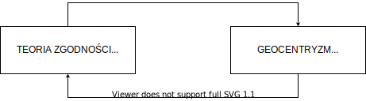

# Odcinek 7: Światopogląd Arystotelesa i Erich Fromm

Witajcie z powrotem w "Przebudzeniu z Kryzysu Sensu".

## Podsumowanie poprzedniego odcinka

Ostatnim razem rozpoczęliśmy dyskusję o Arystotelesie i o tym jak znacząco przyczynił się on do naszego rozumienia sensu i mądrości. Mówiliśmy o tym jak Arystotelesa w szczególności zajmowało coś, czego adekwatnego opisu brakowało mu u Platona: zmiana. Co ważne, arystotelesowskie określenie na zmianę lepiej jest rozumieć w kategoriach wzrostu i rozwoju. Mówiliśmy także jak dalece nasze poczucie wzrostu i rozwoju przyczyniają się do znajdowania naszego życia pełnym sensu. Poruszyliśmy też jak Arystoteles rozumiał ów rozwój używając platońskiej koncepcji _eidos_, formy, strukturalno-funkcjonalnej organizacji oraz jak zmiana i rozwój polegają na _in-formowaniu_ czegoś. Konkretnie, materiał taki jak drewno ma potencjał bycia krzesłem lub stołem, a gdy posiada poprawną strukturalno-funkcjonalną organizację, wtedy to drewno zaczyna zachowywać się jak stół lub zachowywać się jak krzesło. To zarys idei, według której gdy potencjałowi zostanie nadana forma, zostaje zrealizowany w pewien określony przedmiot, czyli zmiana jest realizacją potencjału poprzez _in-formowanie_. Następnie, by to lepiej zrozumieć, przeskoczyliśmy naprzód by przyjrzeć się bieżącemu opisowi wzrostu i rozwoju, który jest bezpośrednio inspirowany Arystotelesem. Przyjrzeliśmy się pracy Alicii Juarrero i przedyskutowaliśmy czym jest układ dynamiczny oraz jak możemy tego opisu użyć do zrozumienia wzrostu i rozwoju posługując się pojęciem "silnika wirtualnego". Następnie powróciliśmy do Arystotelesa i użyliśmy tego języka by lepiej zrozumieć jego sposób rozumienia mądrości jako pielęgnowania charakteru, gdzie mądrością jest stwarzanie wirtualnego silnika. A pomiędzy wirtualnym silnikiem a pielęgnowaniem cnót [łac. virtus] istnieje głębokie połączenie.

Mądrość to kultywowanie wirtualnego silnika, charakteru, który reguluje nasz samorozwój, a właściwie nasze samostwarzanie się, abyśmy mogli zrealizować nasz potencjał. Możemy _wznieść się_ na poziom naszych możliwości, ale co takiego to "wznoszenie się" oznacza? Oznacza, o czym mówiliśmy, poruszanie się poprzez hierarchę, którą opisaliśmy ostatnim razem. Hierarchę aktualizacji potencjału od pospolitej rośliny poprzez istotę ruchomą do istoty myślącej aż do istoty racjonalnej. Zatem być mądrym to wznosić się do własnego potencjału, to kultywować charakter, który w największym stopniu pomaga nam realizować naszą zdolność do racjonalnej autorefleksji. Naszą zdolność do wzięcia w posiadanie i przejęcia kontroli nad samorealizacją. I by robić to tak, aby wypełnić potencjał naszego człowieczeństwa, w jak największym stopniu realizując, odkrywając i zdając sobie sprawę z przymiotów, które są unikalne dla nas jako ludzi. A głupotą jest niepielęgnowanie charakteru we właściwym stopniu, tak że nawet posiadając właściwy zestaw przekonań, będąc przekonanymi, że czegoś się robić nie powinno, i tak padamy ofiarą _akrasii_, ponieważ nie dość poświęciliśmy się kultywacji właściwego charakteru.

Następnie postawiłem wam dwa wyzwania. Jedno, byście spróbowali zreanimować i pogłębić te pojęcia, których co dzień używamy mówić jak pełne sensu jest nasze życie, korzystając z języka wzrostu i rozwoju, samorealizacji, wznoszenia się na poziom własnych możliwości. Pogłębić je powracając i przemyśliwując je raz jeszcze wspomagając się Arystotelesem. Drugie to wyzwanie sokratyczne za pośrednictwem Arystotelesa. Co robicie, by kultywować swój charakter? Ile czasu na to poświęcacie? Skoro już wydaje się rozsądne, dzięki tym argumentom, że owa kultywacja odgrywa znaczącą rolę w poczuciu sensowności życia, ile czasu na nią poświęciliście? Jak wiele czasu regularnie na nią przeznaczacie?

## Teoria zgodności

Jak wcześniej obiecałem, chcę przejść do innego aspektu dorobku Arystotelesa i dalej wykazywać jego wkład w rozwój osioworewolucyjnych koncepcji sensu, mądrości i samotranscendencji. Oczywiście u Arystotelesa samotranscendencja rozumiana jest jako owo "wznoszenie się na poziom własnych możliwości", samorealizacja, wspinanie się w górę hierarchii aż do spełnienia się jako całkowicie racjonalna istota ludzka. Otóż Arystotelesa zajmowała racjonalność właśnie z tego powodu. Uważał ją za definiującą cechę ludzkich istot. To jest właśnie rozumienie osiowe. Racjonalność to właśnie to, o czym mówiliśmy od samego początku tego cyklu - osioworewolucyjna idea myślenia drugiego rzędu, możliwość wykonania kroku w tył i zastanowienia się nad tym jak się samooszukujemy oraz możliwość samokorekcji i samotranscendencji. To właśnie wyróżnik racjonalności. Proszę, byście to zapamiętali. Głównie dlatego, że (i zobaczymy później dlaczego) mamy tendencje do redukowania racjonalności do myślenia logicznego. Ale to nie jest zasadnicza idea racjonalności. Zasadnicza idea racjonalności to zdolność do autorefleksyjnego zdawania sobie sprawy z własnych tendencji do samooszukiwania się, iluzji oraz korzystania ze zdolności do samokorekcji. Dla Arystotelesa owa samokorekcja jest tożsama z procesem realizacji własnego potencjału poprzez pielęgnowanie charakteru.

Lecz co leży u podstaw racjonalności? Spójrzcie, jeśli wrócić do modelu platońskiego, Arystoteles opowiada o jednej stronie: charakterze. To właśnie charakter odpowiada za wyrównywanie psychiki, o którym mówił Platon. Ale Platon mówił też o byciu w kontakcie z rzeczywistością. W jaki sposób Arystoteles rozwinął tę stronę platońskiego równania? Otóż charakter jest jego sposobem na próbę głębszej analizy strukturyzacji psychiki w celu zredukowania samooszukiwania się. W jaki sposób rozwinął Platońską ideę bycia w kontakcie z rzeczywistością? Otóż, jak pamiętacie, posiadamy również pewien metanapęd - potrzebujemy kontaktu z rzeczywistością. Stawiam tezę, że jest to w istocie podstawowa cecha, a przynajmniej podstawowa motywacja racjonalności. Podstawową motywacją racjonalności jest pragnienie wejścia w jak najgłębszy kontakt z rzeczywistością za pomocą takich środków, które są tak niezawodne, jak to tylko możliwe. Arystotelesa zaprowadziło to do dyskusji nad tym, czym jest prawdziwa wiedza. Jak to jest prawdziwie coś wiedzieć. I znów będzie on pod głębokim wpływem Platona, wprowadzając oczywiście swoje własne, unikalne zmiany i wyzwania wobec Platona.

Mamy więc pogląd, w ramach którego w dużej mierze pojmujemy "wiedzę" jako zdolność do podania bardzo dokładnego opisu czegoś. _Wiem_, co to jest krzesło, jeśli mogę je naprawdę dobrze opisać. Można to podeprzeć pewnym wyzwaniem. Rozważmy pytanie. Kto wie lepiej, czym jest krzesło? Ktoś, kto może bardzo dobrze opisać krzesło, czy ktoś, kto je faktycznie potrafi zrobić? I wielu ludzi powiedziałoby: "Cóż, osoba, która potrafi je tylko opisać, tak naprawdę nie rozumie..." - i prawdopodobnie będą się tu zmagać ze słowami i użyją słów zaczerpniętych z Arystotelesa, nie zdając sobie z tego sprawy - "...nie pojmuje esencji krzesła, ponieważ jeśli potrafi się zrobić krzesło, to pojęło się coś więcej.". Innymi słowy - jeśli ktoś potrafi spowodować zaistnienie krzesła, wtedy głęboko rozumie czym jest krzesło. Arystoteles pyta więc: "Cóż takiego posiada twórca krzesła, czego nie posiada ktoś, kto potrafi je dokładnie opisać?" I znów wracamy do tego, co widzieliśmy wcześniej. Kiedy podałem wam mój opis ptaka: ma skrzydła, dziób, itd., brakowało mi _eidos_! Brakowało mi formy, strukturalno-funkcjonalnej organizacji. Arystoteles mówi więc: "To, co odróżnia twórcę krzesła od dobrego opisującego, to fakt, że twórca krzesła ma w swoim umyśle _eidos_."

Pomyślcie o tym jak o architekcie, który posługuje się projektem. Architekt posiada w swoim umyśle strukturalno-funkcjonalną organizację, która faktycznie zostanie zastosowana w budynku. Architekt _posiada_ _eidos_. Twórca krzesła _ma_ _eidos_ w swoim umyśle, który może urzeczywistnić, może użyć tego _eidos_ do urzeczywistnienia potencjału w drewnie, aby zrobić krzesło. Tak więc _znać_ coś, _wiedzieć_ o tym to posiadać ten sam _eidos_, co to coś. Rzecz jasna architekt posiadając _eidos_ budynku nie przechowuje materialnego budynku w swoim umyśle! Nie można wejść i zakwaterować pięcioosobowej rodziny wewnątrz jego umysłu! Kiedy mówimy, że ma ten sam wzorzec, nie mamy na myśli, że aktualizuje tę samą materię, to samo drewno i metal, z którego zbudowany jest ten budynek, ale współdzieli z nim tę samą _formę_. Tak więc dla Arystotelesa, kiedy _znam_ coś, zachodzi _zgodność_, współdzielę z tym czymś tę samą formę. Kiedy więc znam jakiś przedmiot lub znam jakąś rzecz, mój umysł przyjmuje taką samą organizację strukturalno-funkcjonalną, jak ta rzecz, tak że gdybym mógł wziąć ten _eidos_ z mojego umysłu i zaktualizował go w jakiejś potencjalności, mógłbym uczynić instancję tej rzeczy. Mógłbym spowodować jej _zaistnienie_.

Tak więc, jeśli pamiętacie, "kształt" nie jest tym samym, co forma, ale możemy użyć kształtu - za Arystotelesem - jako analogii dla formy. Więc mogę zyskiwać wiedzę o filiżance stojąc z boku i opisując ją, próbując opisać jej kształt - i używam kształtu jako analogii dla formy. Mogę także faktycznie dopasować się do filiżanki, biorąc ją w dłoń. W rzeczywistości przyjmuję ten sam kształt! I zauważcie, jak to pozwala mi na przyczynową interakcję z filiżanką w znacznie bardziej intymny, złożony i wyrafinowany sposób. Więc kiedy coś wiemy, dla Arystotelesa nasz umysł jest z tym zgodny. Jest to bardzo ważne, ponieważ oznacza to, że w arystotelesowskiej teorii wiedzenia nie ma żadnego rozróżnienia - takiego, do jakiego jesteśmy przyzwyczajeni - pomiędzy wiedzeniem a istnieniem.

Co przez to rozumiem? Ponownie posługując się analogią, zastosujmy podejście współczesne. Stojąc z dala od filiżanki jestem tutaj, opisując ją. Stoi sobie tam, niezależnie. Ja jestem tutaj, opisując to. A oto pogląd Arystotelesa. Gdy wezmę filiżankę do ręki, faktycznie zmieniam swoją strukturę! Nie posiadam zaledwie przekonań, jestem zmieniany! To jest zmiana w moim istnieniu, a nie tylko zmiana w mojej wiedzy. Teoria zgodności nie tylko zmienia nasze przekonania, ale zmienia samą strukturę i funkcjonowanie naszego istnienia.

Czyli teoria zgodności jest zupełnie innym sposobem myślenia o tym, czym jest wiedza. Charles Taylor, o którym już wcześniej wspominałem, Hubert Dreyfus i inni, mówią o teorii zgodności jako o epistemologii _kontaktowej_. Zatem znać coś to być w kontakcie z tym czymś, to faktycznie partycypować w tej samej formie, co to coś. Powrócę jeszcze do tego sensu wiedzenia partycypacyjnego. Wiedzenie partycypacyjne ma miejsce wtedy, gdy kształtuję siebie, aby poznać rzecz, i poznaję ją poprzez dostosowanie się do niej. Różni się to od wiedzenia opisowego, w którym stoję obok i generuję na temat czegoś stwierdzenia.

Zatem w teorii zgodności istnieje bardzo intymny związek umysłu z rzeczywistością. Opiera się na bardzo potężnej koncepcji i, jak już wspomniałem, obecnie ma miejsce znaczące odrodzenie Arystotelesa w naszym rozumieniu istot żywych i w rozumieniu istot mentalnych. Coraz bardziej zaczynamy dostrzegać, że ten rodzaj kontaktowego wiedzenia, tego wiedzenia partycypacyjnego, jest o wiele ważniejszy dla działania naszych mechanizmów poznawczych, niż wcześniej sądziliśmy. Będziemy do tego często wracać w tym cyklu. Chcę tylko teraz zwrócić na to waszą uwagę. Zauważcie jak ta teoria wiedzenia, która jest również teorią istnienia, zaspokaja owo pragnienie bycia w kontakcie z rzeczywistością, w przeciwieństwie do bycia oddzielonymi od niej i jedynie wskazywania na nią za pomocą naszych słów lub naszych stwierdzeń.

Zatem jeśli jestem w zgodności ze światem, mówi nam to coś bardzo interesującego. Strukturalno-funkcjonalna organizacja, moje wzorce zrozumiałości (przypomnijmy sobie jak ważna jest dla Platona zrozumiałość, a Arystoteles całkowicie to dziedziczy; znów skieruję was do książki Erika Perla na ten temat) to, czego używam, by nadawać sens rzeczom - wzorzec zrozumiałości - jest tym samym wzorcem, według którego ta rzecz jest zorganizowana. Kiedy więc nadaję czemuś sens, w moim umyśle istnieje strukturalno-funkcjonalna organizacja, którą współdzielę ze strukturalno-funkcjonalną organizacją tego czegoś, czemu ten sens nadaję.

Ale czy to oznacza, że wszystko, co myślę, jest po prostu prawdą? Nie. Arystoteles jest geniuszem, jest on prawdopodobnie czystym przykładem geniuszu uniwersalnego. Nie powinniśmy tak łatwo odrzucać tego, co mówi Arystoteles. Arystoteles dosłownie pisze książki o wszystkim. Powiedzmy, że jesteście na imprezie z Arystotelesem. Mówicie: "Cóż, interesuje mnie fizyka!". Arystoteles powiada: "Słuchaj, ja napisałem o tym książkę. Ma tytuł 'Fizyka'. To jest książka, która zapoczątkowała fizykę." - "Och, cóż, interesuję się również filozofią. Interesuje mnie metafizyka!" - "Oto książka, którą napisałem o metafizyce." - "Cóż, interesuję się tym, jak poruszają się zwierzęta." - "Oto moja książka, którą napisałem o tym, jak poruszają się zwierzęta." - "Interesuję się psychologią" - "Oto moja książka" - "Sny..." - "Oto moja książka!" - "Jak pisać książki." - "Oto moja książka!". Arystoteles jest po prostu niesamowitym intelektem.

O co mu zatem chodzi? Cóż, chodzi mu o to, że po tym jak wprowadziliśmy to całe osioworewolucyjne myślenie drugiego rzędu, po tym, jak przeprowadziliśmy wszystkie te sokratejskie i platońskie argumenty i dyskusje oraz racjonalną refleksję - kiedy już dobierzemy się do tego _eidos_, owej strukturalno-funkcjonalnej organizacji, wtedy możemy być pewni, że znajdowana przez nas strukturalno-funkcjonalna organizacja jest tożsama z tym, jak nadajemy rzeczom sens. Możemy to ubrać w slogan: "Kiedy już nadamy rzeczom sens, wzorzec w naszym umyśle jest tym samym, co wzorzec w świecie".

## Nauka Arystotelesa

Jak się zatem do tego dobrać? Arystoteles we właściwy dla siebie sposób próbuje wytłumaczyć to nieco bardziej. Zróbmy zatem to samo! Pomyślcie czego używacie by ustalić, czy coś stało się naprawdę. Czy jest prawdziwe. Powiedzmy, że wykazuję zainteresowanie Zuzanną. I rozmawiam z moim kolegą Tomkiem, a tak się składa, że i ja, i Tomek, i Zuzanna byliśmy razem na tym samym przyjęciu. Tomek mówi: "O tak, Zuzanna! Myślę, że ona naprawdę cię lubi!". To ważna informacja, bo ja też naprawdę lubię Zuzannę! Ucieszyłbym się, gdyby Zuzanna mnie lubiła. To byłoby fajne. Ale nie chcę rzucić się na to, bo nie raz doznałem zawodu przez moje własne głupie zachowanie i impulsywność, więc chciałbym być pewny. Odpowiadam zatem: "Czekaj, daj spokój, Tomek. Widziałem cię wczoraj i byłeś naprawdę nawalony. Byłeś kompletnie pijany. Nie wierzę ci!". A Tomek mówi: "Nie, nie! Słyszałem to długo zanim się upiłem, słyszałem to jeszcze na początku. Słyszałem, jak Zuzanna mówiła o tym na początku!". A ja kontruję: "Daj spokój, Tomek. Tam było tylu ludzi, był taki hałas. Skąd możesz mieć pewność?". A Tomek odpowiada: "Nie, nie! To było w kuchni. Zuzanna była w kuchni, gdy to mówiła. Tam nie było tak głośno!". No ale ja nadal nie jestem pewny... Ale wtedy Tomek mówi: "Wiesz, Andrzej i Janka też to słyszeli!". Wtedy myślę sobie: "Ojej! Zuzanna chyba faktycznie mnie lubi!".

Wykonujemy zatem te trzy testy. Upewniamy się, że odpowiednie organy naszego poznania - uwaga, pamięć, mózg - funkcjonują poprawnie. Tak, funkcjonują poprawnie. W porządku - jesteśmy trzeźwi. Upewniamy się, że środowisko nie wytwarza zaburzających czynników. Zbyt wiele hałasu? Nie, środowisko jest optymalne. Organ działa poprawnie, środowisko jest optymalne. Następnie poszukujemy relacji innych ludzi. Zgodności intersubiektywnej.

Oto zatem optymalna strategia. Bardzo ostrożnie staramy się wprowadzić swój umysł w optymalny stan. Upewniamy się, że medium jest odpowiednie. Następnie prowadzimy wiele intersubiektywnych dyskusji, aby upewnić się, że nasze doświadczenie zgadza się z doświadczeniami innych ludzi. Więc uprawiamy naprawdę głęboką filozofię: spieramy się i dyskutujemy, zachowujemy się jak Sokrates. Trenujemy swój umysł, uzyskujemy odpowiednie warunki. Wykonujemy to wszystko, dochodzimy do jakiegoś porozumienia, a kiedy już je osiągamy, możemy być pewni, że jesteśmy w zgodzie z rzeczywistością. Że wzorzec, który jest w naszym umyśle jest wzorcem, który występuje w świecie. Mówię wam o tym nie dlatego, że chcę wykazać, że Arystoteles ma ostatecznie rację, ponieważ zobaczymy, jak ten sposób rozumowania został zakwestionowany, ale chcę wskazać wam, jak sami nadal posługujecie się tą techniką. Istnieje coś głęboko wiarygodnego i praktycznego w tym, co mówił Arystoteles! Tym sposobem, na co dzień, staracie się upewnić, że jesteście w kontakcie z rzeczywistością.

Jaki jest porządek rzeczy? Jaki jest strukturalno-funkcjonalny wzorzec świata, kiedy nadaję rzeczom sens? Należy dodać, że Arystoteles jest również, jak już powiedziałem, uważany za założycielską postać w nauce. Właściwie to przez dosłownie tysiąclecia jest on utożsamiany z nauką. Znać Arystotelesa to znać naukę. Opiera się on na wszystkich filozofach przedsokratejskich, którzy go poprzedzali. Ale zasadniczo to, co mówi, to: "W porządku, jak właściwie zorganizowany jest świat? Jaka jest struktura rzeczywistości? Jak to wygląda dla nas? Co do czego możemy się wszyscy zgodzić?". Więc wszyscy jesteśmy trzeźwi jak kamień. Dzień jest jasny. Mamy możliwość rozmawiać swobodnie. Możemy dojść do porozumienia. Oto właśnie - spróbujmy pomyśleć z perspektywy czasów Arystotelesa - jak rzeczy się nam wszystkim przedstawiają: znajdujemy się w centrum! I to jest coś, do czego będziemy wracać, ponieważ tak właśnie wydaje się działać wasz percepcyjny system poznawczy. Jesteśmy w centrum. Świat porusza się wokół nas.

Arystoteles przejawia zatem światopogląd geocentryczny: Ziemia jest w centrum. Dlaczego rzeczy się poruszają? U Arystotelesa występuje koncepcja, że rzeczy poruszają się z tego samego powodu, co my. Przypomnijmy sobie, co mówił na ten temat Tales: magnes się porusza, my się poruszamy. Kiedy naciskam na stół i on na mnie napiera, odczuwam to dokładnie tak samo, gdy ktoś na mnie napiera. To tak, jakby ten stół poruszał się sam względem mnie. Zwracam jeszcze raz uwagę, nie skupiajmy się na tym, czy to _prawda_, czy nie. Skupmy się na tym, jak bardzo ma to _sens_. Kiedy odsunę długopis od ziemi i go puszczę, wygląda to tak, jakby sam się poruszał, aby wrócić na dół, co wygląda dokładnie tak, jak gdy ja sam decyduję, że chcę się przemieścić z tego miejsca w jakieś inne, ponieważ będąc tutaj jestem oddzielony od miejsca, w którym chcę się znaleźć.

Według Arystotelesa wszystko składa się z żywiołów, podstawowych składników takich jak ziemia, woda, powietrze i ogień. Rzeczy, które mają w sobie dużo ziemi - jak długopis - chcą być tam, gdzie naturalnie jest ziemia. A Ziemia jest w centrum! Więc kiedy oddalamy rzeczy od Ziemi, wracają one w jej kierunku. Woda pozostaje na powierzchni. Ogień porusza się w górę, a powietrze znajduje się powyżej. Zauważcie więc, że kiedy spalam drewno, jak bardzo ten pogląd nadaje temu procesowi sens! Ponieważ kiedy spalam drewno, ogień unosi się w górę, woda, która wyparowała, rozprzestrzenia się w formie kondensacji, a następnie popiół, część ziemska, opada w dół. Tak więc dla Arystotelesa Ziemia znajduje się w centrum i w tym tkwi sedno: wszystko porusza się w procesie naturalnego ruchu. Wszystko ma wewnętrzny napęd. Tak jak my. Wszystko stara się dotrzeć tam, gdzie należy. Wszystko ma swoje naturalne miejsce. Więc - i to jest bardzo ważne - wszystko porusza się celowo. Wszystko stara się dotrzeć tam, gdzie należy. Zauważcie jak ten światopogląd jest wypełniony znaczeniem. Wszystko się porusza, tak jak my! Działamy po to, by dostać się tam, gdzie nasze miejsce, a kiedy jesteśmy już tam, gdzie jest nasze miejsce, jest to spełnieniem naszych celów. To czyni nasze życie sensownym. Zatem wszystko to, ogół rzeczy w tym Kosmosie - a pamiętamy z dyskusji o Pitagorasie, że oznacza to piękny porządek - wszystko w ramach tego Kosmosu porusza się celowo, sensownie!

Ważne jest, by oprzeć się pokusie samozadowolenia i powiedzenia: "Wow, co za głupi pomysł! Myślenie, że Ziemia jest w centrum! Czy on jest luddystą?". [Luddyzm - angielski, dziewiętnastowieczny ruch społeczny walczący z postępem technicznym w przemyśle.] Nie, ponieważ idea, że Ziemia wcale nie znajduje się w centrum, idea, że to Ziemia się obraca (a nie Niebiosa), była znana już w świecie starożytnym. Była to idea znana na przykład Arystarchowi. Problem z tym poglądem jest taki, że istniały na niego świetne kontrargumenty. Spójrzcie: jeżeli znajduję się na rotującej Ziemi i upuszczę przedmiot, w miarę jego opadania, ja poruszam się naprzód wraz z rotacją Ziemi. Jestem w innym miejscu, natomiast przedmiot powinien wylądować za mną! Bo gdy go puszczę, ja poruszam się razem z Ziemią, a on nie, zatem powinien upaść za mną:

Więc zróbmy to! Przeprowadźmy eksperyment. Weźcie do ręki długopis i upuśćcie go. Och, on wcale nie spada w innym miejscu! Widzicie, musicie zdać sobie sprawę z tego, że dopóki nie będziemy mieli pojęcia o czymś takim jak powszechne ciążenie i o innych koncepcjach, takich jak ruch bezwładny, pomysł, że Ziemia się obraca, jest pozbawiony sensu! Jeśli się obraca, to dlaczego nie czuję stale powiewu wiatru na twarzy, gdy jestem zwrócony w tę a nie inną stronę? Można zatem przywoływać na to bardzo wiele podobnych argumentów.

## Światopogląd

Jest w Arystotelesie coś, co nadal możemy doceniać. Daje nam poczucie, że można zyskać kontakt z rzeczywistością oraz że istnieją wzorce dzięki którym możemy tego dokonać. Rozumiem przez to, że mimo iż zarówno wy jak i ja jesteśmy post-kartezjańscy, post-newtonowscy, post-kopernikańscy, nadal poruszamy się po świecie tak, jakby Ziemia była jego centrum, nie przemieszczała się, przedmioty spadały prosto w dół, itd., itd.. Biorąc to pod uwagę, przyjmując ogromną wiarygodność propozycji Arystotelesa, możemy te dwie części zestawić razem. Po jednej stronie mamy świat geocentryczny - i przez "świat" nie mam tylko na myśli Ziemi, ale cały Kosmos - z Ziemią w centrum, w którym wszystko porusza się ruchem naturalnym. Po drugiej stronie jest teoria zgodności - i będę to pisał z łącznikiem, bo nie są to dla tej teorii pojęcia rozłączne - _wiedzenie-istnienie_. W jaki sposób wiemy i w jaki sposób istniejemy. Chciałbym, żebyście dostrzegli jak bardzo te dwie strony się wzajemnie wspierają. Teoria zgodności jest wysoce wiarygodna. To dlatego opowiadałem wam całą tę historię o kimś, kto potrafi wykonać krzesło. I kiedy przyznacie, że teoria zgodności jest wiarygodna i użyjecie testu Arystotelesa, okazuje się, że wspiera ona pogląd geocentryczny. Ponieważ jeżeli teoria zgodności jest poprawna i wykonamy całą tę wspomnianą już racjonalną refleksję, to właśnie jest zrozumiały wzorzec, który dostrzeżemy:

Mogę teraz spojrzeć na geocentryczny świat i stwierdzić, że jest to w istocie zrozumiały wzorzec, który jest wiarygodny, pozwala zrozumieć tak wiele rzeczy! A ten pogląd na świat dostarcza mi dowodów, że faktycznie jestem w zgodzie z rzeczywistością! Dostarcza poparcia dla teorii zgodności. Zauważcie, że te dwie strony teraz wzajemnie się wspierają. Tak oto otrzymuje się _światopogląd_. Opis świata oraz opis jego poznawania, które się wzajemnie wspierają w bardzo silnych więzach wiarygodności. Zobaczcie, do czego doszliśmy! Zauważcie, jak głębokie jest teraz połączenie (głęboka więź, ja bym powiedział) pomiędzy rozumieniem _naszego rozumienia_ a naszym rozumieniem świata!

## Agent i arena

Spróbujmy to poskładać w jedną całość. Pogląd geocentryczny jest takim poglądem na świat, który całkowicie nadaje sens naszym działaniom. To świat zorganizowany według przeznaczenia, wszystko porusza się celowo. Rzeczy próbują dostać się tam, gdzie ich miejsce. Struktura świata jest bardzo, bardzo podobna do pełnej sensu struktury naszego doświadczenia. Zatem ten pogląd, w zasadzie - jeśli pozwolicie na użycie określenia, które ukułem wspólnie z Christopherem Mastropietro i Filipem Miscevicem w naszej książce - czyni świat zewnętrzny _areną_. Arena to miejsce zorganizowane w taki sposób, że wiemy, jak w nim działać. Ma dla nas sens. Wiemy, gdzie co powinno być, jakie zachowania są stosowne, jak mierzyć i kalibrować swoją wydajność. I nie mam tutaj na myśli tylko fizycznej wydajności, ale także wydajność intelektualną. Jeżeli jesteśmy piłkarzami i wejdziemy na stadion piłkarski, wszystko zorganizowane jest tak, że wiemy dokładnie jak brać udział i jak wchodzić w interakcje. Możemy się dopasować do sytuacji, _uzgodnić_ siebie z nią (przypomnijcie sobie "zgodność") w znaczący sposób.

W ten sposób zostajemy _agentami_. Być _agentem_ to być w mocy podążania za swymi celami. To być w stanie organizować swoje zdolności poznawcze i swoje zachowanie w taki sposób, by pasowały do sytuacji. By pasowały do środowiska. Zatem jeżeli mamy światopogląd, oznacza to, że istnieje sprzężenie między _agentem_ i _areną_. Arystoteles tłumaczy nam jak stajemy się _agentami_, jak poznajemy siebie i strukturyzujemy siebie, by wykonywać właściwe akcje. Następnie tłumaczy nam jak zorganizowany jest świat - Kosmos - byśmy potrafili sensownie się z nim obchodzić. _Agent_ i _arena_ sprzęgnięte są w procesie współidentyfikacji. Tożsamość _areny_ jest wyznaczana i wyznacza tożsamość _agenta_. A tożsamość _agenta_ jest wyznaczana i wyznacza tożsamość _areny_. Zatem zawodowy piłkarz jest szczególnym rodzajem _agenta_. Jest piłkarzem, który wychodzi na _arenę_ - w jego wypadku na stadion. _Arena_ pozwala mu na bycie piłkarzem. Zapewnia mu możliwości. Jego bycie piłkarzem nadaje sens tej części świata i jej strukturze. Współidentyfikują się. Tożsamość _areny_ i tożsamość _agenta_ uczestniczą w procesie współidentyfikacji.

## Dostrojenie światopoglądowe i porządek nomologiczny

To ważne! Musimy się tu zatrzymać i poświęcić trochę więcej uwagi, ponieważ chcę wam przedstawić pewną koncepcję, ową "współidentyfikację", gdyż jest to coś, co wykonujecie cały czas. Zawsze przyjmujecie jakąś tożsamość. Ja robię to teraz. Przyjmuję tożsamość wykładowcy i przypisuję tożsamość wszystkiemu wokół mnie. Wszystko ma znaczenie w takim stopniu, w jakim umożliwia mi prowadzenie wykładu i nawet wam, jako publiczności, została przypisana określona tożsamość. Zawsze przypisuję arenę i przyjmuję pozycję agenta, a one wzajemnie się współdefiniują. Nazywa się to _modusem egzystencjalnym_, używając pewnego ustalonego pojęcia. Ten proces, w którym współidentyfikujemy siebie jako agentów oraz arenę tak, że pasują one do siebie i mają sens, a my otrzymujemy spójny i funkcjonujący obraz świata - to nasz modus egzystencjalny. Oczywiście ma to dla nas naprawdę duże znaczenie. Wrócimy do tego później.

Istnieje pewna koncepcja pochodząca od [Clifforda Geertza](https://wuj.pl/ksiazka/interpretacja-kultur). To pojęcie, którego używał do mówienia o religii w ogóle i przyjrzymy się temu później. Podobne idee zostały zaproponowane przez innych, na przykład Bubera i Fromma, i chociaż oni również twierdzili, że posiada ono ważne związki z religią, to nie wiązali oni go wyłącznie z religią. Modusy egzystencjalne to relacje metaznaczeniowe. Co to znaczy? Jeżeli nie posiadamy relacji agent-arena, wtedy żadne z naszych jednostkowych akcji nie mają sensu. Jeżelibym postawił tenisistę na stadionie piłkarskim, jest to absurd! Nie ma żadnego sensu! Nic do siebie nie pasuje, tenisista może robić cokolwiek, ale będzie to pozbawione sensu. Środowisko nagle okazuje się niezrozumiałe i absurdalne. (Zauważcie słowo "absurd", wrócimy do niego!) O ile nie działa owo sprzężenie, nasze jednostkowe działania i przedsięwzięcia, które normalnie miałyby sens, są bezowocne. To sprzężenie to układ metaznaczeniowy ponieważ umożliwia on zaistnienie całego systemu znaczeń. Oznacza to, że kopnięcie piłki ma dla piłkarza pewien sens. Odbiór piłki, przemieszczanie się po boisku. Wszystko to nabiera sensu, bo została ustanowiona relacja agent-arena. Robicie to w tej chwili! Przyjęliście pewną szczególną tożsamość, przypisaliście tożsamość mnie. Wewnątrz pewnego _modusu egzystencjalnego_ wszystko to, co robicie i wszystko to, co robię ja, nabiera całego tego sensu, który dostrzegamy. To niezwykle ważne - owa koncepcja naszego _modusu egzystencjalnego_ jako relacji metaznaczeniowej. Ustanawia ona instancję pewnego sposobu rozgrywania relacji między światem a poglądem. Geertz ma na to wszystko konkretne określenie. Na to, co widzimy u Arystotelesa - ten sposób w jaki uzyskujemy wzajemne wspieranie się zrozumienia świata i jego naukowego opisu; nie jako statyczną relację, ale jako rozwijający się proces. Nazywa to _dostrojeniem światopoglądowym_.

Zatem jedną z rzeczy, która jest dla nas naprawdę ważna, jest to, żeby nasz modus egzystencjalny - sposób, w jaki tworzymy współidentyfikacje agenta i areny - faktycznie pasował do jakiegoś procesu dostrojenia światopoglądowego. Jeśli nie posiadamy światopoglądu i nie posiadamy dostrojenia światopoglądowego, to właściwie nie możemy ruszyć się z miejsca. Jesteśmy jak tenisista próbujący grać w tenisa na arenie piłkarskiej. Zaczynamy doświadczać swojej egzystencji jako absurdalnej. Nie ma w niej dla nas żadnego sensu.

To niezwykle doniosłe, ponieważ jedną z manifestacji kryzysu sensu jest, gdy ludzie opisują swoją egzystencję jako absurdalną. Ludzie często wyrażają doświadczenie _przeciwieństwa_ absurdu, kiedy z ich relacji wynika, że posiadają metaznaczeniowy modus egzystencjalny, który zapewnia im funkcjonujące dostrojenie światopoglądowe. Który daje im sposoby na współtworzenie ze światem relacji agent-arena.

Zauważcie, co zostało tutaj osiągnięte. To, czego dokonał tutaj Arystoteles ma wielką moc. Dał nam sposób, język artykułowania połączeń w miejscach, gdzie zwykle tych połączeń nie widzimy. Głębokiego połączenia między naszym przedsięwzięciem intelektualnego zrozumienia świata i przedsięwzięciem egzystencjalnym, w którym poszukujemy poczucia, że do tego świata sensownie pasujemy i przynależymy. To właśnie jest tak piękne w Arystotelesie. Podał nam zintegrowaną wizję tych obu potrzeb. Jednak w dzisiejszych czasach wielu z nas _nie znajduje_ takiego jasnego, zgodnego połączenia. Posiadamy światopogląd naukowy - pogląd na to jak się rzeczy mają, jak zrozumieć rzeczywistość z użyciem danej nam nauki - ale jednym z głównych zarzutów wobec tego światopoglądu jest, że nie daje on nam żadnych egzystencjalnych wskazówek! Nie mówi nam, jak sprawić, by nasze życie miało sens.

Chciałbym zaproponować pojęcie, którego można użyć do opisu stanu rzeczy, w którym istnieje światopogląd wykazujący - w sposób nieprzerwany i niezawodny - dostrojenie światopoglądowe, nieustannie dostarczający modusów egzystencjalnych, w ramach których relacje agent-arena rozwijają się i rozkwitają w sposób naturalny tak, że jednostka nie doświadcza absurdu. Tak, że owa jednostka nieustannie doświadcza głębokiego połączenia pomiędzy swoimi intelektualnymi przedsięwzięciami zrozumienia świata a swoimi egzystencjalnymi przedsięwzięciami odnajdywania sensu, przynależności i dopasowania, umiejscowienia w nim. Będę to nazywał _porządkiem nomologicznym_. Porządek nomologiczny pochodzi od greckiego słowa "nomos" - "prawo". To właśnie czyni Wszechświat podobnym do prawa. Nie tylko w naszym obecnym sensie praw naukowych, ale w tym sensie, że jest on dla nas Kosmosem. To Kosmos, w którym istnieje głęboka zbieżność i współbrzmienie pomiędzy naszymi najlepszymi wyjaśnieniami świata i naszymi najgłębszymi wysiłkami, by egzystencjalnie go zamieszkiwać. Kiedy to posiadamy, kiedy obie te rzeczy razem są nam dostępne, wtedy mamy _porządek nomologiczny_. Gdy porządek nomologiczny się załamuje, oczywiście zaczynamy konfrontować się z absurdem i tracimy poczucie, że pasujemy do świata i że do niego należymy.

Zatem możemy z dziedzictwa Epoki Osiowej wyciągnąć część, która pozwala nam zrozumieć dziedzictwo tego okresu oraz co takiego mówi nam on o poczuciu sensu. Tą częścią jest koncepcja porządku nomologicznego. Mieć sensowne życie to wieść życie, które jest usytuowane w ramach porządku nomologicznego - to mieć dostrojony światopogląd, który niezawodnie generuje modusy egzystencjalne zgodne z naszym najlepszym naukowym zrozumieniem.

## Rewolucja Osiowa w Indiach

Teraz chciałbym na chwilę wstrzymać dyskusję Rewolucji Osiowej w starożytnej Grecji i starożytnym Izraelu. Powrócimy do starożytnego Izraela po ukończeniu naszego podsumowania Epoki Osiowej. Teraz jednak chciałbym przenieść się do innego miejsca, które jest ważnym punktem Rewolucji Osiowej, które wciąż silnie na nas oddziałuje. Trochę już wspominałem o tym w tym cyklu - znajdujemy się obecnie w samym środku tak zwanej rewolucji mindfulness. Jednym ze sposobów, w jaki ludzie reagują na kryzys sensu, jest intensywne zainteresowanie, zarówno pod względem egzystencjalnym, osobistym, jak i naukowym, zjawiskiem mindfulness. Istnieje pewnego rodzaju poczucie, że w jakimś sensie uprawianie mindfulness jest sposobem na przywrócenie kultywowania mądrości i samotranscendencji oraz na pogłębienie poczucia sensu w naszym życiu. I oczywiście, kiedy mówię o mindfulness i wspominam o takich rzeczach jak medytacja i kontemplacja, nasze myśli powinny zwrócić się oczywiście ku Indiom i Rewolucji Osiowej, która miała tam miejsce.

Szczególna forma, jaką przybrała ta rewolucja, która wpływa na kryzys sensu mający miejsce na Zachodzie, jak wspomniałem na początku tej serii, polegała na wytworzeniu buddyzmu i towarzyszącego mu zestawu praktyk. Jest to bardzo złożony temat, nie omówimy go od razu w całości. Będziemy go rozwijać w miarę kontynuacji tego cyklu wykładów. Ale chcę opowiedzieć o rewolucji osiowej w Indiach. Chcę opowiedzieć o mindfulness i chcę powiedzieć o tym, czym ono jest jako psychotechnologia, jak jest związane z mądrością i samotranscendencją. I chciałbym rozpocząć dyskusję o naturze oświecenia oraz dlaczego oświecenie jest w dużej mierze przedsięwzięciem polegającym na próbie poradzenia sobie z zagrożeniami sensu własnego życia.

Podam to tylko jako analogię, więc nie wyciągajcie z tego zbyt wielu wniosków, ale w sposób w jaki Sokrates był ucieleśnieniem Rewolucji Osiowej w starożytnej Grecji, myślę, że można postrzegać Siddhārthę Gautamę jako ucieleśnienie Rewolucji Osiowej w Indiach. Jak już wspomniałem, oczywiście, Rewolucja Osiowa jest tam napędzana przez podobne procesy. Pojawia się tam pieniądz, pojawia się piśmienność, rozwijają się inne tego typu rzeczy. Ale są pewne konkretne psychotechnologie, które wydają się wysuwać na pierwszy plan, a powody tego są bardzo złożone. Polecam zajrzeć do książki Karen Armstrong ["The Great Transformation"](https://www.goodreads.com/book/show/53982.The_Great_Transformation), ponieważ próbuje ona dociec dlaczego psychotechnologie mindfulness stały się tak popularne w starożytnych Indiach. Nie zamierzam zagłębiać się w tę historię, ale daje ona dość spójne wyjaśnienie historycznych i kulturowych czynników, które doprowadziły do wytworzenia psychotechnologii mindfulness. Zamiast tego chciałbym mówić o Siddhārcie traktując go jako wrota do Rewolucji Osiowej w Indiach.

A więc - Siddhārtha! Zawsze, gdy mówi się o postaciach takich jak Sokrates, Siddhārtha, również gdy później będziemy mówili o Jezusie, wszelkie próby dyskutowania realnej, historycznej postaci, to w mojej ocenie donkiszoteria. Próbować w jakiś sposób obrać i oddzielić ich od ich spuścizny jest w dużej mierze przedsięwzięciem, które można realizować tylko do pewnego stopnia. Nie mogę więc mówić, i nie sądzę, by ktokolwiek mógł powiedzieć z całą pewnością: "To właśnie robił historyczny Siddhārtha!" i nie zamierzam podejmować prób oddzielenia mitu (a mówiłem już, jak używam słowa mit) od prawdy historycznej. Zamierzam pozwolić im pozostać płynnie połączonymi, ponieważ właśnie w ten sposób wywierają wpływ na Zachód.

Tak zatem przedstawia się ta przypowieść. Po narodzinach Siddhārthy jego ojciec nakazał wszystkim mędrcom przybyć na jego narodziny i zostało przepowiedziane (zwiastowane, w stylu wyroczni) że chłopca czeka jedna z dwóch możliwych przyszłości. W jednej z nich zostanie wielkim królem, w drugiej będzie wiódł życie religijne i stanie się znaczącą postacią religijną. Król, będąc taki, jacy są wszyscy królowie, wybrał tę pierwszą. Chciał oczywiście, by jego syn został wielkim królem i zdecydował, że aby to osiągnąć, spróbuje usunąć wszystkie rzeczy, które mogłyby skłonić Siddhārthę do prowadzenia życia religijnego - życia poświęconego ideałom Rewolucji Osiowej. Więc co robisz, jeśli nie chcesz, by ktoś przeszedł przez Rewolucję Osiową? Cóż, próbujesz dać mu wszystkie korzyści świata przedosiowego - korzyści płynące z potęgi i dobrobytu. Przypowieść mówi, że król zaaranżował wszystko tak, aby Siddhārtha nigdy nie doświadczał niczego niepokojącego. Zawsze był otoczony pięknymi kobietami, odpowiednią ilością jedzenia, wszystkim, czego chciał. Moglibyśmy po prostu przyjąć to takim, jakim jest, albo możemy się odsunąć i zrobić coś, co zawsze powinniście robić z czymś, co zawiera komponent mitologiczny. Pamiętajcie, że mity nie są pozbawionymi znaczenia opowieściami o przeszłości, ale próbami sprawienia, byście w danej chwili weszli w kontakt z odwiecznymi, trwającymi wzorcami.

Chcę więc porozmawiać o tym, co przedstawia pałac. Dobrym sposobem na zrozumienie tego jest słynny cytat Marka Aureliusza, mówiący, że: ["można więc i w pałacu żyć dobrze"](https://wolnelektury.pl/katalog/lektura/rozmyslania-marek-aureliusz.html#f121). To mówi nam, jak bardzo Rewolucja Osiowa jest przeciwstawna wobec życia pałacowego. Możemy do tego odnieść się poprzez pojęcie, do którego wrócimy później, kiedy będziemy rozmawiać o stoikach takich jak Marek Aureliusz, zaczerpnięte od Fromma, a które właśnie wam wyjaśniłem - &_modusu egzystencjalnego_. Otóż pałac reprezentuje szczególny modus egzystencjalny. Jest to mitologiczny sposób mający skłonić was do doświadczania, nie tylko myślenia, ale aktywowania w waszej pamięci określonego modusu egzystencjalnego.

## Mieć czy być?

Mówimy o pałacu, ponieważ opowiadamy o Siddhārcie mieszkającym w pałacu. Co ten pałac symbolizuje? [Fromm](https://pl.wikipedia.org/wiki/Mie%C4%87_czy_by%C4%87?) mówi o dwóch różnych modusach egzystencjalnych, z którymi wszyscy mamy do czynienia. (Znowu te odwieczne wzorce!) Te modusy są zorganizowane wokół dwóch różnych rodzajów potrzeb. Są to _potrzeby posiadania_ i _potrzeby bycia_. Więc oczywiście potrzebom posiadania odpowiada _modus posiadania_. Jest to rodzaj modusu egzystencjalnego. Jest to sposób, w jaki nadajecie sens światu i nadajecie sens sobie w procesie współidentyfikacji. Potrzebom bycia odpowiada _modus bycia_.

Tak więc "potrzeby posiadania" to potrzeby, które są zaspokajane przez posiadanie czegoś. To potrzeby, które zaspokajane są poprzez sprawne kategoryzowanie różnych rzeczy, skuteczne ich kontrolowanie. Czyli moje rozumienie rzeczy jest kategoryczne. Umieszczam je we właściwych kategoriach. Oto filiżanka. Jest taka sama jak wszystkie inne filiżanki. Działa jak inna filiżanka. Mogę ją wymienić na inną, jeśli ta ulegnie uszkodzeniu. To znacznie poprawia moją zdolność kontrolowania przedmiotów. Dysponuję pewnym kategorycznym sposobem reprezentowania czegoś i jest on ukierunkowany na uzyskanie bardzo skutecznej, efektywnej kontroli nad tym, co się dzieje, ponieważ muszę pić wodę. Rzeczywiście muszę ją spożywać! Jeśli tego nie zrobię, umrę. Więc możliwość kategoryzowania mojego świata, manipulowania nim i kontrolowania go tak, żebym miał wodę jest bardzo ważna. Oznacza to, że odnoszę się do tego, co Buber (o którym również wspomniałem) nazwał trybem "ja - to", gdzie "to" jest tożsamością, którą posiada coś, co należy do jakiejś kategorii. Zatem tym, na czym głównie polegam, jest moja inteligencja, czyli moja zdolność do kontrolowania i manipulowania przedmiotami w celu rozwiązania moich problemów. Nie ma nic złego w _modusie posiadania_. Musimy posiadać wodę. Musimy posiadać jedzenie. Musimy posiadać tlen.

_Modus bycia_ jest czymś innym. Potrzeby bycia nie są zaspokajane przez posiadanie czegoś. Są one zaspokajane przez stawanie się czymś. Zatem przykładowo, _musimy_ dojrzeć. Albo Arystoteles mógłby powiedzieć: "Musicie stać się cnotliwi!". Nie da się tego zaspokoić poprzez posiadanie czegoś. Zaspokoić da się to tylko poprzez stawanie się - rozwój. To są potrzeby rozwojowe. Według Fromma, z tego powodu są to potrzeby, które mają związek ze szczególnym rodzajem sensu, jaki nadajemy swojemu istnieniu. Zatem nie odnosimy się do czegoś kategorycznie, ale, jak powiedziałby na przykład Collingwood, odnosimy się do czegoś _ekspresyjnie_. Pozwólcie, że pokażę, co mam na myśli na konkretnym przykładzie. Powrócimy do tego rodzaju przykładów, gdy będziemy ponownie rozmawiali o związkach między miłością a _anagoge_. Kiedy jesteśmy w kimś zakochani, wchodzimy w kontakt z potrzebą bycia. Jeśli jest to miłość, w przeciwieństwie do zwykłego pożądania czy seksu - staramy się czymś _stać_, starając się również umożliwić _stawanie się czymś_ tej drugiej osobie. Próbujemy zaspokoić swoje potrzeby poczucia sensu, dojrzałości, wzrostu i rozwoju. Dlatego właśnie dążymy do miłości. W odróżnieniu od tego, kiedy - nie jestem pruderyjny - czasami po prostu chcemy z kimś uprawiać seks. Nie o tym mówię! Mówię o tym, kiedy już powiedzieliśmy sobie: "Nie, to czego tutaj poszukuję, to miłość".

Otóż ja jestem zakochany w tej niesamowitej kobiecie, Sarze. Jestem z nią w tym związku. To relacja wzajemnego rozwoju, wzajemnego urzeczywistniania. W zasadzie jest to świetny sposób myślenia o miłości. Miłość jest procesem, jak _anagoge_, wzajemnego urzeczywistniania się. Nie myślę o Sarze w sposób kategoryczny. Przypominacie sobie, jak myślałem o filiżance? To jest dobra filiżanka, ponieważ przypomina mi wszystkie inne filiżanki, jakie kiedykolwiek widziałem i wiem, jak ją zastąpić, jeśli ta ulegnie uszkodzeniu, i mogę ją kontrolować i nią manipulować. Gdybym miał powiedzieć Sarze: "Wiesz dlaczego z tobą jestem? Bo przypominasz mi każdą inną kobietę, z którą byłem, i mógłbym łatwo cię zastąpić, gdybym cię stracił, i wiem, jak cię kontrolować i manipulować tobą", to nie uczyniłbym tego związku lepszym! Zwyczajnie bym go zniszczył. Rozumiecie? Ponieważ nie wchodzę w interakcje z Sarą z poziomu _modusu posiadania_. Nie rozumiem jej kategorycznie, ale ekspresyjnie. Nie próbuję jej kontrolować i nią manipulować, próbuję zaangażować się w proces wzajemnego urzeczywistniania. Będziemy o tym dużo mówić, kiedy będziemy rozmawiać o gnozie. W moim związku nie przejmuję kontroli ani nie manipuluję "czymś". Wchodzę w relację "ja - ty" z Sarą. Nie próbuję rozwiązywać problemów. Używam mojego rozumu, ponieważ nie chodzi mi o pozbycie się problemów. Staram się stwarzać sens.

Żyć w pałacu to próbować żyć i przeżywać wszystko w ramach modusu posiadania. Nie chodzi o to, że to jest dobre, a to jest złe! Frommowi chodzi o to, że się gubimy. Próbujemy zaspokoić nasze potrzeby bycia w ramach modusu posiadania. Cierpimy na _pomieszanie modalne_. Pomyśl, jak bardzo nasza kultura jest wokół tego zorganizowana, ponieważ zdezorientowanie nas jest w interesie rynku - jeśli można nas zdezorientować, jeśli można sprawić, że spróbujemy zaspokajać swoje potrzeby bycia w ramach modusu posiadania. "Musisz być dojrzały - oto samochód, który możesz mieć". "Musisz kochać - oto mnóstwo seksu, który możesz uprawiać.". Zauważcie, jak raz mówimy o kochaniu się, a raz o uprawianiu seksu! Modalne pomieszanie. Głębokie egzystencjalne pomieszanie.

W efekcie tego modalnego pomieszania dochodzi do tego, że nasza potrzeba dojrzałości nie jest zaspokajana poprzez posiadanie samochodu. Nasza potrzeba miłości nie jest zaspokajana poprzez uprawianie seksu. Więc podążamy za tym jeszcze bardziej! Kupujemy więcej samochodów! Kupujemy więcej seksu! Im bardziej świat korporacji, świat rynku, może nas przekonać do realizowania swoich potrzeby bycia z modusu posiadania, im bardziej może on wywołać w nas modalne pomieszanie, tym więcej może nam sprzedać. Życie w pałacu jest mitem w tym sensie, że próbuje nas uczulić na zagrożenie pomieszania modalnego. To mit o próbie przeżycia całego swojego życia z poziomu modusu posiadania. I tu dochodzimy do sedna, ponieważ historia ma ciąg dalszy. Siddhārtha opuszcza pałac i opuszcza pałac w sposób, który może nas nauczyć czegoś o przezwyciężaniu pomieszania modalnego. I następnym razem przyjrzymy się opuszczaniu pałacu przez Siddhārthę. I zastanowimy się nad tym, co mindfulness ma z tym wspólnego? I co to wszystko ma wspólnego z mądrością i oświeceniem.

Dziękuję za poświęcony czas.
