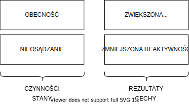
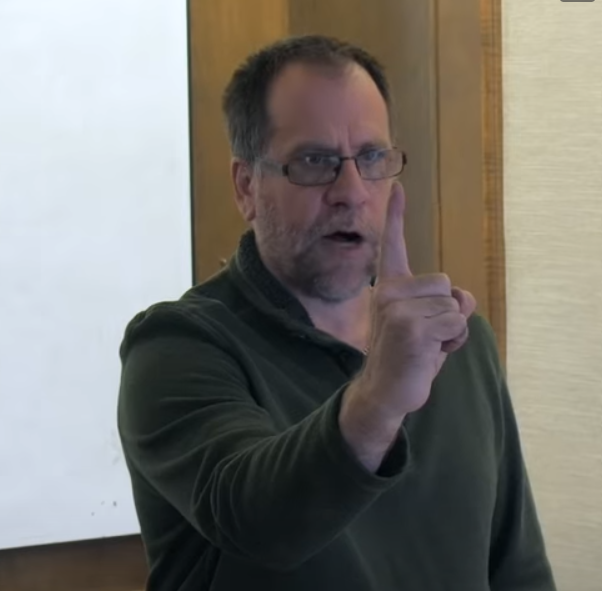

# Odcinek 8: Budda i mindfulness

Witajcie z powrotem w "Przebudzeniu z Kryzysu Sensu".

## Podsumowanie poprzedniego odcinka

Ostatnim razem przyjrzeliśmy się drugiej części dorobku Arystotelesa i jego dalszemu rozwinięciu osioworewolucyjnego rozumienia pojęć sensu i mądrości. Przyglądaliśmy się w szczególności grupie zagadnień, które można nazwać zagadnieniami związanymi ze światem. Przyjrzeliśmy się również arystotelesowskiemu światopoglądowi i jego dwu komponentom. Jednym z nich jest teoria zgodności, która jest istotnym, alternatywnym sposobem rozumienia wiedzy. Jest to epistemologia kontaktowa, intymne poznanie i współistnienie z czymś. Mówiliśmy jak wiarygodna jest ta epistemologia kontaktowa. Potem spojrzeliśmy na pewien wiarygodny (ostatecznie nieprawdziwy, lecz wiarygodny) model świata, który współbrzmi i jest spójny z ową teorią zgodności.

Ten pogląd to świat geocentryczny poruszany ruchem naturalnym. To Kosmos. Następnie użyliśmy tego by dyskutować o tym, jak teoria świata wraz z teorią poznania tego świata i istnienia w nim są głęboko ze sobą połączone i wzajemnie się wspierają. Zyskujemy dzięki temu dostrojenie światopoglądowe, co pozwala na stwarzanie modusów egzystencjalnych w ramach których współidentyfikujemy agenta i arenę i wytwarzamy metaznaczenie - relację, która nadaje sens wszystkim pojedynczym działaniom, zdarzeniom, sytuacjom i miejscom. Widzieliśmy jak niezwykle istotne jest to owo współbrzmienie między naszym modusem egzystencjalnym a naszym intelektualnym zrozumieniem oraz dlaczego Arystoteles stał się tak znaczący ze względu stworzony przez niego światopogląd, który trwał przez tysiąclecie właśnie dzięki temu, że był tak trafnie dostrojony.

Następnie wstrzymaliśmy naszą dyskusję Epoki Osiowej w starożytnej Grecji i przenieśliśmy się do omawiania jej w kontekście starożytnych Indii ze świadomym zamiarem zgłębienia wpływu rewolucji mindfunless. Jedną z tez, które stawiam w tym cyklu, jest, że rewolucja mindfulness jest odpowiedzią na kryzys sensu na Zachodzie, a rosnąca zbieżność między buddyzmem a kognitywistyką jest próbą odpowiedzi i podania rozwiązań na ten kryzys.

Rozpoczęliśmy od przyjrzenia się postaci, która uosabia Rewolucję Osiową w starożytnych Indiach, a jest nią Siddhārtha Gautama. Zaczęliśmy od spojrzenia na jego mitologiczną biografię, można by powiedzieć, a zwracam jeszcze raz uwagę na moje użycie słowa "mit". Mówiliśmy o jego wczesnym życiu w pałacu. Odsunęliśmy się i zbadaliśmy pałac jako mitologiczne przedstawienie szczególnego rodzaju modusu egzystencjalnego. Powiedzieliśmy o dwóch różnych modusach egzystencjalnych pochodzących od Fromma, mających również zbieżne poparcie w pracach Bubera i innych ważnych myślicieli. Przykładowo [Stephen Batchelor](https://lubimyczytac.pl/ksiazka/4915960/sztuka-samotnosci) również korzysta z tego rozróżnienia.

Fromm mówi o dwóch trybach - dwóch modusach egzystencjalnych. Modus posiadania jest zorganizowany wokół zaspokajania naszych potrzeb posiadania, które sprawiają, że postrzegamy świat kategorycznie. Chcemy nim manipulować i go kontrolować, by rozwiązać nasze problemy. Zaś modus bycia jest zorganizowany wokół potrzeb bycia. To potrzeby, które spełnić można tylko poprzez stawanie się: stawanie się dojrzałym, prawym, kochającym. Następnie poruszyliśmy ryzyko pomieszania modalnego - zostania uwięzionym w modusie posiadania i próbach spełniania potrzeb bycia w ramach modusu posiadania. Chodzi na przykład o zaspokajanie potrzeby dojrzałości posiadaniem samochodu lub zaspokajanie potrzeby bycia zakochanym poprzez wzmożone uprawianie seksu. Mówiliśmy też o tym, że możemy zostać wpleceni w modalne pomieszanie, które staje się błędnym kołem, ponieważ gdy nasze potrzeby bycia pozostają stale niezaspokojone, jeszcze bardziej podążamy za tymi błędnie pojmowanymi przedsięwzięciami, które to modalne pomieszanie nam przedstawia - próbujemy coraz bardziej posiadać rzeczy zamiast coraz bardziej stawać się tym, czym powinniśmy się stać.

Następnie zasugerowałem, że przebywanie w pałacu jest mitologicznym przedstawieniem właśnie tego rodzaju pomieszania modalnego, w którym jesteśmy zblokowani w ramach modusu posiadania, a to oczywiście posiada pewien istotny, współczesny aspekt kulturowy (zgodnie z tym, co mówiłem na początku, że miarę naszych dyskusji będziemy rozwijać sposoby na mówienie o połączeniach pomiędzy kryzysem sensu a innymi kryzysami, przed którymi stoimy), mianowicie ma to związek z gospodarką rynkową i utowarowieniem wszystkiego i wszystkich. Dzięki wywołaniu modalnej dezorientacji można nam więcej sprzedawać, a w miarę jak nasza tożsamość staje się czymś coraz bardziej politycznym i ekonomicznym - towarem, który należy rozumieć kategorycznie i którym można manipulować - tym więcej można nam sprzedawać przedmiotów i idei, odpowiednio nami manipulując. Zatem ma to dla nas współcześnie ważne konsekwencje. Dlatego właśnie jest to mit - bo ma ważne konsekwencje dla nas, w teraźniejszości.

## Historia Buddy

Jednak, jak już wspomniałem, Siddhārtha nie pozostaje w pałacu. Ciekawość zwycięża. Istnieje wiele różnych wariacji na temat tej historii, nie sądzę żeby istniała absolutnie kanoniczna wersja, ale co ważne, to że ostatecznie decyduje się on na opuszczenie pałacu. Wyjeżdża swoim rydwanem ze swym sługą Chandrą, podróżują sobie, aż Siddhārtha dostrzega chorego i odczuwa zaniepokojenie. Pyta: "Co jest nie tak z tą osobą?", a Chandra odpowiada: "Panie, on jest chory.". Na to Siddhārtha mówi: "Co takiego zrobił, że tak się stało" - "Nic! To zdarza się każdemu! Każdy czasem choruje. Tak po prostu jest.". Widzicie, że zachodzi tutaj osiowe przebudzenie. Jak pamiętacie, Rewolucja Osiowa to przebudzenie i dostrzeganie, co się dzieje naprawdę - dostrzeganie cierpienia na świecie. Zatem Siddhārtha jest bardzo wzburzony. Pyta: "Co takiego? Czy ja też mogę zachorować?", a Chandra odpowiada: "Cóź, oczywiście!".

Częścią tego mitu jest, że Chandra jest nieświadomy całej historii Siddhārthy, co jest oczywiście niewiarygodne. Ale o to chodzi w micie - abyśmy coś sobie uświadomili - nie aby przekonać nas do prawd historycznych. Tak więc Siddhārtha jest przygnębiony i mówi: "Weź mnie stąd, nie chcę tego więcej oglądać!". No i jadą. Jadą i spotykają starego człowieka. Siddhārtha mówi: "Stój, stój! Czy ta osoba też jest chora?" - "Nie, mój panie, on nie jest chory. Jest stary!". - "Stary? Co masz na myśli?" - "Cóż, to się zdarza każdemu z biegiem czasu!" - "To znaczy, że nie zrobił nic szczególnego?" - "Nie. To nie jego wina. On po prostu się zestarzał.". Po czym Siddhārtha mówi: "Dość! Wracajmy do pałacu, to jest naprawdę straszne!". Wracają więc do pałacu. Siddhārtha próbuje powrócić do zamknięcia w komforcie modusu posiadania. Ale sprawa z modalnym pomieszaniem ma się tak, że kiedy się z niego otrząśniemy, nie możemy do niego powrócić! Zatem Siddhārtha jest w drodze do pałacu i oczywiście spotyka kondukt pogrzebowy - widzi ciało człowieka. I pyta: "Czy ten człowiek jest chory? A może jest stary?" - "Nie, ten człowiek jest martwy. Już nie żyje." - "Co? Ale dlaczego?" - "Cóż, mój Panie, to czeka każdego!".

Teraz widzicie, co tutaj zaszło. Modus posiadania został całkowicie podważony. Całkowicie podważony. A ponieważ Siddhārtha doświadcza kryzysu egzystencjalnego, dzieje się to na poziomie jego modusu egzystencjalnego. To właśnie mamy na myśli, kiedy mówimy o kryzysie egzystencjalnym. Dalej Siddhārtha rozkazuje: "Zabierz mnie z powrotem do pałacu w tej chwili!". Biegną szaleńczo. Ale podczas powrotu, kiedy próbuje wcielić się z powrotem w ten świat, spotyka coś jeszcze - a właściwie jeszcze jedną osobę. Spotyka mendykanta. Spotyka jednego z ludzi, którzy porzucili modus posiadania. Nazywano ich "wyrzekającymi się", ponieważ wyrzekli się świata pałacu, luksusu. W oczach tego człowieka widać głęboki spokój. I ten kontrast na niego oddziałuje. Pomyślcie - to nie tylko kwestia przekonań. To dzieje się w całej jego istocie, całe jego istnienie rezonuje tym niepokojem, ponieważ podważane jest całe jego połączenie ze światem. Odczuwa to wszystko naraz: głęboki niepokój, skontrastowany ze spokojem, który widzi w oczach tego człowieka. Zwraca się do Chandry i pyta: "Kto to jest?", a Chandra odpowiada: "To jest mendykant, wędrujący człowiek." A ta osoba oczywiście reprezentuje wprowadzenie, nie intelektualne, ale bezpośrednią konfrontację z modusem bycia. To jest osoba, która osiągnęła spokój. A Siddhārtha odczuwa ten kontrast przejmująco. Potężnie. Boleśnie. Wraca więc do pałacu, niosąc w sobie te cztery palące znaki: choroba, starość, śmierć... ale także reprezentację modusu bycia. Kogoś, kto wypielęgnował mądrość i spokój, odnalazł jakiś rodzaj głębokiej więzi, która pozostaje nietknięta przez kaprysy naszej śmiertelności.

Ale oczywiście Siddhārtha nie może odnaleźć spokoju, którego pragnie. Nie może wrócić do pałacu. Zastanówcie się nad podwójnym znaczeniem tego słowa, ponieważ jest ono tutaj naprawdę trafne: "rozczarowanie". Kiedy opisujemy kogoś jako rozczarowanego, zwykle mówimy o stanie, w którym dana osoba być może zmierza w kierunku rozpaczy. Jest smutna, doświadczyła straty. Jest to stan negatywny. Ale zauważcie, że u podstaw tego słowa leży też rozpłynięcie się iluzji, czaru. To bardzo osioworewolucyjne. "Rozpływa się czar" modalnego pomieszania, Siddhārtha traci poczucie przynależności, którego doświadczał w pałacu. To już nie jest jego miejsce.

Próbuje, stara się z powrotem dopasować do tego życia. Będziemy o tym jeszcze mówić: dlaczego tak jest, że po tego rodzaju doświadczeniach przebudzenia ludzie czują, że muszą odmienić całe swoje życie? Że nie ma dla nich powrotu? Że jest w tym coś nieodwracalnego? Będziemy o tym musieli bezpośrednio pomówić. Okazuje się, że możemy uzyskać na to kognitywistyczne poparcie. Ale Siddhārtha nie może powrócić. Rozczarowanie jest zbyt realne. Więc decyduje się odejść, a nie jest to łatwy wybór - ma żonę, ma dziecko. Moglibyśmy go, w gruncie rzeczy, nawet etycznie skrytykować - porzuca syna, porzuca żonę. Ale możemy odnaleźć w tym micie poczucie - choć oczywiście powinniśmy dokonywać refleksji i argumentacji moralnej - że *życie moralne opiera się na czymś głębszym*. Że wypełnianie swoich moralnych obowiązków, choć oczywiście ważne, może ostatecznie okazać się bezsensowne, jeśli straciło się sens sam w sobie. Moralność osadza się na tym, czy nasze życie ma sens. Będziemy to jeszcze szeroko poruszali, przy okazji omawiania dorobku Susan Wolf i innych, ów sens w życiu i ogół badań psychologicznych prowadzonych właśnie na ten temat. Sens w życiu jest czymś odrębnym - a ja bym stwierdził, że ten mit to pokazuje - jest czymś głębszym niż po prostu prowadzenie moralnej egzystencji. Widzicie, mądrość to coś więcej niż ledwie moralność. W cnocie chodzi również o owo przepełnienie sensem, o to metaznaczenie. Docelowo chodzi o bycie wpiętym w kultywowanie mądrości. Nie chodzi tylko o robienie tego, co jest moralnie poprawne.

Zatem Siddhārtha opuszcza pałac. Ścina włosy, zostawia pałac, udaje się do lasu i postanawia podążać ścieżką wyrzeczonych i próbuje odnaleźć rozwiązanie dla strachu i niepokoju, które wciąż w nim pobrzmiewają. Więc spotyka się z różnymi nauczycielami i podejmuje się różnych wyzwań. Ale znów znajduje się w kropce, ponieważ mimo, że opuścił pałac, to jednak w pewnym istotnym sensie nie udało mu się opuścić modusu posiadania. Wciąż nosi w sobie to modalne pomieszanie ponieważ teraz dąży do ascezy. Próbuje poddać ciało ogromnym próbom i bólowi. Próbuje doprowadzić je do całkowitej uległości. Praktykuje więc wyrzekanie się siebie. Rozumiecie, dlaczego doszedł do takiego wniosku, prawda? W pałacu chodziło o pobłażanie sobie, więc rozwiązaniem jest wyrzeczenie się siebie. To wydaje się rozsądne. Pomyślcie o tym, jak często my sami huśtamy się między pobłażaniem sobie a samowyrzeczeniem.

Więc głodzi się do tego stopnia, że z przodu jego ciała widać kręgosłup, ponieważ jego brzuch jest tak wycofany i wychudzony, że naciska na kręgi pleców! Na przedstawieniach z tego okresu wygląda jak jakieś anemiczne widmo. Ale to nie działa! Nie działa, bo czy widzicie, co jeszcze jest nie tak? Widzicie to? Próba unicestwienia "ja" to wciąż myślenie o *posiadaniu* "ja". Wciąż jest w modusie posiadania. Po prostu przeniósł to z posiadania rzeczy cielesnych na próbę posiadania swojego "ja". Próbuje je odrzucić, ale wciąż ujmując to ramy modusu posiadania. Wciąż rozumie ten problem w modusie posiadania, nadal jest modalnie pomieszany. Wyrzeczenie się siebie jest takim samym aspektem tego pomieszania jak pobłażanie sobie, ponieważ jest ono jedynie jego zaprzeczeniem. Nie jest jego transcendencją. Kiedy coś negujemy, nadal ujmujemy to w ten sam sposób.

Zatem Siddhārtha siedzi nad brzegiem rzeki, wyczerpany. Wtedy dostrzega barkę płynącą w dół rzeki, a na jej pokładzie gra muzyk wraz ze swoim uczniem. Gra na lirze lub jakimś innym instrumencie strunowym. Wtedy muzyk mówi do ucznia: "Nie, nie, nie, nie, słuchaj! Słuchaj mnie! Struny nie mogą być ani zbyt napięte, ani zbyt luźne! Zbyt napięte są tak samo złe jak zbyt luźne!".

Pomyślcie teraz o Arystotelesie. Pomyślcie o Arystotelesie i o jego złotym środku, który nie oznacza ledwie punktu środkowego w jakiejś średniej. Zwracam na to uwagę ze względu na sposób w jaki zostało to później zinterpretowane. To właśnie wtedy Siddhārtha odkrywa Drogę Środka. Nie oznacza to jakiegoś kompromisowego, pośredniego rozwiązania. Oznacza radykalną zmianę. Droga Środka to transcendencja modusu posiadania poprzez odrzucenie zarówno pobłażania sobie jak i jego zaprzeczenia - samowyrzeczenia. Będziemy o tym mówić przy okazji omawiania strategii optymalizacyjnych. Jak pamiętacie, wspominaliśmy o tym, kiedy rozmawialiśmy o stanie przepływu. Nie próbujemy niczego maksymalizować, próbujemy *optymalizować*. Próbujemy uzyskać właściwy rodzaj więzi. Spójrzcie, o to właśnie chodzi w modusie bycia. Chodzi o odpowiedni rodzaj połączenia.

Siddhārtha dokonuje pewnego ważnego odkrycia. W opowieści to odkrycie przychodzi do niego, gdy wpada do rzeki, tonie, a ratuje go mała dziewczynka. W ówczesnej kulturze było to niezwykle poniżające dla mężczyzny, który był kiedyś księciem, być uratowanym przez małą dziewczynkę. Wskazuje to na stopień zmiany, przez którą przechodzi Siddhārtha. Dziewczynka częstuje go ryżem na mleku (to dlatego w Dniu Bodhi buddyści często spożywają ryż na mleku dla upamiętnienia tego zdarzenia). Zdaje sobie więc sprawę, że musi podążać Drogą Środka. Musi znaleźć sposób optymalizacji swojego poznania, który pozwoli mu dokonać samotranscendencji i odkrycia na nowo owego brakującego modusu egzystencjalnego - sposobu istnienia, który dostrzegł w oczach mendykanta.

Podam teraz niezwykle ważne pojęcie, ponieważ istnieje słowo na tego rodzaju pamiętanie: *sati*. Oznacza ono "pamiętać", "przypominać sobie", lecz nie w znaczeniu pamiętania zdarzeń. Oznacza "przywołać do umysłu". Jest to zatem pamięć modalna. Jest to przypomnienie sobie utraconego modusu bycia. To nie pamiętanie faktu czy wydarzenia, to przypomnienie sobie, jak to jest być w modusie bycia. Jest to odzyskiwanie modusu egzystencjalnego. To głęboki rodzaj restrukturyzacji naszego istnienia. Nie oznacza tylko zwykłego pamiętania czy przypominania sobie. To jak powrócić do miejsca, w którym dawno się nie byliśmy i przypominać sobie i przywracać własną tożsamość, którą wtedy mieliśmy. Nie będąc tam możemy przypominać sobie fakty i zdarzenia, ale gdy tam faktycznie powrócimy, zdajemy sobie sprawę: "Och tak! Właśnie! Tak właśnie było wtedy być mną!". To tego rodzaju pamięć. Pamięć modalna. Ma wiele wspólnego z owym wiedzeniem partycypacyjnym, o którym już mówiliśmy. Siddhārtha stara się przypomnieć sobie, *sati*, modus bycia, który widział w oczach wyrzeczonego.

## Mindfulness

Dlaczego przywołuję to słowo i o nim opowiadam? Ponieważ jest to słowo, które dzisiaj jest przekładane na to określenie: "mindfulness". Ale założę się, że kiedy mówię o mindfulness, szczególnie jeśli mieliście do czynienia z tą rewolucją, która ogarnia naszą kulturę, prawdopodobnie nie myślicie o przypominaniu sobie modusu bycia! Istnieją obecnie pewni wnikliwi badacze, którzy w ten sposób opisują mindfulness. Stephen Batchelor dokonał tego w pięknej małej książce ["Sztuka samotności"](https://lubimyczytac.pl/ksiazka/4915960/sztuka-samotnosci), którą z całego serca polecam.

Siddhārtha podejmie pewne psychotechnologie mindfulness, których nauczył się od swoich nauczycieli, ale które uzna za nieadekwatne. Ostatecznie przekształci je, ponieważ pragnie sobie przypominać, *sati*, chce "odzyskiwać" - to lepsze słowo - modus bycia. Nie w formie intelektualnej koncepcji, ale jako jego własną podmiotowość oraz to jak świat jest urzeczywistniany w powiązaniu i we współidentyfikacji z tą podmiotowością.

Chciałbym przerwać teraz tę opowieść. Wrócimy do niej i opowiemy, co takiego Siddhārtha robi, by osiągnąć przywrócenie modusu bycia. Ale teraz podam wam pewien sposób rozumienia tego, do czego teraz będziemy zmierzali. Jednym z doświadczeń przypominania sobie, w tym rozumieniu *sati*, jest budzenie się ze snu. Jak pamiętacie, mówiliśmy o budzeniu się jako o jednej z metafor, mitów używanych do mówienia o samotranscendencji. Mamy "oświecenie", mamy "przebudzenie", będzie jeszcze przechodzenie z dzieciństwa w dorosłość. Będziemy do nich wracali wielokrotnie.

Lecz dlaczego kiedy się budzę, to nie jest to samo, jak gdy przypominam sobie jakieś wydarzenie, np. właśnie przypominam sobie, jak wygląda korytarz na zewnątrz tej sali? Kiedy się budzę odzyskuję swój świat i swoją tożsamość. Głęboko pamiętam. [Tutaj John używa triku słownego korzystając ze słowa "remember", które oznacza pamiętać, rozpisując je na dwa człony: "re-member", co można rozumieć jako "ponownie stać się członkiem".] Przynależę ponownie do siebie i do świata. To właśnie zachodzi, kiedy się budzę. Siddhārcie właśnie chodzi o wypracowanie psychotechnologii mindfulness - w rzeczywistości nie tylko psychotechnologii, ale pewnego zestawu psychotechnologii - które pomogą mu *przypomnieć sobie*, *odzyskać*, *sati*, modus bycia. Dokona *przebudzenia*. I to jest w rzeczywistości to, co oznacza jego tytuł. "Budda" to nie imię. Budda to tytuł. Oznacza *przebudzonego*.

Musimy jednak porozmawiać o kognitywistyce mindfulness, ponieważ przyglądamy się Siddhārcie właśnie ze względu na rewolucję mindfulness, która ma miejsce tu i teraz. Ta rewolucja mindfulness jest reakcją na kryzys sensu, a my możemy zrozumieć dlaczego! To nawet lepiej, że ponownie umiejscawiamy ją w obrębie mitu Siddhārthy, ponieważ widzimy, że uprawia on mindfulness, aby kultywować przebudzenie, a przebudzenie jest rodzajem odpowiedzi na kryzys sensu. Stąd tytuł tego cyklu: "Przebudzenie z Kryzysu Sensu".

Ale jako kognitywista muszę pozostać krytyczny. Jestem zarówno pełen uznania dla całej pracy naukowej, która jest wykonywana nad mindfulness, ale jestem też wobec niej krytyczny. Tak jak powinien być dobry naukowiec. Chcę więc porozmawiać trochę o tym, jak możemy zrozumieć i lepiej sformułować, co mindfulness oznacza. Te rozważania opieram na pracy na temat mindfulness, którą opublikowałem [w 2016 roku wraz z Leo Ferraro](https://psycnet.apa.org/record/2016-18358-000). Więc znowu, dlaczego to robię? Jeśli chcemy się przebudzić z kryzysu sensu, jeśli chcemy zrozumieć, czym było przebudzenie Siddhārthy, musimy zrozumieć, co dla niego mindfulness oznaczało. A oznaczało to właśnie zestaw psychotechnologii, które owocują przebudzeniem. Po części chcę pokazać, jak możemy wrócić do takiego rozumienia mindfulness wraz z jego konstytutywnymi psychotechnologiami, które właśnie to nam umożliwią.

Jak możemy głębiej zrozumieć procesy poznawcze zachodzące w mindfulness i jak mogą one umożliwić tę ważną egzystencjalną transformację? Najpierw zauważmy, że jeżeli poprosić o opisanie praktyk mindfulness ludzi, którzy te praktyki stosują (np. medytację, praktyki kontemplacyjne - spróbuję później argumentować, dlaczego nie powinny być one traktowane jako synonimy, mimo że często tak się ich używa), ich odpowiedzi są zgodne z pewnym standardowym rozumieniem mindfulness i chciałbym od razu zauważyć jak słabo podchwytują one to, co już powiedzieliśmy o *sati*. Będą odpowiadali, że by być uważnym, trzeba starać się *zwracać uwagę na obecną chwilę bez osądu*. Nauczyć się być obecnym. Jest w tym cień tego modusu bycia, przypominania sobie modusu bycia. On wciąż tam jest, ponieważ mówią, że chodzi o obecność. Przywołują modus bycia. Ale robią to w sposób, który choć pomocny, może być mylący. Chcę się teraz upewnić, że rozumiecie, co krytykuję, a czego nie. Aby to wyjaśnić, pozwólcie, że opowiem wam trochę więcej.

Zarówno badam naukowo mindfulness, jak i prowadzę prace nad nim. Eksperymentuję i publikuję prace teoretyczne na jego temat. Również nauczam. Uczę praktyk medytacyjnych. Uczę praktyk kontemplacyjnych i uczę na dodatkowych zajęciach Tai Chi Chuan, które jest formą ruchowego mindfulness. Znam więc zarówno akademickie przedsięwzięcia wyjaśniania mindfulness, jak i pedagogiczne przedsięwzięcia jego nauczania. I myślę, że ważne jest, aby być w obu tych światach, aby zdać sobie sprawę z tego, w jaki sposób można się pogubić w swoich próbach zrozumienia mindfulness.

## Język treningu a język wyjaśniania

Musimy uniknąć pomieszania poprzez dokonanie rozróżnienia. Unikamy modalnego pomieszania odzyskując rozróżnienie między modusem posiadania a modusem bycia. Podobnie możemy się głęboko pogubić w temacie mindfulness, jeśli nie będziemy pamiętać o rozróżnieniu między językiem treningu a językiem wyjaśniania. Języka treningu używam, kiedy uczę ludzi medytacji, kontemplacji i Tai Chi. Używam języka, który pomaga im nabyć umiejętności. Jest to język naśladowania i zaangażowania, w ramach którego mogę polegać na naszej wspólnej obecności. Mogę polegać na pragmatyce danej sytuacji. Mogę polegać na tym, że celem ucznia jest nabycie danej umiejętności. Wiedząc to, użyję języka, który jest do tego odpowiedni. Ale gdybym miał po prostu używać tego języka bezmyślnie do wyjaśniania mindfulness, popełniłbym błąd. Pozwólcie, że posłużę się przykładem ludzkiej pamięci ze względu na powiązania, jakie między mindfulness a pamięcią można uczynić.

Jednym z najpotężniejszych sposobów treningu pamięci sposób znany jako metoda lokalizacji lub metoda *loci* (jeśli chcemy brzmieć bardziej pretensjonalnie). Niektórzy z was pewnie oglądali serial Sherlock. Sherlock stosuje tę metodę używając tak zwanego pałacu umysłu. Robi się to poprzez zapamiętywanie pewnej przestrzeni. Zapamiętujemy pokoje, aby móc je sobie wyobrazić w umyśle. I wtedy, jeśli chcę zapamiętać kilka rzeczy - powiedzmy, że chcę zapamiętać rzeczy związane z Sokratesem - umieszczam w pokoju Sokratesa oraz kilka związanych z nim obrazów. Teraz chcę zapamiętać rzeczy związane z Platonem, więc umieszczam go w innym pokoju obok razem z innymi związanymi z nim obrazami, i tak dalej. I wtedy, gdy chcę sobie coś przypomnieć, "wchodzę" do tego pokoju, widzę te wszystkie obrazy, ściśle powiązane ze sobą i uzyskuję dostęp do informacji, których potrzebuję na temat Sokratesa. Następnie przechodzę, przenoszę się w moim pałacu umysłu do miejsca, gdzie znajduje się pokój Platona i otwieram go. To potężna metoda.

Starożytni mówcy używali metody lokalizacji do zapamiętywania przemówień trwających nawet do sześciu godzin! I wiemy, że jest to bardzo potężna mnemotechnika. Jeżeli jesteście uczniami lub studiujecie, powinniście nauczyć się z niej korzystać. Nie aby stać się socjopatycznym superbohaterskim detektywem, ale by stać się dobrym uczniem. To metoda lokalizacji. Teraz zauważcie jedno. Ta metoda to potężny język treningu. Dobrze trenuje naszą pamięć. Ale moglibyśmy, i jest to błąd, pomyśleć, że tak właśnie zorganizowana jest pamięć. Nazywa się to *"przestrzenną metaforą pamięci"*. Moglibyśmy pomyśleć: "No tak, tak właśnie zorganizowana jest pamięć. Wszystkie moje wspomnienia związane z pewną rzeczą są w pewnym sensie stabilne i tak jak mój obraz Sokratesa, znajdują się w stabilnej lokalizacji. Wszystkie rzeczy, które są ze sobą powiązane w mojej pamięci, znajdują się w mojej pamięci faktycznie obok siebie. Zatem zasada działania mojej pamięci polega wysyłaniu małego homunkulusa, małego gościa od pamięci (niech się nazywa Bob), który przeszukuje pokoje, aż znajdzie właściwy, wchodzi do niego, a wewnątrz wszystko jest uporządkowane, i znajduje to, czego mi potrzeba. I wynosi to wtedy na zewnątrz i przekazuje do świadomości. Och tak! Tak właśnie działa moja pamięć. Prawda?". I wtedy moglibyśmy mówić o "przeszukiwaniu" naszej pamięci czy "odzyskiwaniu z pamięci".

Rzecz w tym, że - [Eysenck i Keane](https://www.taylorfrancis.com/books/mono/10.4324/9781351058513/cognitive-psychology-michael-eysenck-mark-keane) zwrócili na to uwagę już dawno temu - ta przestrzenna metafora pamięci jest niemal całkowicie błędna. Nasza pamięć nie działa w ten sposób, to błąd. Zobaczcie, pokażę wam! Powiedzcie mi szybko, jakie inne kolory kojarzą się z niebieskim? Na przykład czerwony i zielony. A jakie słowa rymują się ze słowem "niebieski"? Na przykład "deski", "pieski". Zatem czerwony jest blisko niebieskiego oraz deski są również blisko niebieskiego, prawda? To znaczy, że co jeszcze znajduje się obok siebie? Deski i czerwień! Więc kiedy powiem "deski", powinniście pomyśleć o czerwieni! Czy tak się dzieje? Oczywiście, że nie!

Oto kolejny przykład na to, że pamięć nie jest w ten sposób zorganizowana. Szybko jesteście w stanie stwierdzić, kiedy czegoś nie wiecie. Jaki jest numer telefonu Meryl Streep? Nie wiem! Czy byłem kiedyś w Bangkoku? Nie. Co robił przed chwilą mój pamięciowy homunkulus, Bob? Czy wsiadł na jakiś motocykl nadprzestrzenny wewnątrz mojej pamięci? Pojechał do każdego miejsca, w którym byłem? Czy to Bangkok? A czy to Bangkok? A może to jest Bangkok? Nie! On od razu wie! Ja od razu wiem, że nie byłem w Bangkoku! On od razu wie, że nie mam numeru telefonu Meryl Streep. Nie przeszukuje całej przestrzeni. W rzeczywistości wygląda na to, że w ogóle jej nie przeszukuje!

Pamięć jest o wiele bardziej tajemnicza i nie działa w tak uproszczony sposób, jak opisuje to metafora przestrzenna. Ta przestrzenna metafora jest świetna do trenowania pamięci. Jest świetna do ćwiczenia pamięci, ale jest zbyt uproszczona i prowadzi do niewłaściwego zrozumienia jak właściwie działa pamięć. Podobnie język, za pomocą którego trenujemy mindfulness, nie powinien być bezkrytycznie importowany do naszych naukowych przedsięwzięć wyjaśnienia go i zrozumienia. "Zwracanie uwagi na chwilę obecną." Lecz najpierw musimy wiedzieć, czym jest uwaga! Pokażę wam, że jest to o wiele bardziej problematyczne, niż się wam wydaje, ponieważ prawdopodobnie myślicie, że uwaga działa to zgodnie z inną metaforą: świecenie reflektorem. "Uwagę kieruję w podobny sposób, jakbym świecił reflektorem." Druga sprawa - co to jest "chwila obecna"? Oczywiście używamy tego języka podczas treningu! Możemy po prostu wykonać te czynności, ponieważ możemy polegać na kontekście. Ale co to faktycznie jest "chwila obecna"? Czy to jest właśnie tu i teraz? Ta nanosekunda? Ta sekunda? Ostatnie pięć minut? Ostatnia godzina? Co to jest "chwila obecna"? Spójrzcie, słowo "teraźniejszość" nie ma konkretnego znaczenia. Mówi się, że mają charakter *"indeksykalny*". Są względne wobec tego, co aktualnie mam na myśli. Czym jest "tutaj"? Co to jest "teraz"? Zobaczcie, kiedy ludzie twierdzą: "Ale przecież mogę ci powiedzieć, czym jest chwila obecna! To jest zwracanie uwagi na tu i teraz!" - to bezużyteczne! Co to jest "tutaj"? Ten kawałek podłogi, na którym stoję? Ten pokój? To miasto, Toronto? Ten układ słoneczny? Ten wszechświat ze wszystkich wszechświatów w multiwersum? Co to jest "teraz"?

Zobaczcie, nic tu nie jest wyjaśniane! Ten język pomaga szkolić ludzi, ale jest nadmiernie uproszczony i mylący, jeżeli próbujemy coś zrozumieć. Potrzeba nam przeformułować mindfulness i musimy to zrobić, aby odzyskać to, o co chodziło Siddhārcie. Jak dokładnie możemy zrozumieć mindfulness aby mogło nam ono powiedzieć, jak ludzie mogą doznać przebudzenia. Tego potrzebujemy. Tak musimy przeformułować mindfulness.

Więc spróbujmy to zrobić. I wykorzystajmy niektóre z rzeczy, które już się nam udało zbudować. Możemy poprosić o pomoc Platona, a jakże wspaniały jest to sprzymierzeniec! Pamiętacie, na co zwrócił uwagę Platon? Że naszej wiedzy o czymś nie da się uchwycić listą cech! Pamiętacie, że ptak to nie tylko skrzydła, pióra, dziób, to także strukturalno-funkcjonalna organizacja. Rzecz w tym, że jeśli spojrzymy na definicję mindfulness podawaną przez większość ludzi, nawet w artykułach naukowych, jedyne, co są w stanie podać, to lista cech:

1. "Być obecnym". Coś z tym trzeba począć, bo to zaledwie język ćwiczebny, to nie jest język wyjaśniania.
1. "Nie osądzać". I to będzie problematyczne! Co jest rozumiane przez "brak osądu"? Powinienem zwracać uwagę na swój oddech, a nie na rozpraszacze - ale przecież to jest właśnie rodzaj osądu! Co jest rozumiane przez brak osądu? "Cóż..." - no właśnie! Co to znaczy? A ma to prowadzić do osiągnięcia kolejnego ważnego punktu:
1. "Spostrzegawczość". I będzie to ważne, bo spostrzegawczość [także olśnienie, wgląd], jak będę się starał wykazać, znajduje się w tym samym spektrum, co przebudzenie. Powiem, co mam na myśli. A spostrzegawczość ma na pomóc nam w kolejnej rzeczy:
1. "Zmniejszenie reaktywności". Powinniśmy stać się bardziej zrównoważeni. Osiągnąć lepszy balans.

Przejdźmy przez to po kolei. Tak więc mindfulness to zwracanie uwagi na obecną chwilę. Bycie obecnym (1), zwracanie uwagi na obecną chwilę w nieosądzający sposób (2), który ma poprawić spostrzegawczość (3). (Forma medytacji, której uczę, postać buddyjska - twierdzi się, że sięga Siddhārthy - nazywa się *Vipassana*. *Vipassana* oznacza olśnienie - oczywiście nie tylko olśnienie intelektualne, ale olśnienie egzystencjalne.) Ma to zmniejszyć reaktywność (4). Co to znaczy?

Otóż podano nam listę cech! Brakuje nam *eidos*. Brakuje nam strukturalno-funkcjonalnej organizacji, która powiedziałaby nam, jak te wszystkie rzeczy naprawdę ze sobą współgrają. To jest właśnie nasze zadanie. Musimy przekształcić tę listę cech w schemat cech. Musimy odzyskać brakującą organizację strukturalno-funkcjonalną i musimy ponownie zinterpretować wszystkie te mechanizmy, abyśmy mogli faktycznie wyjaśnić ich działanie. I musimy to zrobić w powiązaniu z niezależnie skonstruowaną teorią lub postulatami teoretycznymi w obrębie psychologii. Spójrzcie, są ludzie, którzy zajmują się psychologią i nauką kognitywną na temat uwagi, spostrzegawczości, ulepszonej samoregulacji. Powinniśmy zwrócić uwagę (wybaczcie niezamierzoną grę słów) na to, co badania naukowe mówią nam o tym, jak działają spostrzegawczość, uwaga i samokontrola. Jednym z kroków w przekształcaniu listy cech w schemat cech jest wprowadzenie rozróżnienia pomiędzy rodzajami tych cech.

Oto te cztery najważniejsze cechy, które najczęściej widzimy:

Podzieliłem je w ten sposób, bo istnieje tu pewne rozróżnienie. Obecność i nieosądzanie to stany, w które mogę wejść. To czynności, które mogę wykonać. Zatem bycie obecnym jest czymś, co mogę zrobić. Mogę to rozpocząć, mogę to zatrzymać. Jeszcze wrócimy do tego, co to oznacza, ale wiemy, że jest to rodzaj czynności, w którą się angażujemy, ponieważ jest ona ciągle zakłócana podczas medytacji i ciągle musimy się w nią znowu angażować. Tak samo wygląda sprawa z nieosądzaniem. Nieosądzanie jest czymś, co robimy. Jest to dziwny rodzaj paradoksalnego "nierobienia", ale znowu jest to coś, co można rozpocząć i zatrzymać, a potem ponownie uruchomić.

Ale spostrzegawczość i zmniejszona reaktywność to nie są czynności, które wykonujemy. To są rezultaty. Zatem używając języka psychologii "obecność" i "nieosądzanie" to *stany*, w które możemy się wprowadzić, a "zwiększona spostrzegawczość" i "zmniejszona reaktywność" są *cechami*, które pielęgnujemy. Chcemy stać się bardziej spostrzegawczy. Chcemy stać się mniej reaktywni. Od razu rozumiemy, że jedne z mechanizmów mindfulness to rzeczy, które robimy, a drugie to cechy, które powinny się realizować, gdy uprawiamy mindfulness. Jednak natychmiast pojawiają się pytania! Dokonując tego rozróżnienia mogę zapytać: "W jaki sposób bycie obecnym zwiększa spostrzegawczość?". Albo: "W jaki sposób bycie obecnym zmniejsza reaktywność?". Dlaczego? W jaki sposób? Czy nieosądzanie powoduje spostrzeżenia? Czy nieosądzanie zmniejsza reaktywność? Jaki jest związek przyczynowy?

Zauważcie, że lista cech zupełnie o tym nie mówi. Nie mówi niczego na temat przyczynowych związków między tymi mechanizmami. Nie mówi niczego o tym jak stany mogą spowodować wystąpienie cech! Ale nie prowadzi też do zadawania pytań konstytutywnych. Pytania konstytutywne to relacje "część-całość". Jaki jest związek między obecnością a nieosądzaniem? Czy obecność jest częścią nieosądzania? Czy nieosądzanie jest częścią obecności? Czy oba te stany są częścią jakiejś większej całości? Jaka jest między nimi relacja strukturalna? A co z cechami? Czy spostrzegawczość jest częścią zmniejszonej reaktywności? A może jest na odwrót? Czy one obie są częścią jakiejś całości? Widzicie, lista cech nie posiada eidos, a nie mając eidos, lub nie szukając eidos, nie doprowadzimy do zadania żadnego z tych pytań. Pytań o związki przyczynowe i pytań konstytutywnych.

Teraz, gdy zaczniemy odpowiadać na te pytania i gdy zaczniemy odpowiadać na nie językiem wyjaśniania, a nie językiem treningu, zamienimy listę cech w schemat cech. Zaczniemy docierać do strukturalno-funkcjonalnej organizacji mindfulness i zaczniemy je głębiej rozumieć. A to pomoże nam zobaczyć, w jaki sposób mindfulness może doprowadzić do tego rodzaju radykalnych transformacji obiecanych w odkryciu dokonanym przez Siddhārthę.

## Uwaga

Teraz zamierzam skupić się jednej ze ścieżek łączących stany z cechami, mianowicie jak obecność wpływa na spostrzegawczość. I znowu, zaczniemy od mówienia o konkretnych spostrzeżeniach, ale oczywiście w ogólności nie mamy na myśli "tego spostrzeżenia" czy "tamtego spostrzeżenia". Mówimy o fundamentalnym, egzystencjalnym, modalnym rodzaju transformacji. Mówiłem już, że ten język - "bycie obecnym" - jest bezużyteczny. Niektórzy powiedzą: "W porządku, to co miałem na myśli to coś w rodzaju 'koncentracji'". Tu nie może o to chodzić! To nie wystarcza, ponieważ jeśli przyjrzeć się próbie wyjaśnienia tego przez Siddhārthę, mówi on o "właściwej koncentracji". To dlatego mam tatuaż ze słowem "koncentracja" na *prawej* ręce. Jeśli Siddhārtha mówi nam, że istnieje "właściwa koncentracja", jaki inny mocny wniosek można z tego wysnuć? Że istnieje *niewłaściwa koncentracja*! W mindfulness nie chodzi o koncentrację. Chodzi o uzyskanie *właściwego* rodzaju koncentracji. Co to znaczy? I znowu możemy usłyszeć: "Cóż, to oznacza zwracanie uwagi!". Czyżby? Te próby wyjaśnień używają pewnego określonego modelu uwagi.

Porozmawiajmy rozróżnieniu pomiędzy koncentracją a skupieniem uwagi w kontekście doświadczenia Siddhārthy, kiedy pierwszy raz usłyszał o tym, że struny nie mogą być "ani zbyt luźne, ani zbyt napięte". Zabierzmy się za zbudowanie argumentu fenomenologicznie. Chcę, żebyście spróbowali porównać dwa sposoby koncentrowania się. (Opieram to na pracy wykonanej przez Ellen Langer, która napisała prawdopodobnie pierwszą na Zachodzie książkę o mindfulness zatytułowaną ["Mindfulness"](https://lubimyczytac.pl/ksiazka/306821/mindfulness), w 1988 roku, na długo zanim rewolucja mindfulness nabrała rozpędu. To nadal dyskusyjne jaki związek istnieje między jej opisem mindfulness a opisem buddystów. Nie będę się w to teraz zagłębiać, bo nie to próbuję ustalić. Używam tylko jej metody na sprawienie, byście zrozumieli koncentrację.). Dobrze, zatem przeprowadzimy to to tutaj i teraz. Chcę, żebyście skoncentrowali się na moim palcu:

Skoncentrujcie się na nim! Skoncentrujcie się! Skoncentrujcie się! Skoncentrujcie się na moim palcu! Skoncentrujcie się! Nie pozwólcie, by wasz umysł błądził! Skoncentrujcie się! W porządku, wystarczy.

Większość z was uznała to za nieprzyjemne. Zauważcie, że nawet słowo "koncentracja", które jest metaforą, opisuje, co robię - koncentruję się. Robię z mojego umysłu tunel, ustawiam go na coś i próbuję go na tym czymś utrzymać i nie pozwolić mu się poruszać. Problem w tym, że jedyną wskazówką, jaką wam dałem było moje krzyczenie: skoncentrujcie się!

W porządku, teraz zróbmy coś innego. Gotowi? Przyjrzyjcie się mojemu palcowi. Zauważcie, że nie jest on idealnie prosty, jest trochę wygięty i jest trochę grubszy u nasady niż na czubku. I ma jakby kilka części, jest trochę czerwony z jednej strony...

To coś zupełnie innego, prawda? Langer nazywa to "miękką czujnością", ponieważ nie następuje tutaj zewnętrzne utwardzanie swojego umysłu i przyklejanie go do czegoś. Zamiast tego staramy się o "odnawianie swojego zainteresowania". A to jest wielkie słowo - "zainteresowanie". Pochodzi od *inter esse* - być w czymś. Istnieć wewnątrz czegoś. Chodzi o to współdopasowanie, o którym mówił Arystoteles. To ciągłe odkrywanie i otwieranie. Potrzebujemy więc modelu koncentracji, który zawiera tę "miękką czujność". Takiej, która nieustannie odnawia nasze zainteresowanie, angażuje nas głęboko w coś, ponieważ doprowadzi nas do intymnego kontaktu z tym czymś.

Zatem o jakim rodzaju uwagi mówimy? Nie chcemy krzyczeć: "Skoncentruj się! Skoncentruj się!". To są te zbyt napięte struny. Ale też nie możemy pozwolić, żeby uwaga robiła co jej się podoba. To z kolei struny zbyt luźne! Jak możemy znaleźć pośrednie rozwiązanie? Zauważcie, że kiedy kazałem wam w pewien sposób przesuwać się po moim palcu, było to niemal jak dobrze nastrojona struna! Była w tym nieomal muzykalna zrozumiałość!

Chcę wam głęboko uświadomić o co chodzi w uwadze, mianowicie pokażę, że uwaga to nie reflektor. To bardzo złożony proces optymalizacyjny. Chodzi w nim o prawdziwe dostrojenie i znalezienie się pomiędzy napięciem a luzem, co pozwala na intymne zaangażowanie, współdopasowanie się, uczestniczenie - *inter esse* - w czymś, czemu poświęcamy uwagę. Dobrze, lecz dlaczego tak lubimy tę metaforę reflektora? Można ją nawet spotkać w podręcznikach z psychologii, bez namysłu krzyczących nam w twarz, że "uwaga to reflektor"! Otóż jedna z funkcji uwagi faktycznie dobrze jest ujmowana przez metaforę reflektora. Pamiętacie pewnie wyrazistość, gdy rzeczy się wyróżniają? Uwaga czyni rzeczy bardziej wyrazistymi. To właśnie robi uwaga. Czyni rzeczy bardziej wyrazistymi. I tu wreszcie do czegoś dochodzimy! Dokładnie to robiłem, gdy kazałem wam zwracać uwagę na mój palec, uwydatniałem wam coś. Właściwości mojego palca stały się dla was bardziej wyraziste. Ale co jest nie tak z reflektorem? Otóż z metaforą reflektora jest taki problem, że o ile uwaga faktycznie optymalizuje wyrazistość, brakuje w tej metaforze wiele z tego, czym właściwie jest sam proces optymalizacji! Brakuje również tego jak uwagę można powiązać ze spostrzegawczością. Doskonałą pracę na ten temat wykonał [Christopher Mole](https://oxford.universitypressscholarship.com/view/10.1093/acprof:oso/9780195384529.001.0001/acprof-9780195384529). Znów, to bardzo skomplikowany argument i nie będę podejmował się dyskutowania go w całości, ale sedno polega na tym, że uwaga nie jest czynnością, którą wykonujemy wprost.

Pozwólcie, że posłużę się porównaniem: "chodzić" i "ćwiczyć". Spójrzcie, chodzenie jest czymś, o co ktoś może nas wprost poprosić. Mówicie "idź", ja idę! "Idź. Stój. Idź dalej." Świetnie! Ale jeżeli rozkażecie mi: "Ćwicz! No dalej! Ćwicz!", ja odpowiem: "Co mam ćwiczyć?". Zobaczcie, ćwiczyć coś można jedynie poprzez optymalizację wykonywania jakiejś innej czynności. Jeśli ćwiczę grę w szachy, to nie gram w szachy jednocześnie wykonując dodatkową czynność "ćwiczenia"! Ćwiczenie szachów to optymalizowanie gry w szachy. Ćwiczenie tenisa nie jest graniem w tenisa wraz z jakimś dodatkowym, sekretnym działaniem - "ćwiczeniem". Ćwicząc grę w tenisa optymalizuję umiejętności gry w tenisa. Mole'owi chodzi o to, że zwracanie uwagi nie jest czynnością samą w sobie. Jednak nie jest dla nas oczywiste, że tak jest, zarówno przez powszechność tej metafory jak i naszą sprawność w zwracaniu uwagi. Ale to jest właśnie sposób, w jaki działa uwaga. Zwracamy na coś uwagę poprzez optymalizację jakiegoś innego procesu.

To dlatego kiedy proszę was o zwrócenie uwagi, może oznaczać to robienie tego na wiele różnych sposobów. Mogę wam nakazać zwrócić uwagę, a będzie to oznaczało optymalizację wzroku, aby stał się patrzeniem i obserwowaniem. Mogę wam nakazać zwrócić uwagę, a będzie to oznaczało optymalizację waszego słyszenia, aby stało się słuchaniem. Mogę wam nakazać zwrócić uwagę i może to oznaczać robienie obu tych rzeczy naraz: optymalizację wzroku i słuchu tak, by były ze sobą dobrze skoordynowane. Ale zauważcie, że jeżelibym wam powiedział: "Zwróćcie uwagę, ale nie chcę, byście robili to optymalizując jakąś inną czynność. Nie chcę, byście zwracali uwagę poprawiając patrzenie, słyszenie czy pamiętanie. Macie po prostu, wprost, zwracać uwagę. No dalej, do roboty! Zwracajcie uwagę!", nie wiecie, co począć! Zatem uwagę zwraca się optymalizując inne czynności. Mole określa to mianem "poznawczego unisono" - to wtedy, gdy optymalizujemy, próbujemy skoordynować rozmaite procesy tak, aby miały ten sam cel i dobrze ze sobą współpracowały. Wróćcie myślami do koncepcji Platona, w której staramy się skłonić różne układy do współpracy.

Stoimy zatem przed zadaniem zrozumienia czym jest uwaga. W jaki sposób optymalizuje, jak integruje ze sobą różne procesy? W jaki sposób można ją usprawnić w praktykach mindfulness i w jaki sposób przynosi to zwiększoną spostrzegawczość? I nie przynosi jedynie spostrzeżeń w tym lub innym zagadnieniu, ale systematyczną spostrzegawczość, która jest pobudzająca, która motywuje i nadaje ludziom siłę do radykalnej transformacji samych siebie, tak aby mogli wyswobodzić się od modalnego pomieszania i innych egzystencjalnych dylematów. Przyjrzymy się temu następnym razem.

Dziękuję bardzo za poświęcony czas.
