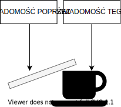
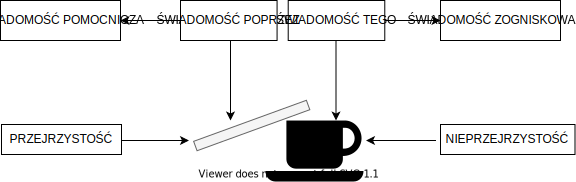
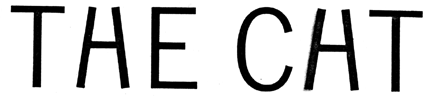
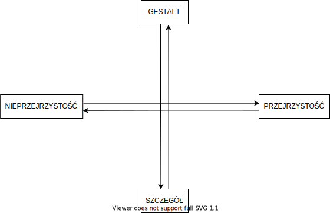
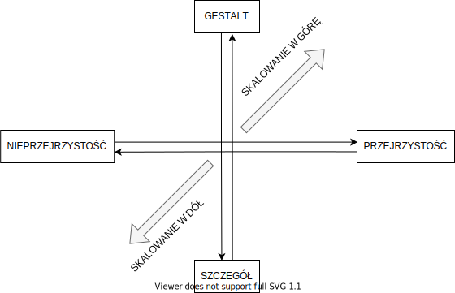

# Odcinek 9: Spostrzegawczość

Witajcie z powrotem w "Przebudzeniu z Kryzysu Sensu".

## Podsumowanie poprzedniego odcinka

Ostatnim razem kontynuowaliśmy przeglądanie mitu o przebudzeniu Siddhārthy, o tym jak opuścił pałac i próbował pozbyć się modusu posiadania, o jego próbie ponownego odkrycia i odzyskania modusu bycia oraz o trudnościach, jakie napotkał podążając za samowyrzeczeniem z taką samą pasją, z jaką dążył do samopobłażania i dlaczego ostatecznie to się nie udało, ponieważ Siddhārtha nadal podążał za _posiadaniem_ "ja". Następnie przyjrzeliśmy poświęceniu się Siddharthy na rzecz "Drogi Środka", pewnej próbie przezwyciężenia tego problemu poprzez kultywowanie mindfulness. Wtedy rozpoczęliśmy naszą eksplorację zagadnienia mindfulness. Najpierw przyjrzeliśmy się, co oznacza _sati_, a jest to głębokie przypominanie sobie, to odzyskiwanie modusu bycia, które prowadzi do fundamentalnej transformacji połączonej ze złagodzeniem egzystencjalnego niepokoju i cierpienia, której doświadczył Siddhārtha i która potencjalnie nam również dostępna. Potem zaczęliśmy przyglądać się właśnie temu - samej praktyce mindfulness i próbie przeciwdziałania chociażby jednostkowemu lub osobistemu doświadczeniu kryzysu sensu, którą podjął Siddhārtha. A robiliśmy to, ponieważ chcieliśmy zbadać szerzej rewolucję mindfulness i to, w jaki sposób stanowi ona reakcję na kryzys sensu na Zachodzie.

Zaczęliśmy od zauważenia, że badania naukowe nad mindfulness są pod pewnymi względami mylące, ponieważ zwykle zaczynają analizę od listy cech. A jak już wielokrotnie zauważaliśmy, lista cech pomija _eidos_, strukturalno-funkcjonalną organizację. Aby się temu przyjrzeć, wyodrębniliśmy cztery główne cechy z tej listy: bycie obecnym, nieosądzanie, spostrzegawczość i zmniejszoną reaktywność lub zwiększoną równowagę. Następnie zauważyliśmy, że powinniśmy dokonać rozróżnienia pomiędzy typami cech - na te, które są stanami, w które możemy wejść, na działania, które możemy wykonać oraz na cechy, które możemy rozwijać. To pozwoliło nam otworzyć możliwość zadawania pytań przyczynowych. Na przykład w jaki sposób praktykowanie bycia obecnym może skutkować rozwijaniem spostrzegawczości? Następnie mogliśmy zadawać pytania konstytutywne. Na przykład jaka występuje relacja "część-całość" pomiędzy byciem obecnym a nieosądzaniem?

Zauważyliśmy również, że powinniśmy zastąpić język nauczania językiem wyjaśniania. Te dwa języki operują w oparciu o różne założenia i mają odrębne cele. Zaczęliśmy od pytania co oznacza "bycie obecnym"? To zaprowadziło nas do dyskusji o koncentracji. Mówiliśmy o różnych jej rozumieniach, między innymi o "miękkiej czujności", która faktycznie wspiera spostrzegawczość, dyskutowanej przez Ellen Langer i innych. Jest to rodzaj zaangażowania, który polega w dużej mierze na współdopasowaniu, _inter esse_, stawaniu się głęboko zainteresowanym, połączonym ze strukturalno-funkcjonalną organizacją czegoś. To nas zaprowadziło w kierunku dyskusji o zwracaniu uwagi, przy czym nieustannie mieliśmy w pamięci koncepcję, którą zawdzięczamy Siddhārcie Gautamie poprzez jego opowieść o dostrajaniu - zyskiwania właściwego dostrojenia, rodzaju optymalizacji.

Następnie zaczęliśmy rozmowę o uwadze i poczyniliśmy pewne argumenty przeciw użyteczności metafory reflektora. Chociaż ta metafora komunikuje nam koncepcję uwagi, która manipuluje wyrazistością, brakuje w niej wiele z tego, co mechanizm uwagi zdaje się robić. Dalsze poszukiwania brakujących części zaczęliśmy od użycia koncepcji Christophera Mole'a według której poświęcanie uwagi nie jest bezpośrednio wykonywaną przez nas czynnością lecz czymś, co robimy modyfikując inną czynność, optymalizując inny proces. To dlatego potrafimy z powodzeniem poświęcać czemuś uwagę robiąc to na różne sposoby. Możemy poświęcać czemuś uwagę optymalizując wzrok by patrzeć, optymalizując słuch by słyszeć, optymalizując zarówno wzrok jak i słuch by w sposób skoordynowany śledzić, co ktoś mówi. To wszystko są sposoby zwracania na coś uwagi. Zatem potrzebujemy zrozumienia mechanizmu uwagi w ramach którego uchwycimy go jako strategię optymalizacyjną, która wpasowuje się w ową koncepcję _dostrajania_ i którą można powiązać z odpowiedzią na egzystencjalne pomieszanie modalne i z łagodzeniem cierpienia, które jest skutkiem tego pomieszania.

## Struktura uwagi

Chciałbym kontynuować dyskusję o uwadze i zacząć wskazywać na to, na czym może ona polegać. Jak pamiętacie, Mole używa koncepcji _poznawczego unisono_ - sprawiania, by kilka procesów działało na rzecz wspólnego celu, by były w jakiś sposób wzajemnie skoordynowane. Poprzestaje na tak abstrakcyjnym ujęciu, lecz ja uważam, że powinniśmy zbadać nieco dokładniej, konkretniej, cóż takiego może to oznaczać. Uwaga jest obecnie jednym z najgorętszych tematów w kognitywistyce. Wielu badaczy wykonuje naprawdę dobrą robotę na ten temat, np. Frank Wu, Sebastian Watzl i wspomniany Christopher Mole. Wielu ludzi o tym dyskutuje, a ja nie będę udawał, że jestem w stanie objąć tutaj tę bogatą i płodną dziedzinę. Nie to jest moim celem. Moim celem jest spróbować podchwycić pewne kluczowe zagadnienia, bo chcemy zrozumieć w jaki sposób mindfulness jest w stanie trenować uwagę w kierunku lepszych spostrzeżeń, by zwiększyć spostrzegawczość jednostki. Ponieważ, jak już wspominaliśmy, gdy mówimy o mądrości, nie mamy na myśli pewnego pojedynczego spostrzeżenia. Mówimy o systematycznym zbiorze spostrzeżeń, które są sprzężone z fundamentalnym przeistoczeniem egzystencjalnego modusu danej osoby.

Pomówmy zatem znów nieco o tym, czego brakuje w dotychczasowym modelu uwagi. Myślę, że by lepiej zrozumieć koncepcję _poznawczego unisono_, możemy posłużyć się dorobkiem pewnego innego ważnego kognitywisty, filozofa i naukowca, który prowadził badania nad uwagą, Michaela Polanyi'ego. Michael Polanyi wskazuje, że uwaga ma pewną określoną strukturę. Kontynuując praktykę podążania za platońską koncepcją przeobrażania listy cech w schemat cech, dobierania się do struktur, spróbujemy wydobyć to, co ma na myśli Polanyi, posługując się eksperymentem. Możecie w nim uczestniczyć razem ze mną.

Pozwólcie, że najpierw go opiszę. Znajdźcie jakiś przedmiot w rodzaju ołówka lub długopisu, nazwiemy go sondą. Następnie weźcie jakiś inny przedmiot, który możecie postawić przed sobą lub trzymać w dłoni. Będziecie robili rzecz następującą. Nie zaczynajcie jeszcze, poczekajcie aż skończę opis! Będę was prosił o ostukiwanie przedmiotu za pomocą sondy tak, jakbyście byli niewidomi i próbowali dociec jakiego kształtu jest ten przedmiot. Jaki ma kształt, strukturę, ciężar, gęstość. I gdy postukacie w niego, powiecie np.: "O, to jest filiżanka, prawda?". Wszystko jasne, tak? Ważne, by podczas tego trzymać oczy zamknięte. Posługuję się tutaj dotykiem, bo jest wolniejszy niż wzrok, dzięki czemu możecie stać się bardziej świadomi tego, co zachodzi. Ważne, abyście cały czas kontynuowali ostukiwanie.

Więc za chwilę poproszę was o zamknięcie oczu i rozpoczęcie ostukiwania. Gdy będziecie to robili, nie przerywając wykonujcie moje polecenia. Do da wam poczucie co się dzieje. Dobrze, zamknijcie oczy. Zaczynacie stukać w przedmiot. Stukajcie tak długo, aż zaczniecie formować obraz tego przedmiotu w waszym umyśle. Dobrze, zatem wasze oczy są zamknięte, macie obraz obiektu w umyśle. W tej właśnie chwili jesteście _świadomi w sposób zogniskowany_, a świadomość skupiacie na przedmiocie. Stukajcie nadal, ale teraz przenieście swoją świadomość do sondy, poczujcie jak ołówek lub długopis porusza się, przesuwa. Stukając nadal przenieście swoją świadomość do swoich palców i poczujcie jak wasze palce się poruszają i przesuwają.

Niektórzy z was mogą być w stanie wychwytywać pojedyncze odczucia w swoich palcach. Wróćcie uwagą do palców, poczujcie ruch swojego kciuka. Teraz poczujcie ruch sondy. A teraz pozwólcie by stukanie ujawniło wam znów ten przedmiot.

Wystarczy. Wykonywałem to z wieloma ludźmi wiele razy. Co interesujące, większości przychodzi to z wielką łatwością. Możemy zauważyć kilka rzeczy. Na przykład gdy zaczynałem ostukiwać filiżankę, byłem jej świadomy, ale potem moja świadomość przesunęła się na mój długopis, a następnie do mojego palca, ale gdy ulokowana była na moim palcu, nie byłem już wcale świadomy filiżanki! Następnie mogłem to odwrócić. Przeszedłem od świadomości moich palców przez świadomość sondy do świadomości filiżanki. Możecie powiedzieć: "No i co z tego? O co chodzi?". Cóż, jest w tym pewna ważna struktura. Przyjrzyjmy się jej krok po kroku.

Zatem mamy nasz przedmiot, filiżankę lub cokolwiek innego, ostukiwany sondą. Oto rzecz interesująca. Nie byłem _całkowicie_ nieświadomy mojej sondy, bo gdyby tak było, nie mógłbym nią manipulować. Ale nie byłem faktycznie świadomy _sondy_, byłem świadomy _filiżanki_ _poprzez_ sondę. Zatem jestem świadomy _tego_ (filiżanki) i jestem świadomy _poprzez_ (sondę). To tak, jakby moja sonda była dla mnie przejrzysta, a filiżanka była dla mnie nieprzejrzysta. Podam wam analogię. Już o tym wspominaliśmy, ale zróbmy to raz jeszcze. Oto moje okulary, one reprezentują moje ujmowanie rzeczywistości. Okulary są dla mnie przejrzyste w takim rozumieniu, że patrzę _poprzez_ nie, poza nie, za ich pomocą. Są dla mnie przejrzyste. Ale mogę przesunąć moją świadomość tak, aby spojrzeć _na_ moje okulary zamiast _przez nie_. Zatem moje okulary stały się dla mnie nieprzejrzyste. Mogę zatem wykonać _przesunięcie przejrzystość-nieprzejrzystość_. O czym świadczy zdolność wykonania takiego przesunięcia?

Cóż, to właśnie część koncepcji Polanyi'ego. Oto mamy moją sondę, przez którą jestem świadomy. Posiadam _świadomość pomocniczą_ lub _ukrytą_ ponieważ mam świadomość poprzez sondę, a nie świadomość jej samej. Poprzez sondę posiadam świadomość mojego przedmiotu ogniskowego, czyli filiżanki. Względem przedmiotu mam _świadomość zogniskowaną_ lub _dosłowną_. Otóż argument Polanyi'ego, bardzo zresztą trafny, brzmi, że uwaga jest zjawiskiem polegającym na tego rodzaju strukturyzowaniu, płynięciu _od-do_ (jak to określił), pomiędzy _świadomością pomocniczą_ a _świadomością zogniskowaną_. Gdy poświęcam czemuś uwagę, robię dokładnie to. Ale zauważmy jeszcze coś interesującego! Potrafiłem odsunąć się i zogniskować się na sondzie, następnie na moich palcach i potrafiłem być świadomym sondy _poprzez_ moje palce. A nawet mógłbym się jeszcze raz odsunąć i stać się świadomym moich odczuć, czegoś, co niektórzy nazwaliby _doznaniami_.

Czyli mogę wciąż odsuwać się i odsuwać. Patrzę na filiżankę poprzez sondę. A teraz patrzę poprzez moje palce na sondę. A teraz patrzę poprzez doznania na moje palce. I oczywiście robiłem to wszystko przez cały ten czas, gdy studiowałem filiżankę - patrzyłem przez moje odczucia w palcach, poprzez sondę i na filiżankę. Widzicie zatem, że metafora reflektora pomija całe to wielowarstwowe, rekursywne, dynamiczne strukturyzowanie, które ma tutaj miejsce. Zauważcie też, że możemy przesuwać się w obu kierunkach. Możemy dokonać przesunięcia przejrzystość-nieprzejrzystość, w którym mogę się odsunąć w głąb mojego umysłu, ale mogę też pójść w odwrotną stronę - mogę wykonać przesunięcie _nieprzejrzystość-przejrzystość_, czyli przejść od patrzenia na palce do patrzenia poprzez nie na sondę i przejść od patrzenia na sondę poprzez palce do patrzenia na filiżankę poprzez sondę. Nasza uwaga właśnie tym cały czas się zajmuje - przepływa "do i od" wykonując przesunięcia między przejrzystością a nieprzejrzystością. To niezwykle ważne, bo możemy tu dostrzec jak wszystkie te procesy zostają skoordynowane i zintegrowane ze sobą, aby zoptymalizować i - używając ważnego pojęcia, za Watzlem - _spriorytetyzować_ ten właśnie przedmiot, scenę lub sytuację.

Taki jest zatem jeden ze sposobów działania waszej uwagi. Z powodów, których nie jestem do końca pewien (myślę, że taka przestrzenna metafora bierze się z tego, jak wzrok jest zorientowany w naszych ciałach), kognitywiści mają tendencję do używania metafory "wewnątrz-zewnątrz". Dlatego właśnie używam "cofania się" i "patrzenia na" lub jego przeciwieństwa "patrzenia poprzez". Zauważcie też coś bardzo ważnego - będziemy tego potrzebować, gdy będziemy mówić o gnozie i wiedzeniu partycypacyjnym - kiedy, jeśli pozwolicie, "poznawałem" filiżankę poprzez sondę, _przebywałem wewnątrz_ sondy. To nie jest zaledwie tak, że uczestniczę w tym, jak sonda zachowuje się w stosunku do filiżanki - jestem niejako w środku. Nie poznaję sondy, poznaję poprzez sondę. Jestem _inter esse_. Jestem tak głęboko zainteresowany, że właściwie jestem z nią zintegrowany, a poprzez nią z filiżanką. Tak samo jak mój wzrok jest zintegrowany z tymi szklanymi soczewkami, że widzę przez nie i za ich pomocą. Rzecz w tym, że ten mechanizm działa nie tylko w parze z technologią ale również w parze z psychotechnologiami. Mówiliśmy o tym przy okazji omawiania myślenia drugiego rzędu. Możemy tak zintegrować, na przykład, umiejętność czytania i pisania ze swoim poznaniem, że właściwie niezbyt często przyglądamy się jej samej, ale automatycznie patrzymy przez nią. I do tego jeszcze wrócimy.

## Złożony i dynamiczny charakter uwagi

Raz jeszcze to podkreślę, ludzie zdają się określać uwagę metaforycznie jako przysuwanie i odsuwanie swojej świadomości. Zatem jednym ze sposobów działania uwagi jest przysuwanie się i odsuwanie. Możemy spoglądać poprzez wiele warstw przetwarzania wgłąb świata, albo możemy się odsunąć i spojrzeć na wiele warstw przetwarzania, wycofując się w kierunku do wewnątrz naszego umysłu.

Istnieje jeszcze jedna istotna oś wzdłuż której działa nasza uwaga i mogę to przywołać posługując się znanym przykładem [pochodzącym od [Neissera, 1967](https://psycnet.apa.org/record/1967-35031-000) - przyp. tłum.]. Pokazuje się ludziom rzecz następującą:

|           
| :------------------------------------------------------:
| "THE CAT" [po polsku "kot" lub "ten kot" - przyp. tłum.]

Pyta się ich o przeczytanie tego, co widzą. A co widzą? "THE CAT"! I są z siebie zadowoleni. Następnie zwraca się im uwagę, że ten sam kształt raz odczytują jako _H_, a drugi raz jako _A_, a są one dokładnie identyczne! Czemu odczytujemy pierwszy jako _H_, a drugi jako _A_? Przeważnie odpowiadają na tak postawione pytanie w taki sposób: "No cóż, bo do tego słowa pasuje to jako _H_, a do tego słowa pasuje to jako _A_."

Użyjmy języka, który już udało nam się tutaj rozwinąć. Litery są szczegółami, a słowa _Gestaltem_, ogólną strukturą. Zauważcie teraz - stajemy przed pewnym problemem! Brzmi to trochę jak sentencja z jakiejś filozofii pseudo-_Zen_ - _"Aby odczytać słowa, muszę wpierw odczytać poszczególne litery, lecz by rozróżnić poszczególne litery, muszę najpierw przeczytać słowa, zatem czytanie jest niemożliwe!"_.

Ale oczywiście czytanie nie jest niemożliwe, czyli coś w naszym rozumowaniu musi ulec zmianie. Mianowicie musimy zmienić model uwagi. Metafora reflektora nie jest w stanie rozwiązać tego paradoksu. Oto, czym uwaga naprawdę się zajmuje! Jednocześnie przechodzi od szczegółu do _Gestaltu_, do _eidos_, do strukturalno-funkcjonalnej całości, przechodząc w tym samym czasie w dół od _Gestaltu_ - słów - do jednostkowych szczegółów - liter. Robi to jednocześnie! Wasza uwaga robi coś jeszcze! Nie tylko przepływa "do i od", wykonując przesunięcia między przejrzystością a nieprzejrzystością, przepływa również "w górę i w dół" między szczegółem a _Gestaltem_! Tym wszystkim się zajmuje wasza uwaga. Wykonuje to wszystko właśnie teraz. A metafora reflektora nie jest w stanie niczego z tego uchwycić. Natomiast w mindfulness chodzi o wykorzystanie wszystkich elementów tego złożonego, dynamicznego przetwarzania (przypomnijcie sobie, czym są układy dynamiczne). To dynamiczne, samoorganizujące się procesy, które da się zoptymalizować. A mindfulness w pewien sposób je optymalizuje.

Pokażę wam teraz pewien rysunek. Wygląda jak wykres, ale to _nie jest_ wykres, bo nie ma na nim bezwzględnych położeń. To tylko schemat, bo położenia na nim są względne:

Gdy przesuwam się z prawej do lewej - przypominam twórczość Polanyi'ego! - wykonuję przesunięcie przejrzystość-nieprzejrzystość. Przesuwając się w przeciwną stronę wykonuję przesunięcie nieprzejrzystość-przejrzystość. To nie są pojęcia bezwzględne! Żadne położenie nie jest albo całkowicie przejrzyste albo nieprzejrzyste. Zawsze liczy się tylko kierunek. Im bardziej przesuwam się w lewo, tym bardziej odsuwam się i _patrzę na_. Im bardziej przesuwam się w prawo, tym bardziej _przebywam wewnątrz_ i patrzę wgłąb świata.

Następnie mamy oś pionową. Mogę przesuwać się w dół od _Gestaltu_ do szczegółu - przykładowo, wykorzystywać słowo by rozpoznać litery - ale mogę także przesuwać się w górę od szczegółu w kierunku _Gestaltu_. Nic nie jest samo z siebie "szczegółem"! Spójrzcie na zdanie: "Kot jest fajny!" - litery są szczegółami w słowach, ale słowo "kot" jest szczegółem w tym zdaniu! Nic nie jest samo z siebie szczegółem, to zawsze kwestia względna. Dlatego na diagramie umieszczam strzałki w obu kierunkach! To nie jest wykres kartezjański. To schemat.

Musicie jednak wiedzieć, że pomimo iż jestem w stanie je przedstawić, a wy zrozumieć te osie jako odrębne, niemal zawsze działają one w wysoce dynamiczny i zintegrowany sposób. Bardzo często, w miarę jak przesuwam się w kierunku _Gestaltu_ - obejmuję większy obraz, używam ogólniejszych wzorców by zajrzeć głębiej w świat. Często zatem idę po przekątnej jednocześnie w kierunku _Gestaltu_ oraz przejrzystości.

Dla przykładu - to właśnie robimy w nauce! Przyjmijmy, że dowiedziałem się wielu różnych faktów, uzyskuję pewien wzorzec i odnajduję sposób na ich połączenie, a następnie używam tego wzorca by spojrzeć w świat głębiej. Oto przykład:

Znalazłem wzorzec, który pozwala mi zgłębić świat! Nie przyglądam się już tym poszczególnym elementom - sile, masie i przyspieszeniu. Połączyłem je, a to pozwala mi spojrzeć w świat głębiej.

Z drugiej strony, często gdy odsuwamy się i patrzymy na nasz umysł, przesuwamy się po drugiej przekątnej. Przyglądamy się procesom świadomości w ramach naszej uwagi, często rozbijając _Gestalt_ na szczegóły. Przykładowo podczas niedawnego ćwiczenia rozbijaliśmy doświadczenie całego palca na jego poszczególne elementy. Albo rozbijaliśmy doświadczenie trzymania filiżanki na indywidualne punkty kontaktu. Zatem bardzo często przesuwanie się w kierunku szczegółu oraz przesuwanie się w kierunku nieprzezroczystości występują wspólnie. Pierwszą przekątną nazywam "skalowaniem w górę", a drugą "skalowaniem w dół":

## Skalowanie uwagi a mindfulness

Teraz zajmiemy się mapowaniem tych dwóch procesów na praktyki mindfulness, by rozjaśnić dlaczego one zachodzą. Zajmuję się nauczaniem Vipassany, która jest bardzo tradycyjną formą medytacji. Zauważcie najpierw, co oznacza to słowo: "medytować". Faktycznie oznacza poruszanie się w kierunku środka. [John posługuje się tutaj podobieństwem do słowa _medius_, oznaczającego "środek", jednak etymologia słowa _meditatio_ jest inna i pochodzi od słowa _medeor_, odnoszącego się do leczenia i udzielania pomocy. "Medytacja" ma zatem ten sam źródłosłów, co "medycyna". Możemy jednak docenić wartość tej analogii jako mnemotechniki i praktycznej wskazówki.] Wiemy zatem, że ten aspekt będzie tej praktyce towarzyszył. Jak się to robi? Zwykle trenuje się ludzi wydając im polecenie poświęcenia uwagi ich oddechowi. Po pierwsze w ten sposób przestają poświęcać uwagę światu, odsuwają się, ale tak naprawdę nie przenoszą uwagi na sam oddech. Instruuje się ich w następujący sposób (zwróćcie uwagę, że tym razem będzie to język nauczania, nie język wyjaśniania!) - mają zwracać uwagę na odczucia i doznania wytwarzane w obszarze jamy brzusznej w trakcie oddychania. Zatem gdy biorą wdech, mają pewne doznania w obszarze jamy brzusznej, podobnie gdy wydychają powietrze. I starają się robić to samo, co ja próbowałem osiągnąć poświęcając uwagę mojemu palcowi - starają się utrzymać i odnawiać zainteresowanie, nieustannie czynić te doznania wyrazistymi.

Zauważcie, co ma miejsce. Zwykle nie tyle poświęcamy uwagę naszym ucieleśnionym doznaniom (nie jestem całkowicie zadowolony z użycia tego słowa z ważnych powodów filozoficznych, ale nie mam teraz czasu się w to zagłębiać), co poświęcamy uwagę światu _poprzez nasze doznania_. Czyli zwykle nie zwracam uwagi _na_ moje odczucia, bo gdy trzymam filiżankę, wtedy _jej_ poświęcam uwagę _poprzez_ te odczucia.

Podczas medytacji odsuwam się i nie patrzę już poprzez moje doznania - odsuwam się i to _im_ się przyglądam. To tak jakby powiedzieć, że nie patrzę poprzez sposób, w który mój umysł ujmuje świat, przyglądam się _samemu ujmowaniu_. Robię coś jeszcze. Nie patrzę na to jak na jakąś bezkształtną masę. Wykonuję pewnego rodzaju analizę obserwacyjną. Rozbijam _Gestalt_ na poszczególne doświadczenia. Wykonuję owo _skalowanie w dół_. Odsuwam się i "patrzę na", rozbijam _Gestalt_ mojego doświadczenia na jego detale, jego atomowe szczegóły (pozwalając sobie na metaforę, której nie powinniśmy posuwać za daleko). To właśnie robi się podczas medytacji. Jeszcze pomówimy o tym _dlaczego_ mielibyśmy to w ogóle robić. Dlaczego miałoby to mieć znaczenie? Będziemy też musieli odpowiedzieć na postawione przez nas wcześniej ważne pytanie - w jaki sposób miałoby to wspierać powstawanie spostrzeżeń?

Zatem ta lewa przekątna, "skalowanie w dół", to medytacja. Czyli przykładowo Vipassana. Ale nauczam również praktyk _kontemplacyjnych_, które odpowiadają drugiej przekątnej ("skalowanie w górę")! Skoro "medytacja" oznacza poruszanie się ku środkowi (co tak świetnie pasuje do Vipassany), jej przeciwieństwem jest "kontemplacja"! Wiele mówi, o tym jak ograniczony jest Zachód w rozumieniu tych praktyk, fakt, że te określenia są obecnie używane jako synonimy - "praktyki kontemplacyjne", "praktyki medytacyjne". To samo? Synonimy? Nie! To nie są synonimy. A przyjrzenie się ich etymologii szybko to ukaże. Po pierwsze łacińskim źródłosłowem słowa _contemplatio_, w samym jego środku, jest _templum_! Świątynia! A pierwotnie świątynią było miejsce zamieszkane przez bogów, w kierunku którego spoglądaliśmy, by szukać znaków boskich, czyli nieboskłon! Kontemplować to spoglądać w górę, w kierunku boskości. Jest jeszcze inna zbieżność - _contemplatio_ jest tłumaczeniem greckiego słowa _theoria_. _Theoria_ nie odnosi się pierwotnie do "wymyślania sobie jakichś teorii". "Teoria", w naszym rozumieniu, jest rodzajem _theorii_, bo w _theorii_ chodzi o spoglądanie głębiej w rzeczywistość.

Widzicie? Medytacja to poruszanie się do wewnątrz. Kontemplacja to poruszanie się na zewnątrz! Medytacja podkreśla "skalowanie w dół", kontemplacja podkreśla "skalowanie w górę". Mnie nauczono obu. Właściwie nauczono mnie trzech rzeczy złączonych ze sobą - nauczono mnie Vipassany (strategii skalowania w dół), nauczono mnie Metty (strategii skalowania w górę, przy czym skalowane jest tutaj nasze poczucie tożsamości, wrócimy do tego), ale dodatkowo nauczono mnie Tai Chi Chuan. Istotą Tai Chi Chuan jest ruch - do wewnątrz i na zewnątrz, przepływ pomiędzy ruchami dośrodkowymi i odśrodkowymi w sposób dynamiczny i optymalizacyjny. Dlaczego wszystkiego tego nauczano mnie jednocześnie? Ponieważ tak naprawdę te psychotechnologie składają się na jeden wspólny system, który jest w stanie zoptymalizować moje poznanie i moją spostrzegawczość.

## Skalowanie uwagi a spostrzegawczość

W porządku, teraz przypomnijmy sobie raz jeszcze zadanie z dziewięcioma punktami, które poruszaliśmy na początku tego cyklu. Przypomnijcie sobie fakt, że możemy popaść w błędne ujmowanie. Postawmy ten problem raz jeszcze - połącz punkty czterema prostymi liniami. Ludziom sprawia to niezwykłą trudność. Dlaczego? Przypomnijcie sobie, mówiliśmy już o tym - teraz wsłuchajcie się w język - ludzie automatycznie i nieświadomie rzutują obręb kwadratu na ten problem! Następnie automatycznie uznają ten problem za zadanie łączenia kropek, w którym nie wolno robić zakrętów w miejscach, gdzie kropek nie ma, a zatem nie są w stanie dojść do rozwiązania.

A rozwiązanie jest proste - jedna, dwie, trzy, cztery linie!

Powodem tej trudności jest konieczność przebicia tego obrębu kwadratu i nietraktowania tego zadania jak zwyczajnego łączenia kropek. Musimy przestać traktować je w sposób kategoryczny (by użyć już znanego wam języka), pozbyć się domysłu, że zakręty w miejscach, gdzie kropek nie ma, są niedozwolone. Zapamiętajcie to! A teraz zauważcie, że w spostrzeżeniu istnieją dwa etapy. Wpierw muszę rozbić niewłaściwe ujmowanie. Czego muszę dokonać? Muszę rozbić _Gestalt_! A następnie muszę także _zdezautomatyzować_ moje poznanie - muszę sprawić, by przestało działać ono nieświadomie i automatycznie.

Jednak jak mam to zrobić? Muszę wziąć coś, co zwykle dzieje się nieświadomie i muszę to wydobyć na powrót do świadomości. Ma to sens, prawda? Jak tego dokonać? Dokonuję tego wykonując przesunięcie przejrzystość-nieprzejrzystość. W normalnych warunkach w sposób automatyczny doświadczam _poprzez_ moją sondę. Ale mogę przesunąć swoją świadomość i stać się świadomym samej sondy. Mogę wydobyć ją na poziom świadomości. Zatem dezautomatyzację poznania możemy osiągnąć wykonując przesunięcie przejrzystość-nieprzejrzystość.

Zatem rozbijam niewłaściwe ujmowanie oraz dezautomatyzuję poznanie wykonując skalowanie w dół. Co ciekawe, istnieje sporo badań wykonanych przez [Knoblicha i innych](https://doi.apa.org/doiLanding?doi=10.1037%2F0278-7393.25.6.1534), pokazujących, że możliwe jest poprawienie zdolności do rozwiązywania zadań wymagających spostrzegawczości, gdy uda się sprawić, by uczestnicy dokonywali tak zwanej dekompozycji na kawałki oraz relaksacji więzów. Dekompozycja na kawałki to po prostu rozbijanie _Gestaltu_. Z kolei relaksacja więzów to w zasadzie dezautomatyzacja poznania. Skalowanie w dół pomaga rozbijać na kawałki, rozbijać _Gestalt_ oraz pomaga w dezautomatyzacji poznania.

Ale czy to wystarcza, by wywołać spostrzeżenie? Nie, nie wystarcza! Owszem, muszę rozbić niewłaściwe ujmowanie, ale muszę w jego miejsce utworzyć lepsze, alternatywne. Spójrzcie na obręb kwadratu w zadaniu z dziewięcioma punktami - muszę go rozciągnąć. Muszę rozciągnąć, rozszerzyć pole mojej świadomości. Muszę powyciągać rzeczy z tła i zmienić stopień ich istotności. Muszę spojrzeć głębiej w poszukiwaniu głębszych, ogólniejszych wzorców, których wcześniej nie brałem pod uwagę. Co więc muszę zrobić, by utworzyć nowe ujmowanie problemu? Muszę skalować w górę. Okazuje się, że posiadamy mnóstwo niezależnych dowodów, zupełnie niemających nic wspólnego z mindfulness ani z medytacją, że jednym ze sposobów poprawienia zdolności do doświadczania spostrzeżeń jest przejście treningu, posiadanie doświadczenia, praktykowanie lub naturalna zdolność do skalowania w górę. Ludzie, którzy potrafią dopełniać wzorce dokonując pewnego rodzaju skoków - jak opisywali to [Ceci i Baker-Sennett](https://onlinelibrary.wiley.com/doi/abs/10.1002/j.2162-6057.1996.tb00765.x), a także inni - przykładowo jeżeli widząc rozmyte obrazy potrafią wyostrzyć je mentalnie i nagle dostrzec ich nierozmytą zawartość, gdy potrafią w ten sposób skalować w górę, lepiej wychodzi im rozwiązywanie zadań wymagających spostrzegawczości. Obie te rzeczy zatem poprawiają tę zdolność. Ale istnieje pewien problem, bo obie z nich jednocześnie ją pogarszają.

Bo gdy będę jedynie skalował w górę, jeżeli będę jedynie maksymalizował - pomyślcie o zbyt mocnym naciąganiu struny - wtedy oczywiście natychmiast będę rzutował obręb kwadratu na dziewięć punktów i zostanę w nim zamknięty! Czy zatem powinienem zawsze skalować w dół? Po prostu zawsze medytować? Jeżeli będę wciąż tylko rozbijał _Gestalt_, nigdy nie znajdę rozwiązania! Zablokuję się. To się właśnie dzieje, gdy ludzie się blokują. Dla przykładu, podczas sparringu w sztukach walki dobrą metodą na destabilizację przeciwnika jest udzielenie mu komplementu. "To było świetne, ten prawy sierpowy!" - wtedy ten ktoś zacznie odsuwać się i patrzeć na swoją technikę i wytrąci go to z rytmu. Rozpadnie się jego zdolność składania _Gestaltu_.

Zauważcie, co tutaj chcę powiedzieć. Wczujcie się w to, bo to jest naprawdę podchwytliwe. Skalowanie w dół może poprawić naszą spostrzegawczość poprzez rozbijanie niewłaściwego ujmowania. Ale może również popsuć naszą zdolność do rozwiązywania problemów powodując zblokowanie. Z kolei skalowanie w górę może poprawić spostrzegawczość pomagając w stworzeniu lepszego ujęcia, ale to zaś może prowadzić do skoku do błędnego ujęcia i zamknięcia się w fiksacji.

Co zatem powinniśmy robić? Nie chcemy, aby struny były zbyt napięte, ani zbyt luźne. Nie chcemy też być zwyczajnie pośrodku. Cóż, należy zatem trenować ludzi w obu z tych umiejętności, a następnie wytrenować ich w przepływaniu między nimi. Ta strategia nosi nazwę _przetwarzania przeciwstawnego_. Celem jest sprawienie, aby te dwa procesy wzajemnie na siebie napychały i odciągały tak, aby zmuszone były do ciągłej koordynacji, aby uzyskać właściwy stopień zaangażowania uwagi, który jest w sposób dynamiczny najlepiej dopasowany do świata. To dlatego ci, którzy mnie nauczali, nauczyli mnie tych wszystkich rzeczy. To dlatego nie powinniśmy zrównywać mindfulness jedynie z medytacją. Mindfulness to nie tylko medytacja. Przykładowo, jeżeli przyjrzeć się Ośmiorakiej Ścieżce, znajdziemy tam trening praktyk medytacyjnych, kontemplacyjnych oraz praktyk w których przepływa się między tymi przeciwieństwami aż do osiągnięcia płynności i umiejętności w nieustannym dostosowywaniu i dopasowywaniu swojej uwagi do świata.

Stąd można płynnie przejść do omawiania doświadczeń mistycznych i tego rodzaju mistycznych przeżyć, jakich ludzie doświadczają w praktykach mindfulness. Ale zanim to zrobię zbierzmy to wszystko razem. Zauważcie, co tutaj opisałem. Doszliśmy do pewnego sposobu rozumienia mindfulness. Co mindfulness robi? Otóż mindfulness w zasadzie naucza nas jak uzyskać i ćwiczyć elastyczność skalowania uwagi tak, abyśmy mogli w sposób efektywny interweniować w to, jak ujmujemy nasze problemy i zwiększyć szanse na dokonywanie spostrzeżeń wtedy, kiedy zachodzi taka potrzeba.

## Zdarzenie czystej świadomości

Zauważcie, że zwyczajowy opis według którego "bycie obecnym" zwiększa spostrzegawczość, nie wyjaśnia mechanizmu, jak to właściwie zachodzi. Ale ja przedstawiłem wam sposób rozumienia "bycia obecnym", który jest spójny. Gdy skaluję w dół, w istocie sprawiam, że mój umysł pracuje w mniejszym stopniu na reprezentacjach i mniej inferencyjnie. Podejmuję się tego wysiłku, by stać się świadomym i uzyskać pewną władzę nad moim procesem ujmowania problemów, a przez to wytrenować zdolności, które uczynią mnie bardziej spostrzegawczym. Co by się jednak stało, gdybym robił tylko to - skalował w dół i w dół, itd.? Tak właśnie mogę osiągnąć jedno z ważnych doświadczeń mistycznych. [Forman](https://philpapers.org/rec/FORTPO) nazywa to - i jest to dobrze poświadczone - "zdarzeniem czystej świadomości" - "PCE" [pure consciousness event]. Jest to rodzaj doświadczenia mistycznego, którego można dostąpić w wyniku dogłębnej praktyki mindfulness.

W tej właśnie chwili patrzę na świat. W praktykowaniu medytacji chodzi o próbę odsunięcia się i zamiast tego popatrzenia - za pozwoleniem - na "soczewkę naszego umysłu". Okazuje się, że trudno jest to utrzymać, bo posiadamy głęboko zakorzenione nawyki zwracania uwagi z powrotem w kierunku świata. Zaczynamy znów myśleć o robieniu prania, różnych obowiązkach, itd. i właśnie wtedy powinniśmy cofnąć z powrotem naszą uwagę. To musimy zrobić, musimy z powrotem przemieścić się do centrum, odsunąć się i spojrzeć _na_ swój umysł zamiast automatycznie patrzeć _poprzez_ niego. To właśnie podlega treningowi. Potrafi to być frustrujące i żmudne, ale to jak robienie powtórzeń na siłowni. Na tym polega medytacja. Medytacja to budowanie zdolności do odsuwania się i przyglądania się swojemu umysłowi. A teraz spójrzcie, co się dzieje. Pamiętacie jak odsuwaliśmy się warstwa po warstwie? Przeszliśmy do sondy, potem do palców, potem do doznań. Gdy ćwiczę to z ludźmi, często ci, którzy mają już za sobą trochę praktyki medytacyjnej, mogą od razu odsunąć się całkowicie do swoich doznań. To nie przypadek.

Wróćmy do zdarzenia czystej świadomości. Zatem przyglądam się swojemu umysłowi, następnie zaczynam przyglądać się coraz bardziej warstwom pomocniczym wewnątrz mojego umysłu, tym głębszym warstwom przez które chwilę temu patrzyłem na warstwy wyższe. I odsuwam się znowu, i znowu. W pewnym momencie patrzę tylko na swoją świadomość. W końcu odsuwam się całkowicie i wtedy nie jestem już nawet świadomy niczego konkretnego. Nie jestem świadomy doznań, jestem świadomy _po prostu_. To właśnie jest "zdarzenie czystej świadomości". Nie jesteśmy wtedy świadomi niczego konkretnego, jesteśmy tylko całkowicie obecni _jako_ świadomość. Nie jesteśmy nawet świadomi siebie samych. Nie patrzymy poprzez maszynerię swojego "ja", nie patrzymy poprzez naszą świadomość, nie patrzymy nawet poprzez nasz umysł. Jesteśmy po prostu w pełni świadomi. Zdarzenie czystej świadomości. To ostateczny rezultat skalowania w dół.

## Rezonujące zjednoczenie

A co jeżeli naprawdę mocno skalowałbym w górę? Pomyślcie o wyrażeniach, które mogliście słyszeć w powiązaniu z Buddyzmem: "Widzę wszystko połączone ze sobą, płynące i wieczne." Będę tworzył wszechogarniający _Gestalt_, który będzie ogarniał wszystko, a z tym wszystkim obejmie również mnie. Doświadczę "rezonującego zjednoczenia". A wy wiecie już przecież jak to jest, już o tym mówiliśmy. To jak znajdować się w stanie swego rodzaju _super_przepływu, w którym jestem głęboko ze wszystkim zjednoczony. Stan _superprzepływu_ - _rezonujące zjednoczenie_. Być może bardziej odpowiednim od "zjednoczenia" byłoby słowo "pojednanie", ale ma to pewne chrześcijańskie konotacje, których nie chcę teraz przywoływać, zatem: _zjednoczenie_. [John używa "atonement" - tutaj tłumaczone jako "zjednoczenie" - i "at-onement" - tutaj tłumaczone jako "zjednoczenie". To drugie określenie jest pochodzącym od niego neologizmem nawiązującym jednak do pierwszego słowa. "Atonement" czyli "pojednanie" lub "zadośćuczynienie" wskazuje jednoznacznie na pewien aspekt uzyskiwania spokoju i równowagi towarzyszący doświadczeniu kontemplacyjnemu, który John chciał zachować. Warto o tym pamiętać.]

Zobaczcie, ten model mindfulness wyjaśnia dlaczego ludzie dostępują tego rodzaju mistycznych przeżyć. Jeżeli praktykują bardzo dużo medytacji, mogą doznać zdarzenia czystej świadomości. Jeżeli praktykują bardzo dużo kontemplacji, mogą rozwinąć owo empatyczne, partycypacyjne, przepływające (superprzepływające!), rezonujące zjednoczenie. Pamiętajcie jednak, że ostatecznie zależy nam na obu.

## Niedualność

Istnieje jeszcze trzeci stan. To ten stan liczy się tak naprawdę. Jest to stan znany jako niedualność. Pozwólcie, że spróbuję wyjaśnić to w taki sposób, abyście mogli przynajmniej sobie wyobrazić jak moglibyście do niego dojść. Używam tego podczas treningu. Wyobraźcie sobie, że cyrkulujecie pomiędzy skalowaniem w górę i skalowaniem w dół za pomocą oddechu. Wdychając powietrze, skalujecie w górę i dokonujecie tego rezonującego zjednoczenia. Próbujecie przepływać w zjednoczeniu ze wszystkim. A podczas wydechu wykonujecie Vipassanę. Próbujecie odsunąć się tak blisko jak potraficie w kierunku zdarzenia czystej świadomości. I w ten sposób oscylujecie w obie strony za pomocą oddechu. Czasem trzeba to praktykować latami, ale jest to możliwe i są nawet inne sposoby, aby dostać się do tego stanu, nie jest on wyłączny dla tych praktyk. To po prostu sposób w jaki mnie nauczano. Otóż możecie doświadczyć trzeciego rodzaju przeżycia mistycznego. Nie jest to ani zdarzenie czystej świadomości ani rezonujące zjednoczenie. Zawiera je oba, ale też oba je przekracza. To oba te doświadczenia naraz. Macie świadomość wgłąb własnej świadomości i wgłąb świata. I są one zupełnie zjednoczone. Wszystko naraz.

Ten stan to _pradżnia_, stan niedualności. To jedno z określeń oznaczających "mądrość". Jest to też rodzaj doświadczenia mistycznego. To ten stan jest tak naprawdę najbardziej pożądany, owa niedualność, ponieważ jest to stan, który powinien prowadzić nas do kompleksowej spostrzegawczości. Wtedy nie będziemy mieli tylko spostrzeżeń na temat dziewięciu kropek i czterech prostych linii - będziemy mieli spostrzeżenia wnikające do fundamentów, do sedna, do gramatyki relacji agent-arena. Rozszerzamy obszar działania agenta i rozszerzamy obwód areny, optymalizując tę maszynerię! Wszystko aby móc dostrzec w możliwie głęboko zintegrowany sposób połączenie między nimi.

Zyskujemy zatem zdolność spostrzegawczości. Nie w ramach tego czy innego problemu, ale zdolność spostrzegania własnych modusów egzystencjalnych. Tak właśnie można "przypomnieć sobie" modus bycia. Możemy dokonać na jego temat fundamentalnych spostrzeżeń. Oczywiście Siddhārtha doświadczył właśnie tego. Praktykował Vipassanę oraz praktykę kontemplacyjną zwaną Mettą bardzo głęboko i z wielką mocą. I wygląda na to, że jedną z jego głównych innowacji było połączenie tych dwóch praktyk razem. Często opisuje je w swoich przekazach. W efekcie doświadczył radykalnej przemiany - doświadczył oświecenia. (Poruszymy jeszcze, co to słowo może oznaczać.) Po swym oświeceniu, po przebudzeniu, gdy przechadzał się ulicą, ludzie podchodzili do niego, bo jego oblicze się zmieniło! Pomyślcie, co obserwujecie, gdy widzicie kogoś, kto jest głęboko czymś pochłonięty, znajduje się w stanie przepływu. Widać tę grację, energię i muzyczność zrozumienia, która odmalowuje się na jego twarzy, w jego gestach i jego ruchach. I nie jesteśmy w stanie tego ująć konkretnie, większość z tego wychwytujemy w sposób niejawny, ale mamy poczucie, że jest to piękne, wdzięczne i pełne mocy. Jest w tym pewna charyzma, w której można się zatracić. Zatem ci ludzie podchodzą do Siddhārthy, bo właśnie tym jest przepełniony.

Pytają go więc: "Czy jesteś bogiem?" (Pomyślcie jakie muszą zajść okoliczności, że rozsądnie jest zadać komuś takie pytanie.) Odpowiada, bardzo jasno: "Nie, nie jestem." - "Czy jesteś jakimś anielskim wysłannikiem lub istotą?" - "Nie, nie jestem?" - "Czy jesteś jakimś prorokiem?" - "Nie, nie jestem." - "Czyli jesteś tylko człowiekiem?" - "Nie, nie jestem.". Popadają we frustrację. Pytają: "Kim zatem jesteś?" - "Jestem przebudzony."

Stąd bierze się jego przydomek. Przechodzi od mówienia o tożsamości, którą mógłby mieć, w kierunku fundamentalnego sposobu istnienia - _przebudzony_. W pełni, dogłębnie - do tych głębi, które starałem się tutaj nakreślić - _sati_, _przypomniał sobie_ modus bycia, nie tyle dostrzegając coś na temat tego lub innego zagadnienia, ale uzyskując fundamentalną zdolność dostrzegania tego, czym jest bycie istotą ludzką. Systematyczny zbiór spostrzeżeń, który optymalizuje całe nasze życie, który wyzwala i wzmacnia rodzaj fundamentalnego doświadczenia transformatywnego.

## Doświadczenia transformatywne

Jako kognitywista, szczególnie taki, który bada powiązania między buddyzmem a kognitywistyką, bardzo zainteresowałem się tego rodzaju doświadczeniami i otaczają mnie koledzy i współpracownicy, których również to zajmuje. Dlaczego ludzie dążą do odmiennych stanów świadomości? Dlaczego rewolucja mindfulness (które jest podążaniem za odmiennym stanem świadomości) ma taką moc? Dlaczego przechodzimy obecnie rewolucję psychodeliczną? A zauważmy, że w odróżnieniu od innych środków farmakologicznych psychodeliki działają właśnie przywołując odmienny stan świadomości. Czemu jest to aż tak krytycznie ważne? Dlaczego nie jesteśmy nawet jedynymi istotami, które szukają odmiennych stanów świadomości? Wygląda na to, że im inteligentniejsza istota, tym intensywniej będzie poszukiwać odmiennych stanów świadomości. Wrony brodate turlają się po dachach, żeby im się kręciło w głowie. To ryzykowne, ale robią to, bo odmienny stan świadomości sprawia im frajdę.

Co powoduje, że niektóre z tych odmiennych stanów - doświadczenia mistyczne, niektóre doświadczenia psychodeliczne - są w stanie w ramach terapeutycznego kontekstu umożliwić i wywołać tak silne przemiany? Co się tutaj dzieje? A jest jeszcze coś interesującego. Niekiedy ludzie doświadczają odmiennego stanu świadomości, który według mnie jest odpowiednikiem Rewolucji Osiowej. Spójrzcie, zwykle gdy doświadczacie odmiennego stanu świadomości i - by użyć metafory Siddhārthy - budzicie się z niego, występuje kontrast jak między snem a jawą. W pewnym typowym odmiennym stanie świadomości, takim, którego doświadczacie co noc, śnicie. A gdy jesteście we śnie, jesteście przekonani, że ten świat jest prawdziwy! Wchodzicie z nim w interakcje tak, jakby był realny. Ale po przebudzeniu od razu stwierdzacie, że to był tylko sen, że nic z tego nie było prawdą. Zwykle, gdy wychodzimy z odmiennego stanu świadomości, wskazujemy na niego z odrzuceniem, stwierdzając: "To nie było prawdziwe!". "Byłem pijany, to nie było naprawdę." "Byłem zjarany, to nie było naprawdę." Ale czasem ludzie doświadczają pewnego rodzaju przeżyć, pewnych odmiennych stanów świadomości, w których dzieje się coś dokładnie odwrotnego.

Wchodzą w ten stan, a gdy z niego powracają, są w stanie powiedzieć: "To było bardziej prawdziwe. To było naprawdę realne. A _to_ jest mniej realne." Widzicie w tym osiowość? W tym doświadczeniu miałem dostęp do wyższego stanu świadomości, miałem dostęp do prawdziwego świata! A gdy powróciłem, jak ktoś powracający do jaskini Platona, cofnąłem się ze światła. _To_, ten świat - zdaję sobie teraz sprawę - to tylko echa i cienie. Jest mniej prawdziwy. W rzeczy samej, ponieważ tak bardzo pragnę kontaktu z tym, co prawdziwe, będę teraz starał się zmienić siebie i świat wokół mnie, by spróbować przywołać i - _sati_ - _przypomnieć sobie_ jak to jest być w tym prawdziwym świecie. Chcę żyć w lepszym kontakcie z tym, co naprawdę realne.

Zatem niektórzy ludzie po tych doświadczeniach przemieniają całe swoje życie i samych siebie. Ich relacje agent-arena zostają całkowicie i radykalnie, rewolucyjnie zrestrukturyzowane. Nazywane to jest "skokiem kwantowym" - fatalna nazwa, dobra teoria. Ludzie tego doświadczają. To oczywiście bardzo istotne dla zrozumienia, co takiego dzieje się z ludźmi takimi jak Siddhārtha. Właściwie to większość światowych religii, które wyłaniają się w toku Rewolucji Osiowej, jest oparta o koncepcję istnienia pewnych wyższych stanów świadomości. Takich, które mają dać nam siłę, rzucić wyzwanie i zachęcić do zaangażowania się w kwantową transformację. By przejść przez owe radykalne doświadczenia przemienienia. W sposób oczywisty leży to w centrum buddyzmu. Doświadczam _Satori_, dostrzegam _Siunjatę_. Jest to sednem _Wedanty_ - gdy doświadczam _Mokszy_ i wyswobodzenia. Jest to sednem Daoizmu, gdy realizuję _Dao_.

## Doświadczenia mistyczne a sens życia

Jak to możliwe, że tym doświadczeniom przyznawany jest aż taki autorytet? Są również ważne historycznie, stanowią podstawę wielkich światowych religii. Również religii zachodnich - mamy przecież sufizm w islamie, chrześcijańskie tradycje mistyczne i kabałę w judaizmie. Wszystkie światowe religijne tradycje wskazują na te wyższe stany świadomości, które mogą wywołać radykalne modalne przemiany w naszym poznaniu i naszym istnieniu. Samo to powinno wystarczyć! Ale gdy się przeprowadzi sondaże, okazuje się, że od 30 do 40 procent całej populacji miało tego typu doświadczenia. I podobnie jak przepływ jest to stała międzykulturowa, niezależna od grup językowych, statusu socjoekonomicznego, płci, itd., powszechna i uniwersalna. Nie uniwersalna w sensie, że każdy tego doświadcza, ale uniwersalna w takim rozumieniu, że nie istnieje żadna grupa lub klasa istot ludzkich, którą moglibyśmy wyodrębnić, wśród której nie byłoby osób zdolnych do takich przeżyć.

Zatem zarówno ilościowo, historycznie jak i jakościowo, naukowo, jest to ważne zjawisko. A teraz coś, co jest szczególnie ważne dla nas w tym cyklu. Istnieje głębokie połączenie - przypominam, już o tym mówiłem - pomiędzy tym jak często wchodzimy w przepływ a subiektywną oceną sensu w naszym życiu. W wypadku tych przeżyć to połączenie jest jeszcze silniejsze. Ludzie po tych doświadczeniach wyższych stanów świadomości, po przejściu przez owe kwantowe przemiany, głębokie doświadczenia transformatywne, powtarzalnie - i jest na to sporo dobrych danych eksperymentalnych - raportują znaczny wzrost poczucia sensu w ich życiu. Właściwie to wielu z nich uważa te doświadczenia jako jedne z najważniejszych życiowych doświadczeń, a znaczna część sensu w ich życiu opiera się o te konkretne przemiany. Istnieją głębokie połączenia między przebudzeniem a odzyskiwaniem poczucia sensu. Istnieją głębokie powiązania między przebudzeniem a spostrzegawczością, jak już zdążyłem zaznaczyć. Wreszcie, co później zobaczymy, istnieje głębokie połączenie między zagadnieniami wymagającymi spostrzegawczości, doświadczeniami mistycznymi a pełnymi doświadczeniami przebudzenia.

W mojej pracowni niedawno ukończyliśmy pewne badania. Wspólnie z moim współpracownikiem Andersonem Toddem, z kierownikiem pracowni Juensugnem Kimem, wszystkimi moimi wspaniałymi asystentami naukowymi niedawno przedłożyliśmy artykuł opisujący pewien eksperyment. Wykonaliśmy ogromny sondaż z użyciem Amazon Mechanical Turk, by zobaczyć czy istnieje związek pomiędzy przeszłym doświadczeniem mistycznym a poczuciem sensu w życiu. I faktycznie istnieje istotny związek między doświadczeniem mistycznym i poczuciem sensu w życiu. Wykonaliśmy bardziej drobiazgową analizę, która zbiega się z pracą [Samanthy Heintzelman i innych](https://journals.sagepub.com/doi/abs/10.1177/0956797612465878), eksperymentalnymi badaniami, które pokazują, że to coś w rodzaju zdolności spostrzegawczych, nadawania sensu - co często w literaturze nazywa się koherencją - zdaje się grać główną rolę. Czyli nie ma to tak naprawdę znaczenia - jeżeli pozwolicie - jaka jest zawartość doświadczenia mistycznego. Właściwie to często nie ma takowej zawartości, bo te doświadczenia są niewyrażalne.

Wydaje się, że w tych doświadczeniach w jakiś sposób jesteśmy w stanie zoptymalizować naszą zdolność do nadawania sensu, zarówno wewnętrznie jak i zewnętrznie. Wygląda to tak, jakby optymalizowany był sam proces _anagoge_, a ludzie znajdują w tym głęboki sens. Nie jestem piewcą buddyzmu. Jak już wspominałem, bardzo podobne stwierdzenia znajdujemy we wszystkich tradycjach mistycznych, nie uważam ich jednak za identyczne. Nie bawię się w Aldousa Huxleya. Jednak wydaje się, że istnieją pewne głębokie prawdy na temat natury uwagi, natury mindfulness i na temat ulepszania zdolności wchodzenia w owe wyższe stany świadomości, mogące w istotny sposób złagodzić egzystencjalny niepokój i przynieść rodzaj wszechobecnej i głębokiej optymalizacji naszej spostrzegawczości i naszej zdolności do odnajdywania sensu naszego życia. A to, zdolność do tego wszystkiego - łagodzenia egzystencjalnego niepokoju, stwarzania systematycznej spostrzegawczości, transformacji agenta i areny, która przywraca modus bycia, do dokonywania przemiany - czyż to nie jest sedno sensu? A ta zdolność, czy to nie byłoby sednem mądrości?

Chcę kontynuować eksplorację tego tematu. O co chodzi w doświadczeniach mistycznych? O co chodzi w owych wyższych stanach świadomości? Dlaczego psychodeliki powracają do centrum badań kognitywistycznych? Musimy też pomówić o świadomości. Musimy pomówić o odmiennych stanach świadomości. Musimy pomówić o nich w kontekście doświadczeń transformatywnych. I o tym o jakiego rodzaju wiedzenie w nich chodzi. Bo nie jest to poznawanie słów. Nie ma tam słów, nie ma zawartości, jak w zdarzeniu czystej świadomości nie ma świadomości niczego konkretnego. Wszystko jest jednym, istnieje tylko rezonujące zjednoczenie, przepływanie. Jakiego rodzaju jest to wiedzenie? Temu właśnie przyjrzymy się następnym razem.

Dziękuję za poświęcony czas.
