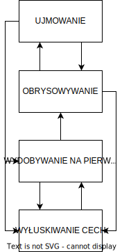

# Odcinek 10: Świadomość

Witajcie z powrotem w "Przebudzeniu z Kryzysu Sensu".

## Podsumowanie poprzedniego odcinka

Ostatnim razem rozwijaliśmy temat mindfulness i próbowaliśmy wyjaśnić w jaki sposób mindfulness może doprowadzać do spostrzeżeń. Nie tylko spostrzeżeń na temat konkretnego zagadnienia, ale spostrzeżenie modalne, systematyczną spostrzegawczość, która w pełni przemienia relację agent-arena i przynosi ukojenie niepokoju egzystencjalnego oraz umożliwia poprawę odczuwanego poczucia sensu. Przyglądaliśmy się temu poprzez dobieranie się do maszynerii uwagi i zauważenie, że uwaga angażuje dwa rodzaje "skalowania".

Uwaga angażuje zdolność do dokonywania przesunięć przejrzystość-nieprzejrzystość wraz z rozbijaniem *Gestaltu* na szczegółowe cechy. To skalowanie w dół - coś, co możemy ulepszyć w drodze medytacji. Ale obejmuje również zdolność do skalowania w górę - przesuwania się od szczegółu do *Gestaltu* i od przyglądania się czemuś w kierunku patrzenia głęboko w rzeczywistość. Zauważyliśmy, że w medytacji mindfulness ćwiczymy skalowanie w dół, aby rozbić niewłaściwe ujmowanie, a skalowanie w górę ćwiczymy by stworzyć lepsze ujmowanie. Jeżeli moglibyśmy zoptymalizować te dwa procesy ucząc się biegłego przepływania między nimi - dodając aspekt płynności i przepływu, o których już mówiliśmy - wtedy moglibyśmy zoptymalizować naszą zdolność kompleksowej spostrzegawczości. Jeżeli udałoby się nam zejść z tą optymalizacją wgłąb nas - jak w zdarzeniu czystej świadomości - oraz wznieść się wyżej wgłąb rzeczywistości - jak w rezonującym zjednoczeniu - to moglibyśmy uzyskać *pradżnię*, rodzaj niedualności, która mogłaby przemienić całą naszą relację agent-arena, rozproszyć modalne pomieszanie i poprawić poczucie sensu w życiu. *Pradżnia* to jedno z najpotężniejszych mistycznych doświadczeń, których możemy dostąpić. Daje ono zwiększone poczucie realności, które rzuca wyzwanie, zachęca i dodaje sił ludziom, aby odmienili całe swoje istnienie i doprowadzili do ogromnego wzrostu poczucia sensu w ich życiu.

Mówiliśmy o niedawnym rozwoju nauk kognitywnych w tej dziedzinie, w tym o części mojego własnego dorobku eksperymentalnego, który wydaje się wspierać twierdzenie, że te wyższe stany świadomości mogą przynieść owe przejścia kwantowe, owe radykalne doświadczenia transformatywne.

## Funkcja świadomości

Dzisiaj właśnie o tym chcę opowiedzieć. Chcę poruszyć temat doświadczeń transformatywnych, szczególnie w kontekście naprawdę błyskotliwej i przełomowej pracy, którą wykonała [L. A. Paul w książce "Transformative Experience"](https://oxford.universitypressscholarship.com/view/10.1093/acprof:oso/9780198717959.001.0001/acprof-9780198717959). Ale zanim przejdę do tego, najpierw muszę cofnąć się o krok i kontynuować nieco omawianie odmiennych stanów świadomości. Musimy bardziej rozwinąć co takiego rozumiemy przez "odmienne stany świadomości", co mamy na myśli mówiąc o tego rodzaju transformacji. A to nas prowadzi w kierunku jednego z najtrudniejszych zagadnień w historii. David Chalmers sławnie nazwał to "Trudnym Problemem Świadomości". Artur Schopenhauer nazwał to węzłem do świata. Próbować wyjaśnić świadomość to jak próbować wyjaśnić Boga. To jedno z najtrudniejszych zagadnień. Nie będę się podejmował dokonania tego, ale będę próbował skorzystać ze wspólnych starań moich i Andersona Todda oraz Richarda Wu, które podjęliśmy na rzecz próby zrozumienia przynajmniej niektórych z ważnych funkcji i własności świadomości oraz dlaczego odmienne stany świadomości są tak sprzyjające dla radykalnych doświadczeń transformatywnych.

Jednym ze sposobów dobrania się do tego jest przyjrzenie się dwóm pytaniom, które możemy sobie postawić. Jednym z nich jest: "Czym jest świadomość?". Jak coś takiego jak świadomość wyłania się z mózgu? To pytanie o naturę świadomości, pracuje nad tym szereg badaczy. Możemy także zadać inne pytanie: "Jaką funkcję spełnia świadomość?". Czym świadomość się zajmuje? To nie jest to samo pytanie. Zdziwiłoby was zapewne, że tak naprawdę nie mamy konsensusu naukowego na temat tego, co takiego właściwie świadomość robi. Większość ludzi wie, że świadomość jest tajemnicą. Jednak większość nie zdaje sobie sprawy, że zadanie wykonywane przez świadomość również pozostaje tajemnicą.

Pomyślcie o tym. Lubicie swoją świadomość. Identyfikujecie się z nią. Świadomość to nie jest coś, co znacie w taki sam sposób, w jaki znacie inne rzeczy. Znacie swoją świadomość poprzez bycie świadomymi! Mógłbym was zapytać, jak bardzo jesteście teraz świadomi. Skąd to wiecie? Po prostu jesteście świadomi. A wiemy od Arystotelesa i z jego teorii zgodności, że wiedzieć i być to to samo! Partycypujecie we własnej świadomości. A czy bylibyście w stanie ją oddać za cokolwiek? Gdybym wam powiedział: "Możecie mieć nieograniczoną władzę i bogactwo. Jedynym, co musicie poświęcić, jest świadomość tego faktu!". Bierzecie? Oczywiście, że nie.

No ale czym się ta świadomość zajmuje? Powiecie: "Czy to nie oczywiste?". Nie! Wcale nie. Bo potraficie wykonywać i w istocie większość z waszych czynności wykonujecie nieświadomie. Nie posiadam świadomego poznania (choć posiadam pewne naukowe zrozumienie) tego, co mój mózg robi, co pozwala mi generować mowę. A wy? Nie! To skomplikowany, rozbudowany proces, którego nadal nie potrafimy dobrze nauczyć sztucznej inteligencji. I dzieje się on prawie zupełnie nieświadomie. No to po co mi świadomość? Co ona robi?

Mamy zatem dwa ważne pytania: jak coś tak tajemniczego i dziwnego wyłania się z materii (pytanie o naturę) oraz czym się to coś zajmuje (pytanie o funkcję). Ponownie, nie zamierzam ośmielać się próbować udzielić wyczerpującej odpowiedzi na te pytania. Nie potrzebuję tych odpowiedzi do osiągnięcia moich celów, ponieważ nie próbuję rozwiązać trudnego problemu świadomości. Próbuję rozwiązać trudny problem sensu. Jeden trudny problem na raz, proszę. Ale chciałbym pokazać wam, jak zbieżność przedsięwzięć naukowych, biorąc pod uwagę niektóre z najlepszych osiągnięć w dziedzinie świadomości, wskazuje na możliwą odpowiedź na pytanie, dlaczego odmienne stany świadomości są dla nas tak cenne.

Zacznijmy od jednego z najlepszych opisów funkcji, jaką pełni świadomość - teorii *globalnej przestrzeni roboczej*. Koncepcja ta mówi, że nasza świadomość funkcjonuje na podobnej zasadzie jak pulpit komputera. Mamy na tym komputerze wszystkie nasze pliki, które możemy aktywować jeden lub wiele plików naraz, wydobywając tę informację na pulpit i pracować na niej, pozwalając poszczególnym aktywnym informacjom oddziaływać na siebie. Następnie możemy rozpowszechnić efekty tej pracy, zmiany, które wprowadziliśmy, do pozostałych plików. Tak działa pulpit, tak go używamy. Gdzie leży analogia? Otóż te nieaktywne pliki to całe nasze nieświadome przetwarzanie w naszym mózgu, z którego możemy coś wyłowić i wydobyć do pewnej przestrzeni - czegoś w rodzaju pamięci roboczej - aktywować to, aby części informacji mogły ze sobą wchodzić w interakcje, a następnie rozprowadzić efekty do pozostałych, nieaktywnych plików.

Czemu mielibyśmy chcieć robić coś takiego? A jak korzystamy z komputera? Nie chcemy przecież mieć wszystkich plików aktywnych naraz, bo to byłaby katastrofa. Chcemy mieć możliwość - i zauważcie, co tu zachodzi - wybierania pewnych fragmentów informacji, które są istotne, zbierania je razem, przetwarzania je w jakiś istotny sposób, a następnie rozpowszechniania potrzebnych zmian. Zatem teoria globalnej przestrzeni roboczej mówi - i zdobywa na to mnóstwo dowodów empirycznych - że taka jest funkcja świadomości.

## Problem ujęcia i realizacja istotności

Zgoda, to bardzo ogólne. Zatem przyjrzyjmy się bardziej szczegółowo. To teoria przypisywana Baarsowi, następnie ukazała się [praca Shanahana i Baarsa](https://www.sciencedirect.com/science/article/abs/pii/S0010027704002288), w której starali się odpowiedzieć konkretnie na pytanie, czym jest cały ten "komputer"? Baars później opublikował jeszcze bardziej szczegółową próbę odpowiedzi na to pytanie w [Cambridge Handbook of Consciousness](http://perpus.univpancasila.ac.id/repository/EBUPT181231.pdf#page=195). Teoria sprowadza się do koncepcji, że architektura tego "komputera" (pliki wraz z pulpitem) pomaga w rozwiązaniu czegoś, co zwane jest "problemem ujęcia" [ang. "frame problem", w literaturze tłumaczone jako "problem ramy", ale moim zdaniem "problem ujęcia" lepiej oddaje jego istotę - przyp. tłum.]. Dużo później będę szczegółowo omawiał czym sam problem ujęcia jest, wrócimy do tego. Ale chodzi mniej więcej o to - ten system pomaga nam nacelować się na istotne informacje. A to jest niezwykle ważne, ponieważ istnieją trzy obszary, w których jest to ogromnym problemem.

### Trzy obszary "problemu ujęcia"

1. Pierwszym z nich jest ogrom informacji dostępnej przez cały czas. Będziemy musieli do tego później wrócić, ale technicznie, matematycznie ilość informacji obecnej w dowolnym pokoju jest astronomicznie ogromna, a my nie potrafimy skorzystać z niej całej. Bylibyśmy przytłoczeni. Zatem częściowo muszę z całej tej informacji wybierać tę, z której zrobię użytek.

1. Drugi to ogromna ilość informacji w mojej pamięci. Przytłaczająca! Jest rozległa zarówno w objętości jak i liczbie wzajemnych połączeń. Muszę w jakiś sposób dokonywać selekcji.

1. Trzeci to konieczność składania części informacji ze sobą, a możliwości ich składania - połączeń między informacjami ze środowiska a informacjami z mojej pamięci - jest jeszcze więcej. Nieprzebranie i przytłaczająco wiele. Później podam na to argumenty matematyczne. Póki co wystarczy rozumienie intuicyjne.

Zatem świadomość pomaga rozwiązywać te problemy. Pomaga nacelować się na istotne informacje. Zbiera razem istotne informacje ze środowiska, istotne informacje z umysłu oraz istotne informacje, które pozwolą poskładać te fragmenty informacji ze sobą w sposób, jakiego potrzebujemy. Tak jak robimy to obsługując komputer. Przeszukujemy pamięć, wybieramy to, co istotne, wydobywamy to na pulpit, składamy to wszystko razem w istotny sposób, a następnie robimy użytek z efektów w istotny sposób. Ale nie wolno nam użyć homunkularnego wyjaśnienia! Nie ma małego człowieczka biegającego w środku! Tego wszystkiego, w sposób samozorganizowany, dokonuje nasza świadomość. To pomaga wyjaśnić dlaczego świadomość jest tak ściśle powiązana z pamięcią roboczą, a pamięć robocza jest ściśle powiązana z inteligencją.

Podstawową funkcją świadomości wydaje się pomoc w *realizacji istotności* - uświadamianiu sobie, realizowaniu i wprowadzaniu w czyn ["Realizacja istotności" to "relevance realization" - autorska koncepcja Johna. Podobnie jak inne jego określenia, korzysta ona z gry słów, w dodatku w obu słowach składowych. "Realize" może być rozumiane zarówno jako "urzeczywistnianie" oraz jako "zdawanie sobie sprawy", "relevance" to słowo bez bezpośredniego tłumaczenia na język polski, najczęściej tłumaczone jako "istotność", ale dość często używa się formy przymiotnikowej "relevant", która oznacza nie tyle "istotny" co "odpowiedni do sytuacji". O tych wszystkich znaczeniach trzeba pamiętać, mimo iż używane będzie tłumaczenie "istotny".]. Pomaga w zdawaniu sobie sprawy z istotnych informacji. Wrócimy do omawiania tego głębiej. Istnieje bardziej neuronaukowe i psychologiczne ujęcie, którego autorami są [Bor i Seth](https://www.frontiersin.org/articles/10.3389/fpsyg.2012.00063/full). Gdy prowadzić pomiary na osobach świadomych, zdaje się to korelować z pewnymi rodzajami aktywności w mózgu. Jakiej aktywności? Otóż takiej, która zdaje się brać udział w rozbijaniu informacji na kawałki lub jej restrukturyzacji, podobnie jak przy spostrzeżeniu. Już to poruszałem. To owa zdolność manipulowania uwagą umożliwiająca spostrzeżenia. Bor i Seth argumentują, że to jest jedna z kluczowych funkcji świadomości. A czym się ona zajmuje? Tym, co poruszyłem przed chwilą. Model Bora i Setha mówi po prostu, że zadaniem świadomości jest dostarczanie nam dynamicznego ulepszania naszej zdolności do nacelowania się na istotne informacje - *realizacja istotności*.

## Teoria zintegrowanej informacji

Jedną z najbardziej znanych obecnie teorii natury świadomości jest teoria Tononiego zwana ["Teorią zintegrowanej informacji"](http://integratedinformationtheory.org). Co prawda jego teoria nie traktuje o funkcji świadomości, lecz o jej naturze, niemniej jednak oczywiście Tononi wyprowadził z niej pewien opis tej funkcji. Czym jest według niego świadomość? Świadomość jest stopniem w jakim mocno zintegrowane są ze sobą części informacji. Kryje się ona w tym, jak bardzo jakaś część informacji w naszym mózgu jest przyczynowo zależna od, łączy się z i wpływa na inne części informacji w naszym mózgu. Im ściślejsze to połączenie, im potężniejsze przetwarzanie, tym bardziej ten *kompleks* - jak to nazywa, gdyż właściwie chodzi tu o kompleksyfikację (skomplikowanie) informacji - będzie umożliwiał świadomość. Możnaby go jednak dalej zapytać, czym ta świadomość jest, dlaczego jeżeli *to właśnie* mogłoby stanowić świadomość, to dlaczego wykonuje ona tę gigantyczną kompleksyfikację informacji? Otóż proponuje on coś w rodzaju testu Turinga na świadomość. Powiada, że można przetestować w jakim stopniu świadomy jest układ poprzez pokazywanie mu nietypowych obrazów i nakazywanie mu określenia czy te obrazy mają sens. Pomyślcie o tym w ten sposób - gdy dokonuję kompleksyfikacji, gdy wykonują ową niezwykle dynamiczną integrację informacji, to w istocie odzwierciedla to, jak dobrze jestem w stanie wychwytywać wzorce w świecie, dostrzegać sens w świecie! Przyczyną dla której wykonuję integrację informacji jest właśnie moje staranie, jak tylko potrafię, śledzenia złożoności świata.

Jaka zatem jest główna funkcja świadomości? Cóż, główną funkcją zintegrowanej informacji jest pozwolenie nam na rozstrzygnięcie, czy części informacji są istotne wobec siebie nawzajem i czy są istotne dla nas. Ostrożnie - nie mówię, że każdy przypadek *realizacji istotności* jest świadomością! Próbuję przekonywać, że świadomość wydaje się być sposobem w jaki możemy skoordynować uwagę i inne powiązane mechanizmy przytomności tak, by zoptymalizować jak w sposób możliwie spostrzegawczy możemy rozumieć świat. Dlatego zatem świadomość jest potrzebna w skomplikowanych sytuacjach, które wymagają spostrzegawczości. W sytuacjach i zagadnieniach wysoce nietypowych i wymagających. To dlatego potrafimy zredukować udział świadomości, gdy zagadnienie jest już dobrze określone - nie jest wysoce nietypowe, nie wymaga spostrzeżeń.

Nie mam pojęcia, czy to wyczerpujący opis funkcji świadomości, ale wyjaśnia coś, co już zauważyliśmy. W momencie spostrzeżenia doświadczamy błysku. To jakbyśmy doznawali nagłego rozjaśnienia świadomości. Tłumaczy to, dlaczego moglibyśmy chcieć zmienić swój stan świadomości, ponieważ zmieniając stan świadomości zmieniam to, co znajduję istotnym i w jakim stopniu jest to dla mnie wyraziste.

## Dynamika świadomości i afordancje

Poskładajmy to wszystko razem - mechanizmy uwagi, płynność, przepływ, wyrazistość. Możemy to zebrać w zjawisko nazwane przez [Matsona](https://philpapers.org/rec/MATS-10) *przymierzaniem* [ang. sizing up]. Według niego świadomość po części zajmuje się tworzeniem i prezentowaniem nam *krajobrazu wyrazistości*. Co to znaczy dla nas? Po pierwsze dokonuję wyboru spośród wszystkiego, z czego mógłbym wybierać. I mówiąc "wybieram" nie mam na myśli *mnie*, mam na myśli *moją świadomość*. Wyłuskuję pewne cechy - nie jestem w stanie zwracać uwagi na każdą informację zawartą w tym pokoju - nie da się, jest ich zbyt dużo! Ale niektóre z nich wyłuskuję. Następnie mając już powybierane pewne cechy, zaczynam je priorytetyzować i wydobywać niektóre z nich na pierwszy plan. Przykładowo mam nadzieję, że w trakcie tego wykładu ja jestem wysunięty na pierwszy plan, a reszta jest tłem. Oczywiście już widzieliśmy jak działa to w obie strony - pamiętamy dyskusję o przechodzeniu między "patrzeniem przez" a "patrzeniem na". Patrzę na *to, przez co patrzę*, wyłuskuję jego cechy, wydobywam je na pierwszy plan, a następnie składam z nich *Gestalt*. Używam cech jako detali składając je w jeden obraz. Tworzę coś w rodzaju rysunku, konfigurując cechy ze sobą *obrysowuję* *Gestalt* - sprawiam, że staje się dla mnie bardziej wydatny, bardziej wyrazisty, a zarazem nadaję mu rysy.

Przypuśćmy zatem, że widzę filiżankę. Wyłuskuję jej cechy, niektóre z nich wychodzą na pierwszy plan, następnie obrysowuję ją. Obrysowywanie wpływa również na powrót na wyłuskiwanie cech. Następnie oczywiście tworzę pewne ujęcie filiżanki. Ujmuję zagadnienia - o tym mówiliśmy przez cały czas. To wszystko składa się zatem na bardzo złożony układ dynamiczny, który tutaj działa.

Czyli właśnie teraz wasza świadomość rozkłada przed wami krajobraz wyrazistości. Niektóre rzeczy wznoszą się ponad niezrozumienie jako cechy, które wysuwają się na pierwszy plan i tworzą rysunek. Następnie ujmujecie te rysunki w zagadnienia, lecz to wszystko się przesuwa razem z waszą uwagą. Z chwili na chwilę inne rzeczy stają się wyraziste, a wam przedstawiany jest wysoce wypukły, dynamicznie płynący krajobraz wyrazistości. To właśnie tak jest być tu i teraz.

Ale dzieje się coś więcej, prawda? Uzyskuję krajobraz wyrazistości, a moje zagadnienie ujęte jest wokół filiżanki, ale nie jestem całkowicie pewny, więc "poruszam się" dookoła. Staram się znaleźć w optymalnym "położeniu". Jeżeli znajdę się zbyt "blisko", stracę zbyt wiele z *Gestaltu*, a gdy odsunę się zbyt "daleko", będę widział całość, ale bez szczegółów. Muszę dotrzeć do właściwego miejsca, z którego będę mógł, zarówno metaforycznie jak i dosłownie, wykonać coś, co Merlau-Ponty nazwał *optymalnym chwytem*. Czyli optymalizując między *Gestaltem* a szczegółem, pomiędzy "patrzeniem poprzez" a "patrzeniem na", poruszam się w ramach tego procesu przymierzania. Używam mojego krajobrazu wyrazistości, by złapać rzeczy w optymalny chwyt. Optymalny - nie "maksymalny". "Chwyt" jest rozumiany jako metafora. Chodzi o kontakt, kontakt interakcjonalny.

Jak możemy zrozumieć, co jest osiągane przez ten optymalny chwyt? Otóż gdy przedstawiany mi jest ów krajobraz wyrazistości, a ja dokonam dopasowania, otwiera się *afordancja* [ang. afford - umożliwić, móc sobie na coś pozwolić]. Czym jest afordancja? Ta koncepcja wywodzi się od [Gibsona](https://www.taylorfrancis.com/books/mono/10.4324/9781315740218/ecological-approach-visual-perception-james-gibson), który postrzeganie wizualnie rozumiał jako proces aktywnego tworzenia krajobrazu. Filiżanka jest dla mnie "uchwytna". To nie jest właściwość filiżanki, bo nie jest uchwytna dla modliszki. Nie jest to też właściwość mojej dłoni, bo dłoń nie może chwytać dowolnych przedmiotów. Afordancja aranżuje relację koordynacji pomiędzy ograniczeniami przedmiotu a ograniczeniami mojej dłoni tak, że mogę z tym czymś wejść w interakcję. Jest to zatem sposób współidentyfikacji. Filiżanka stała się dla mnie wyrazista, mogę wykonać na niej optymalny chwyt tak, że mogę tworzyć afordancje. Czyli przedstawia się ona mnie, a ja dopasowuję się do niej - dzięki temu jest dla mnie uchwytna. A to dokładnie argument Gibsona - my nie widzimy tak naprawdę kolorów i kształtów. Widzimy afordancje. Ta podłoga nadaje się do chodzenia. Ten stół to miejsce, gdzie mogę coś postawić. Ten przedmiot daje się przesuwać.

Widzicie? Otrzymujemy podstawy - krajobraz wyrazistości pozwala nam na kontakt i wchodzimy w proces optymalnego chwytania, a optymalny chwyt powoduje generowanie afordancji tak, że zachodzi współidentyfikacja agenta i areny. Jestem *chwytaczem*, to jest *uchwytne*. Przedstawiam siebie temu czemuś, a to przedstawia się mnie. Zatem świadomość ustanawia krajobraz wyrazistości, ale w ramach niego wykonujemy proces przymierzania, którego wynikiem jest *krajobraz obecności*. Cała sieć afordancji jest nam przedstawiana. Ale to nie wystarcza. Pamiętacie dyskusję o przepływie? Musimy być w stanie śledzić różnice między wzorcami korelacyjnymi a wzorcami przyczynowo-skutkowymi. W miarę wchodzenia w interakcje ze światem nasz mózg wychwytuje wzorce przyczynowe jako odrębne do zwyczajnie korelacyjnych. To jest *krajobraz głębi*. To nasza zdolność wyciągania wniosków. Obserwujemy to u dzieci. Jak dam dwulatkowi łyżkę, będzie ją upuszczał na ziemię, podnosił znowu i walił nią we wszystko dookoła. I tak w kółko. Po co? Bo próbuje wykorzystać swój krajobraz wyrazistości do tworzenia afordancji. Łyżka jest "trzymalna", "rzucalna" i "upuszczalna".

Dlaczego dwulatek tak się zachowuje? Dlaczego wciąż chwyta łyżkę, rzuca nią i upuszcza? Bo próbuje wywnioskować wzorce przyczynowo-skutkowe z nią związane! Transformuje krajobraz wyrazistości w krajobraz obecności, a to z kolei w krajobraz głębi. Otrzymuje rodzaj głębokiego zrozumienia łyżki - nie poprzez słowa, ale poprzez interakcje. To właśnie wykonuje dla nas świadomość. Robi to właśnie teraz. Wszystko to jest po to, by świadomość mogła nam pomóc nacelować się na istotne informacje. Tworzy ten bogaty krajobraz wyrazistości, abyśmy pewne rzeczy widzieli jako bardziej wydatne, a niektóre mniej. I ten krajobraz nieustannie, dynamicznie się zmienia. A wewnątrz tego krajobrazu powstaje krajobraz obecności, w którym zachodzi współidentyfikacja pomiędzy nami a tym, co wyraziste oraz wzajemne sprzężenie w relację agent-arena. Świadomość także prezentuje nam afordancje. To wszystko jest dynamiczne, bo te afordancje nieustannie się zmieniają. Z kolei to wszystko umożliwia nam śledzenie wzorców przyczynowo-skutkowych, wchodzenie w głębszy kontakt z wnętrznościami świata. Tego dokonuje świadomość.

Zatem odmieniając świadomość, odmieniam całą tę maszynerię. Transformuję mój krajobraz wyrazistości, mój krajobraz obecności, mój krajobraz głębi. Wzorce, które śledzę, rodzaj agenta, jakim mogę być, rodzaj areny, w której mogę się znaleźć - wszystko to zostaje radykalnie odmienione. I nie będę miał jedynie błysku spostrzeżenia, jak w zadaniu z dziewięcioma punktami - doznam spostrzeżenia systematycznego. Spójrzcie. Odmienny stan świadomości to nie spostrzeżenie *w ramach* świadomości, to spostrzeżenie *na temat* świadomości. To gwałtowna transformacja wszystkich naszych krajobrazów, nie tylko w ramach jakiegoś konkretnego zagadnienia. Spróbuję pokazać, co rozumiem przez *systematyczne spostrzeżenie*.

## Systematyczne spostrzeżenie

Odwołamy się do psychologii rozwojowej, do przełomowego dorobku Piageta. Podchwycimy niektóre z metafor na temat mądrości, które do tej pory wypracowaliśmy. Do tej pory doszliśmy do dwóch: "mądrość jest jak oświecenie" oraz "mądrość jest jak przebudzenie". Oto następna: "kim dla dziecka jest dorosły, tym dla dorosłego jest mędrzec". Mądrość jest jak dorastanie. Dobrze zatem, rozwińmy pierwszą część tej metafory. Sadzamy przy stole czterolatka i robimy rzecz następującą. Odliczamy pięć cukierków - "raz, dwa, trzy, cztery, pięć":

Potrzebny jest do tego czterolatek, bo czterolatki potrafią liczyć i rozumieją, że pięć to więcej niż cztery, a mniej niż sześć. Odliczamy pięć cukierków, a następnie odliczamy następne pięć - "raz, dwa, trzy, cztery, pięć":

Pokazujemy dziecku te dwa rzędy i pytamy: "Który rząd cukierków wolisz?". Okazuje się - a odliczaliśmy na głos, dziecko wie, że w obu rzędach jest pięć! - że powtarzalnie i z pewnością siebie wybierze drugi rząd. I tu jest pies pogrzebany. Wszystkie czterolatki tak robią, a ten błąd jest powiązany z całą masą innych błędów, które popełniają. To nie tylko jeden rodzaj błędu!

Oto dlaczego Piaget był naprawdę wybitnym naukowcem, dlaczego jest przełomową postacią w naszym rozumieniu rozwoju. (Wróćcie pamięcią do Arystotelesa i tego, co mówił o rozwoju!) Otóż już przed Piagetem robiło się mnóstwo różnych badań nad ilorazem inteligencji. Badania nad dziećmi wykonywano już od dłuższego czasu. A błędy odrzucano jako śmieci, bo zwracano uwagę na to, co dzieci były w stanie zrobić dobrze. "Och tak! Sukces!" - i dołóżmy jeszcze do tego protestancki etos pracy. Ale Piaget doznał olśnienia i zadał pytanie: "A co jeśli błędy układają się we wzorzec?". Jeżeli błędy są systematyczne, a nie losowe, oznaczałoby to, że istnieją ograniczenia działające na zdolnościach poznawczych dziecka. (Przypomnijcie sobie znów Arystotelesa, ograniczenia i biologię. A Piaget był biologiem!) I być może moglibyśmy zrozumieć rozwój jako zmianę ograniczeń, które kształtują sensomotoryczną interakcję dziecka ze światem! I faktycznie Piaget odkrył, że błędy są systematyczne. Wszystkie dzieci popełniają ten sam rodzaj błędów oraz całą masę innych, powiązanych. Istnieje cały system tych błędów. A to wskazuje na jakiś pierwotny zestaw ograniczeń.

