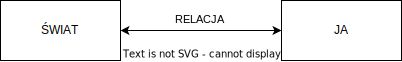

# Odcinek 11: Wyższe stany świadomości - część I

Witajcie z powrotem w "Przebudzeniu z kryzysu sensu".

## Podsumowanie poprzedniego odcinka

Poprzednim razem omawialiśmy Rewolucję Osiową w starożytnych Indiach. Skupiliśmy się na kluczowej postaci Siddhārthy Gautamy - Buddy. Omawialiśmy jego osobistą historię. Poruszaliśmy kwestię dwóch modusów egzystencjalnych, które reprezentowane są w historii opuszczania przez Siddhārthę pałacu - modusu posiadania i modusu bycia. Mówiliśmy o pomieszaniu modalnym i radzeniu sobie z nim. Śledziliśmy Buddę aż pod drzewo Bodhi, pod którym siedząc osiągnął rodzaj głębokiego odkrycia, głęboki stan oświecenia. Po drodze omawialiśmy czym jest mindfulness, jak mindfulness działa poprzez skalowanie uwagi i jak może poprawić kognitywną elastyczność, zdolność do dokonywania spostrzeżeń. Potem próbowaliśmy wszystko to połączyć z kognitywistyką. Wszczęliśmy dyskusję o tym jak to jest doświadczyć oświecenia. Zaznaczę, że nie oferuję tutaj kompletnego wyjaśnienia, kompleksowej teorii oświecenia. Do tego będziemy dopiero zmierzać w toku tego cyklu wykładów. Ale chciałbym teraz wejść w tematykę i kontynuować dyskusję wyższych stanów świadomości.

## Teoria deskryptywna i normatywna

Jak zapewne pamiętacie, te wyższe stany świadomości są problematyczne, lecz leżą one u podstaw wielu religii i fundamentalnych szkół filozofii z okresu Epoki Osiowej. Tą podstawą jest koncepcja, że ludzie posiadają pewien alternatywny stan świadomości, który uważają za bardziej realny niż ich codzienny stan świadomości. A to problematyczne właśnie dlatego, że realność oceniamy zwykle po tym jak spójne i zrozumiałe jest nasze doświadczenie, jak bardzo ma dla nas sens. Tymczasem w tych odmiennych stanach - które są bardzo różne od naszej codziennej świadomości, a przez to z nią niespójne - ludzie robią coś odwrotnego. Zamiast odrzucać je tak samo jak odrzucają śnienie - przykładowo, ponieważ nie jest ono spójne z naszym codziennym doświadczeniem - odrzucają oni codzienne doświadczenie jako iluzoryczne i twierdzą, że ten stan świadomości jakimś sposobem dał im lepszy dostęp do rzeczywistości.

Jak pamiętacie z omawianego przy okazji Epoki Osiowej sposobu rozumienia mądrości oraz związanego z nią poczucie sensu, zdolność do przekraczania iluzji i nawiązywania połączenia z tym, co bardziej prawdziwe, leży u podstaw tego, co to znaczy być mądrym. A posiadanie pewnego rodzaju głębokiego połączenia z rzeczywistością leży u podstaw uznawania swojego życia za w jakimś stopniu autentycznie znaczące.

Tak postawiliśmy zagadnienie - zagadnienie wyższych stanów świadomości. Teraz chciałbym powrócić do omówienia co oznacza podanie teorii odpowiedniej zarówno deskryptywnie jak i normatywnie. Teoria deskryptywna powinna dać nam dobre wyjaśnienie dlaczego te wyższe stany świadomości odczuwane są tak, jak są i dlaczego są w stanie wywołać te głębokie transformacje. Ponieważ, jeżeli pamiętacie, ludzie, którzy doznali tego głębokiego połączenia z rzeczywistością - a poczucie kontaktu z rzeczywistością jest jedną z podstaw sensu w życiu - w radykalny sposób odmieniają swoje życie, swoje poczucie własnego ja, swoje relacje interpersonalne, aby podtrzymać i wzmocnić to połączenie z ową pogłębioną rzeczywistością.

Musimy zatem dostarczyć wyjaśnienie deskryptywne, które ma sens na wielu poziomach. Właśnie dlatego kognitywistyka jest tak ważna: z uwagi na sposób, w jaki podejmuje się tworzenia pomostów między tymi różnymi poziomami i dziedzinami. Musimy podać opis procesów psychologicznych, procesów informacyjnych, a ostatecznie procesów działających w mózgu.

Następnie potrzebujemy odpowiedniej normatywnej teorii wyższych stanów świadomości. Potrzebny nam opis wskazujący dlaczego mogłoby być uznawane za racjonalne, że te stany uzasadniają i legitymizują tego typu przemiany. Czy możemy dostrzec dlaczego należałoby wierzyć tym stanom, gdy te roszczą sobie przydzielanie nam dostępu do głębszej rzeczywistości?

Aby zabrać się za pierwszą część - rozumieć przez co przechodził Siddhārtha, gdy osiągał ten wyższy stan świadomości, ten stan przebudzenia (a jeżeli pamiętacie, ostatnim razem omawialiśmy jak powszechne jest to zjawisko - nie tylko jakościowo wśród światowych religii, ale też ilościowo pośród całej populacji; 30-40 procent ludzi przyznaje się do tego typu doświadczeń przebudzenia i do następującej po nim głębokiej transformacji) - by się za to zabrać, pomówmy o tym jak to jest być w takim stanie. A ponieważ posiadamy wyniki z kwestionariuszy, znamy prace [Newberga](http://www.andrewnewberg.com/books/how-enlightenment-changes-your-brain), [Taylora](https://www.hup.harvard.edu/catalog.php?isbn=9780674967519) oraz wiele pierwszoosobowych relacji, możemy nakreślić ogólny obraz tego, co się dzieje.

Istnieją trzy komponenty, którym powinniśmy się przyjrzeć. Chcemy wiedzieć jak doświadczany jest *świat*, jak doświadczane jest *"ja"* oraz jak doświadczana jest relacja *pomiędzy* światem a "ja".

Zacznijmy od strony "świata". Ludzie donoszą co następuje: donoszą o niezwykłym poczuciu klarowności, zarówno percepcyjnym jak i poznawczym. Zatem świat wydaje się im niezwykle klarowny i zdaje się mieć sens jakiego wcześniej nie posiadał. Percepcyjna strona tej klarowności jest często doświadczana jako jasność. Rzeczy wydają się błyszczące. A to na przykład jest pierwotne znaczenie "glorii" - określeniem biblijnym najczęściej używanym do opisu Boga jest "gloria" [chwała], które wcale nie jest określeniem moralnym. Mówi o tym jak "lśniący", jak "jasny" jest Bóg. Pamiętacie również, że jest to cecha, którą niezmiennie podają ludzie w odniesieniu do doświadczenia przepływu - że wszystko zdaje się bardzo żywe, jasne i intensywne.

Co ciekawe, to że ludzie opisując z jednej strony ową klarowność (i zauważcie jak to nawiązuje do czegoś, co poruszaliśmy mówiąc poprzednio o mindfulness - mówią o rozszerzeniu pola widzenia, czyli jest to coś całościowego, jakby zaczynali zdawać sobie sprawę z całego świata), z drugiej mają poczucie drobnych detali. Przykładowo jest to dobrze ujęte w słynnym wierszu Blake'a:

*"Ujrzeć świat w ziarenku piasku,\
I niebo w polnym kwiecie,\
Zamknąć w swej dłoni nieskończoność,\
A wieczność w jednej godzinie.*"

Zyskujemy zatem rodzaj głębokiego przenikania pomiędzy ogółem a szczegółem. Widzicie zatem, że ma miejsce dalece idące rozszerzenie skalowania uwagi, które to wzmacniane jest poprzez mindfulness, o czym poprzednio mówiliśmy. Tym sposobem wzmacniana jest nasza zdolność wyrwania się z jednego sposobu ujmowania i utworzenia nowego, aby doznać fundamentalnego spostrzeżenia. I zwróćcie uwagę na słowo "spostrzeżenie" - spojrzenie wewnątrz rzeczywistości. [Tutaj lepiej funkcjonuje tłumaczenie "wgląd" (ang. insight) niż "spostrzeżenie", którego nie używamy tutaj z wymienionych już powodów - przyp. tłum.] Podsumowując, ma miejsce zwiększenie poczucia sensowności. Nadawania rzeczom sensu. Czyli świat staje się zarazem misterny i interesujący na ten rozszerzony i lśniący sposób.

Czyli nieomal powszechnie ludzie opisują to doświadczenie jako "Świat jest piękny!". Jawi się im jako głęboko piękny. (Powrócimy jeszcze kiedyś do powiązań między pięknem a prawdą, konkretnie w ujęciu [Scarry](https://press.princeton.edu/books/paperback/9780691089591/on-beauty-and-being-just).) Świat zdaje się niezwykle żywy. Zdaje się niezwykle żywy podczas tych doświadczeń ponieważ jest tak brzemienny w energię i znaczenie. I wszystko to: cała ta kompleksowość, misterna szczegółowość, lśnienie, piękno, sensowność, wszystko to łączy się w poczucie jedności. W jakimś sensie wszystko jest ze sobą połączone na podstawowym poziomie. Dostrzegamy głęboką i doniosłą integrację, co oczywiście ma sens z uwagi na fakt, że często gdy udaje się nam coś dobrze wyjaśnić, jest to możliwe dlatego, że znajdujemy coś, co jednoczy i łączy w całość.

Co dzieje się po stronie "ja"? Otóż po stronie "ja" ludzie mówią o doniosłym poczuciu wewnętrznego pokoju. I nie chodzi o pusty brak konfliktu. To coś podobnego do tego, o czym mówiliśmy dyskutując Platona i pewnie już widzicie pobrzmiewającą tutaj platońską koncepcję *anagoge*. Taką mam nadzieję! Przypomnijcie sobie, że u Platona ten stan wewnętrznego pokoju jest stanem wewnętrznej harmonii, w którym wszystkie z rozmaitych składników naszej osobowości i naszego poznania optymalnie ze sobą współpracują. Tego właśnie ludzie doświadczają. Donoszą, że doświadczyli najgłębszego poczucia pokoju w całym swoim życiu. I znów, u Platona to poczucie pokoju jest powiązane i współbrzmi z owym zwiększonym poczuciem kontaktu z rzeczywistością. I, co ciekawe, to właśnie się obserwuje w tych doniesieniach.

Ludzie opisują również doświadczenie ogromnej radości. Ale my oczywiście utraciliśmy poczucie co to słowo właściwie oznacza. Radość utożsamiamy z rozrywką lub przyjemnością. Ale radość nie jest doświadczeniem rozrywki lub przyjemności, radość jest pozytywną emocją odczuwaną gdy doświadczamy głębokiego złączenia z tym, co dobre. Radość jest wtedy, gdy możemy powiedzieć: "To jest naprawdę dobre.". 

Co ciekawe, ludzie często doznają fundamentalnej przemiany w poczuciu własnego "ja". Powrócimy do tego. Donoszą o dwóch rzeczach. Po pierwsze twierdzą, że ich zwyczajne poczucie własnego "ja" znika. Ich egocentryczne, autobiograficzne "ja" znika. A jeżeli pamiętacie, to zgadza się z doświadczeniami przepływu - ludzie twierdzą, że ich samoświadomość, owo autobiograficzne, narratywne "ja" znika.

Często donoszą o przypominaniu sobie - w tym sensie _sati_, przypominania sobie modusu bycia - powiadają: "Przypomniałem sobie swoje prawdziwe «ja» - pamiętam kim naprawdę jestem!". Istnieje zatem doniosłe powiązanie wgłąb do sedna maszynerii samego "ja", które jednoczy się z doniosłym poczuciem kontaktu z podstawowymi wzorcami, które rządzą rzeczywistością i czynią ją zrozumiałą. Ludzie podają, że w tym stanie czują ogromną energię i witalność. Znów - analogicznie jak w stanie przepływu. Oraz, wreszcie, mówią o doświadczaniu (często tego używają właśnie tego określenia) dogłębnego poczucia wglądu i zrozumienia. Znów, zbieżnie ze stanem przepływu. 

A co z relacją _świat-ja_? Otóż jest to rodzaj głębokiego połączenia, doniosłe poczucie kontaktu. Głębokie _zjednoczenie_. Znów jak w przepływie, ale w jeszcze większym stopniu. Ludzie czują się tak zjednoczeni, że zaczynają odczuwać partycypację w rzeczywistości, z którą mają kontakt. Zaczynają odczuwać, że współdzielą z nią tożsamość. A ten sposób myślenia o tym doświadczeniu występował również u Arystotelesa, gdy omawialiśmy arystotelesowską koncepcję teorii poznania jako _zgodności_. Czują się tak głęboko zgodni z zasadniczą rzeczywistością, z samego sedna swojego istnienia, że identyfikują się z nią. Ale to wiedzenie partycypacyjne jest tak wspaniałe, tak doniosłe i tak transformatywne, że nieuchronnie określą to doświadczenie, to połączenie jako niewysławialne. I zaznaczyliśmy to dobitnie, gdy poprzednio o tym mówiliśmy. Jak to jest, że te doświadczenia, które nie posiadają żadnego wyrażalnej, deklaratywnej treści - bo są niewysławialne! Nie da się ich ubrać w słowa, nie da się ich ubrać w postulatywną myśl - są jednakowoż uważane za tak wypełnione, tak zdolne do noszenia tej sygnatury ostatecznej rzeczywistości?

Potrzebujemy zatem teorii opisowej, która obejmie wszystkie te właściwości. Właściwości tego jak świat jest doświadczany, jak doświadczane jest "ja" oraz jak doświadczana jest relacja między nimi. Wszystko to, co wam pokazywałem do tej pory jest ciągłe z doświadczeniem przepływu. Nie twierdzę, że jest to doświadczenie przepływu - to coś więcej - ale pokazuję, że istnieje ciągłość. Podobnie jak poprzednio pokazałem, że istnieje ciągłość między przepływem a doświadczeniem spostrzeżenia i dlatego właśnie gdy ludziom przydarzają się te wyższe stany świadomości, donoszą oni także o doniosłych spostrzeżeniach. I zauważcie, że często gdy doświadczamy spostrzeżenia, jest to również niewysławialne. Nie zauważamy jak to spostrzeżenie się pojawiło ani w jaki sposób powstało, możemy jedynie powiedzieć: "Aha! Po prostu to widzę!".

## Strategie zaburzające

Istnieją inne ważne cechy tych stanów, o których powinniśmy wiedzieć. Otóż często są one poprzedzone "strategiami zaburzającymi". To strategie zaprojektowane w celu zaburzenia naszego zwykłego poznawczego funkcjonowania i przemiany naszego stanu świadomości. Obejmują strategie zarówno długoterminowe jak i krótkoterminowe. Strategiami długoterminowymi mogą być te, o których już wspominaliśmy, jak przykład Siddhārthy. Siddhārtha przez sześć lat poświęcał się tym praktykom - praktykom medytacji mindfulness oraz kontemplacyjnym, a one skutkują bardzo długoterminowym, inkrementalnym, jednakowoż dogłębnym zaburzeniem zwykłego stanu świadomości i poznania. Niektórzy mogą angażować się w krótkoterminowe strategie zaburzające. Zaliczają się do nich post, powstrzymywanie się od snu i abstynencja seksualna. Jeżeli pamiętacie, wspominaliśmy jak szamani korzystają z tych strategii by wprowadzić się w trans szamański. Poddają się działaniu bębnów, intonacjom, itd. Wszystko to zaburza normalny poziom poznania i - rzecz jasna, też już o tym mówiliśmy - niektórzy stosują środki psychodeliczne właśnie z uwagi na wysoki stopień zaburzania zwykłego poznania i zwykłego stanu świadomości.

Zatem wiemy... Przepraszam, to zbyt silne stwierdzenie. Mamy dobre początkowe dowody, że kombinacje tych strategii mogą być bardzo skuteczne. Jest pewien niedawno przeprowadzony eksperyment wykonany w 2018r. przez [Griffiths Lab](https://journals.sagepub.com/doi/full/10.1177/0269881117731279), w którym okazało się, że osoby, które ćwiczyły mindfulness a następnie brały psychodeliki miały tendencję do wzmocnionych doświadczeń w porównaniu z osobami, które brały jedynie psychodeliki. To jeden przykład. Czyli można te strategie ze sobą łączyć, mogą się wzajemnie wspierać. Co w tym ważne i do czego wrócimy i czemu przyjrzymy się starannie za kilka minut, że strategie zaburzające są także kluczowe w przygotowaniu gruntu pod spostrzeżenia. To powinno mieć sens z uwagi na to, o czym do tej pory mówiliśmy. Trzeba wpierw sporo przełamywania ujęć zanim otworzą się możliwości utworzenie zupełnie nowych ujęć.

Istnieje też niedawny eksperyment przeprowadzony w 2017r. przez [Yadena i innych](https://psycnet.apa.org/doiLanding?doi=10.1037%2Fcns0000098). Udział wzięło 701 uczestników. 69% z nich opisywało coś, co poprzednio nazwałem _ontonormatywnością_ - ową wzmocnioną realność doświadczanych wyższych stanów świadomości. A to okazało się predyktorem znacznej poprawy w wielu wymiarach ich życia. Miała miejsce znaczna poprawa w życiu prywatnym, zdrowiu, poczuciu celowości, duchowości oraz uwolnienie od lęku i strachu przed śmiercią. Czyli postulat, że te stany faktycznie wiążą się z transformacją uzyskał wsparcie empiryczne. Ale Yaden wyciąga z tych badań coś jeszcze, czego nie widzimy aż tak dobrze wyrażonego w pracach Newberga i Taylora, a jest to strategia zaburzająca, z której ludzie często korzystają i rozciąga się ona aż do fenomenologii. Mam tutaj na myśli rodzaj odczucia towarzyszącego temu doświadczeniu i jego strukturę. Chodzi tutaj o pojęcie decentrowania.

## Decentrowanie

Otóż ludzie opisujący te doświadczenia przesuwają się z rodzaju bardzo pierwszoosobowej orientacji, egocentrycznej, w kierunku orientacji allocentrycznej. Nie są już tak egocentryczni. To dlatego nazywamy to decentrowaniem. Wypowiadają się z perspektywy bardziej trzecioosobowej, allocentrycznej. Pozwólcie, że przedstawię wam szybko pewien sposób rozumienia różnicy między tymi pojęciami. Otóż mogę opisywać swoje ruchy w sposób egocentryczny: przedmioty znajdują się przed mną, za mną, po mojej prawej albo lewej stronie; a to oczywiście zmienia się razem ze zmianą mojego ustawienia, bo jest wobec mnie względne. Ale mogę także opisać moje położenie w sposób allocentryczny - mogę na przykład powiedzieć gdzie się znajduję względem Bieguna Północnego, prawda? Zatem pierwszym jest egocentryczny sposób poruszania się poprzez świat. Drugim jest sposób allocentryczny, trzecioosobowy. A teraz wyobraźmy sobie, że to rozszerzamy. Ludzie stają się znacznie mniej egocentrycznie nastawieni, gdy opisują doświadczenie tego stanu, niż zwykle. Są nastawieni dużo bardziej allocentrycznie. I to ma sens z uwagi na to jak zintensyfikowane jest dla nich doświadczenie realności. To jakby wydatność rzeczywistości była w końcu w stanie przyćmić narcystyczną poświatę naszego ego. I chociaż na chwilę lub kilka chwil - doznajemy wyswobodzenia! I jest to ważna koncepcja. *Nirwana* oznacza zgaśnięcie, wygaszenie. Albo pojęcie z *Wedanty*: *moksza* - to wyswobodzenie. Doznajemy wyswobodzenia z więzienia, z samoidealizacji spowodowanej nadwydatnością, a co za tym idzie *bullshitem*, naszej własnej egocentrycznej perspektywy. Powiedzcie sobie - czy nie życzylibyście sobie czasem być uwolnieni z więziennej celi nadwydatności swojego własnego ego?

Czyli tak, jak dotąd sugerowałem, te wyższe stany świadomości posiadają wiele cech spostrzeżenia. O spostrzeżeniu już mówiliśmy. Pamiętacie zadanie z dziewięcioma punktami. To te chwile, gdy mówimy: "Aha!", gdy doznajemy błysku spostrzeżenia. Doznajemy wtedy rodzaju nadwydatności, rzeczy mają sens, spostrzegamy - nieomal wizualnie - podstawowe wzorce, jedność, której wcześniej nie było. Nasze wrażenie tego, co jest istotne i ważne, zostaje odmienione, wraz z ową zdolnością radykalnego rozumienia, odnajdywania spójności - podstawowego, zrozumiałego, scalającego wzorca. Wiemy ze współczesnych badań, że jest to bezpośrednim predyktorem doświadczania sensu w życiu.

Polecam wam dorobek Samanthy Heintzelman, z którą miałem okazję o tym porozmawiać osobiście. Otóż zdobyła ona [wiarygodne dowody eksperymentalne](https://journals.sagepub.com/doi/full/10.1177/0956797612465878) rzeczy następującej: gdy pokazać ludziom obrazy, które są w stanie zrozumieć, w których są w stanie określić jakiś podstawowy wzorzec, a następnie zapytać jak sensownym oceniają swoje życie, ocenią swoje życie jako bardziej sensowne. Sama czynność - rozumiecie? - sam akt rozumienia, znajdywania spójności, faktycznie sprawia, że ludzie oceniają swoje życia jako bardziej sensowne. I nie są im pokazywane jakieś doniosłe obrazy czy jakieś głęboko dramatyczne, narracyjne, emocjonalnie naładowane sytuacje. Używane są bardzo proste obrazki. Ale sama czynność dostrzegania sensu, odnajdywania spójności, podnosi poczucie tego jak znaczącym znajdujemy swoje życie.

